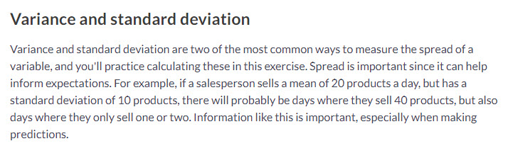

```{r setup, include=FALSE}

library(tidyverse)
library(ggplot2)
library(jpeg)

food_consumption_url <- 'https://raw.githubusercontent.com/rfordatascience/tidytuesday/master/data/2020/2020-02-18/food_consumption.csv'
food_consumption <- readr::read_csv(food_consumption_url)


```


## Quartliles
```{r}

quantile(food_consumption$co2_emmission)


```

## Quantiles

```{r}

quantile(food_consumption$co2_emmission, probs = c(0, 0.2, 0.4, 0.6, 0.8, 1))

```
## Deciles

```{r}

quantile(food_consumption$co2_emmission, probs = c(0.0, 0.1, 0.2, 0.3, 0.4, 0.5, 0.6, 0.7, 0.8, 0.9, 1.0))

```

# Variance and Standard Deviation

```{r echo=FALSE}



```


```{r}

# Calculate variance and sd of co2_emission for each food_category
food_consumption %>% 
  group_by(food_category) %>% 
  summarize(var_co2 = var(co2_emmission),
            sd_co2 = sd(co2_emmission),
            .groups = 'drop')


ggplot(food_consumption, aes(co2_emmission)) +
  geom_histogram() +
  facet_wrap(~ food_category)

```

# Finding Outliers using IQR

```{r echo=FALSE}

knitr::include_graphics("referance_images/finding_outliers_using_iqr.jpg")


```

```{r}

# Calculate total co2_emission per country: emissions_by_country
emmissions_by_country <- food_consumption %>%
  group_by(country) %>%
  summarize(total_emmission = sum(co2_emmission),
            .groups = "drop")

emmissions_by_country

# Compute the first and third quantiles and IQR of total_emission
q1 <- quantile(emmissions_by_country$total_emmission, .25)
q3 <- quantile(emmissions_by_country$total_emmission, .75)
iqr <- q3 - q1

# Calculate the lower and upper cutoffs for outliers
lower <- q1 - 1.5 * iqr
upper <- q3 + 1.5 * iqr

# Filter emissions_by_country to find outliers
emmissions_by_country %>%
  filter(total_emmission > upper | total_emmission < lower)

```

# Probability & The Law of Large Numbers

```{r}

restaurant_groups <- tribble(~group_id, ~group_size, 
                             "A", 2,
                             "B", 4,
                             "C", 6,
                             "D", 2,
                             "E", 2,
                             "F", 2,
                             "G", 3,
                             "H", 2,
                             "I", 4,
                             "J", 2)

# Create probability distribution
size_distribution <- restaurant_groups %>%
  # Count number of each group size
  count(group_size) %>%
  # Calculate probability
  mutate(probability = n / sum(n))

size_distribution

expected_val <- sum(size_distribution$group_size *
                    size_distribution$probability) 
expected_val

knitr::include_graphics("referance_images/law_of_large_numbers.jpg")

knitr::include_graphics("referance_images/the_law_of_large_numbers.jpg")

```

# Calculating Probability

```{r}

amir_deals <- readRDS("data/seller_1.rds")

amir_deals %>% 
  count(product) %>% 
  mutate(prob = n / sum(n))

```
# Sampling Deals

### Randomly pick 5 deals to ask if they are satisfied with the service they received.
### Setting a random seed shows that it can be reproduced in case you get asked how you chose the deals
### In this example it is better to use Without replacement
### If you sample with replacement, you might end up calling the same customer twice.

```{r}

set.seed(31)

amir_deals %>% 
  sample_n(5)

# Sample 5 deals with replacement
amir_deals %>%
  sample_n(5, replace = TRUE)

```

```{r}
# Create a histogram of group_size
ggplot(restaurant_groups, aes(group_size)) +
  geom_histogram(bins = 5)

# Create probability distribution
size_distribution <- restaurant_groups %>%
  count(group_size) %>%
  mutate(probability = n / sum(n))

size_distribution

# Calculate expected group size
expected_val <- sum(size_distribution$group_size *
                    size_distribution$probability) 
expected_val

# Calculate probability of picking group of 4 or more
size_distribution %>%
  # Filter for groups of 4 or larger
  filter(group_size >= 4) %>%
  # Calculate prob_4_or_more by taking sum of probabilities
  summarize(prob_4_or_more = sum(probability))


```


```{r echo=FALSE}

knitr::include_graphics("referance_images/probability_example.jpg")


```


```{r}

knitr::include_graphics("referance_images/probability_example.jpg")

# Min and max wait times for back-up that happens every 30 min
min <- 0
max <- 30

# Calculate probability of waiting less than 5 mins
prob_less_than_5 <- punif(5, min = 0, max = 30, lower.tail = TRUE)
prob_less_than_5


# Calculate probability of waiting more than 5 mins
prob_greater_than_5 <- punif(5, min = min, max = max, lower.tail = FALSE)
prob_greater_than_5


```

```{r}

knitr::include_graphics("referance_images/simulating_wait_time.jpg")

# Set random seed to 334
set.seed(334)

# Generate 1000 wait times between 0 and 30 mins, save in time column
wait_times <- tibble(simulation_nb = 1:1000)

wait_times %>%
  mutate(time = runif(1000, min = 0, max = 30)) %>%
  # Create a histogram of simulated times
  ggplot(aes(time)) +
  geom_histogram(bins = 30)


```

# Simulating deals
```{r echo=FALSE}

# Set random seed to 10
set.seed(10)

# Simulate 52 weeks of 3 deals
deals <- rbinom(52, 3, 0.30)

# Calculate mean deals won per week
mean(deals)

# Probability of closing 3 out of 3 deals
dbinom(3, 3, 0.3)

# Probability of closing <= 1 deal out of 3 deals
pbinom(1,3,0.3)

# Probability of closing > 1 deal out of 3 deals
pbinom(1, 3, 0.3, lower.tail = FALSE)

# Expected number won with 30% win rate
won_30pct <- 3 * 0.30
won_30pct

# Expected number won with 25% win rate
won_25pct <- 3 * 0.25
won_25pct

# Expected number won with 35% win rate
won_35pct <- 3 * 0.35
won_35pct

```


```{r}

# https://campus.datacamp.com/courses/introduction-to-statistics-in-r/more-distributions-and-the-central-limit-theorem?ex=7


```


```{r}


```


