```r
knitr::opts_chunk$set(fig.path = "README_figs/README-")
library(tidyverse)
library(plotly)
library(highcharter)
library(leaflet)
library(rmarkdown)
library(flexdashboard)
library(shiny)
library(forecast)
library(DT)
```


```
## Observations: 108
## Variables: 4
## Groups: is_china [2]
## $ is_china  <chr> "China", "China", "China", "China", "China", "China", "Ch...
## $ date      <date> 2020-01-22, 2020-01-23, 2020-01-24, 2020-01-25, 2020-01-...
## $ cases     <dbl> 548, 95, 277, 486, 669, 802, 2632, 578, 2054, 1661, 2089,...
## $ cum_cases <dbl> 548, 643, 920, 1406, 2075, 2877, 5509, 6087, 8141, 9802, ...
```


Data Visualization
https://www.udemy.com/course/r-tidyverse-reporting-and-analytics-for-excel-users/learn/lecture/8820024#overview


```r
cars %>% plot()
```

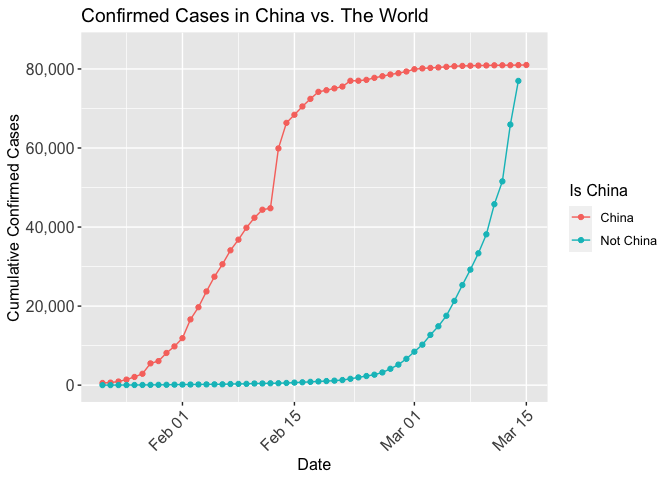<!-- -->

```r
forecast(AirPassengers) %>% plot()
```

<!-- -->

```r
ggplot(mpg) +
  geom_point(mapping = aes(x=displ, y = hwy, color = class, size = year, alpha=model))
```

<!-- -->

```r
ggplot(confirmed_cases_china_vs_world) +
  geom_line(aes(x = date, y = cum_cases, group = is_china, color = is_china)) +
  ylab("Cumulative Confirmed Cases")
```

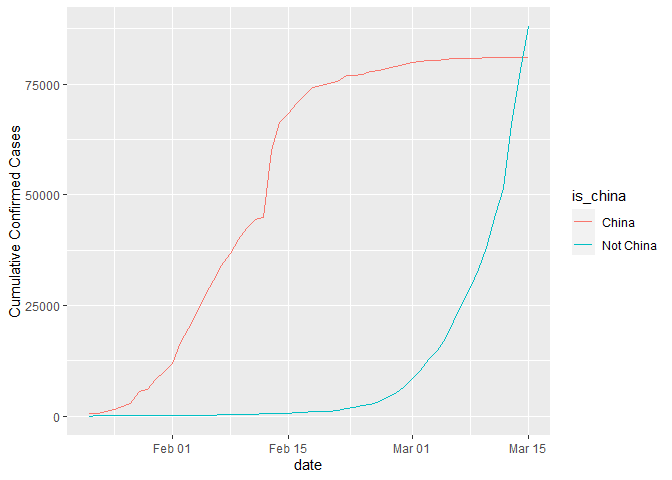<!-- -->

```r
ggplot(confirmed_cases_china_vs_world, aes(x = date, y = cum_cases, group = is_china, color = is_china)) +
  geom_line() +
  geom_point() +
  ylab("Cumulative Confirmed Cases")
```

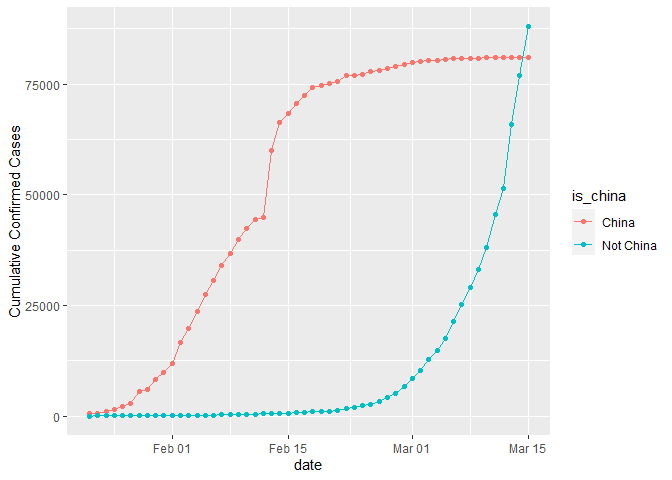<!-- -->


Different Bar Charts
Turning off legends
addjusting labels


```r
ggplot(mpg) + 
  geom_bar(mapping = aes(x=displ))
```

<!-- -->

```r
ggplot(mpg) + 
  geom_col(mapping = aes(x=displ, y=hwy, fill=class))
```

<!-- -->

```r
ggplot(mpg) + 
  geom_col(mapping = aes(x=displ, y=hwy, fill=class)) +
  theme(legend.position = "none") +
  theme(axis.text.x = element_text(angle = 45, hjust = 1))
```

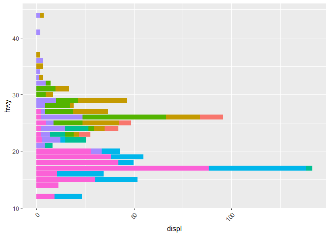<!-- -->


GGPlotly


```r
g <- ggplot(mpg) + 
  geom_point(aes(x=displ,y=hwy,color=class))

ggplotly(g)
```

<!--html_preserve--><div id="htmlwidget-af5dbe2a6e4ecc67378b" style="width:672px;height:480px;" class="plotly html-widget"></div>
<script type="application/json" data-for="htmlwidget-af5dbe2a6e4ecc67378b">{"x":{"data":[{"x":[5.7,5.7,6.2,6.2,7],"y":[26,23,26,25,24],"text":["displ: 5.7<br />hwy: 26<br />class: 2seater","displ: 5.7<br />hwy: 23<br />class: 2seater","displ: 6.2<br />hwy: 26<br />class: 2seater","displ: 6.2<br />hwy: 25<br />class: 2seater","displ: 7.0<br />hwy: 24<br />class: 2seater"],"type":"scatter","mode":"markers","marker":{"autocolorscale":false,"color":"rgba(248,118,109,1)","opacity":1,"size":5.66929133858268,"symbol":"circle","line":{"width":1.88976377952756,"color":"rgba(248,118,109,1)"}},"hoveron":"points","name":"2seater","legendgroup":"2seater","showlegend":true,"xaxis":"x","yaxis":"y","hoverinfo":"text","frame":null},{"x":[1.8,1.8,2,2,2.8,2.8,3.1,1.8,1.8,2,2,2.8,2.8,3.1,3.1,2.4,2.4,2.5,2.5,2.5,2.5,2.2,2.2,2.4,2.4,3,3,3.3,1.8,1.8,1.8,1.8,1.8,2,2,2,2,2.8,1.9,2,2,2,2,2.5,2.5,2.8,2.8],"y":[29,29,31,30,26,26,27,26,25,28,27,25,25,25,25,29,27,25,27,25,27,27,29,31,31,26,26,27,30,33,35,37,35,29,26,29,29,24,44,29,26,29,29,29,29,23,24],"text":["displ: 1.8<br />hwy: 29<br />class: compact","displ: 1.8<br />hwy: 29<br />class: compact","displ: 2.0<br />hwy: 31<br />class: compact","displ: 2.0<br />hwy: 30<br />class: compact","displ: 2.8<br />hwy: 26<br />class: compact","displ: 2.8<br />hwy: 26<br />class: compact","displ: 3.1<br />hwy: 27<br />class: compact","displ: 1.8<br />hwy: 26<br />class: compact","displ: 1.8<br />hwy: 25<br />class: compact","displ: 2.0<br />hwy: 28<br />class: compact","displ: 2.0<br />hwy: 27<br />class: compact","displ: 2.8<br />hwy: 25<br />class: compact","displ: 2.8<br />hwy: 25<br />class: compact","displ: 3.1<br />hwy: 25<br />class: compact","displ: 3.1<br />hwy: 25<br />class: compact","displ: 2.4<br />hwy: 29<br />class: compact","displ: 2.4<br />hwy: 27<br />class: compact","displ: 2.5<br />hwy: 25<br />class: compact","displ: 2.5<br />hwy: 27<br />class: compact","displ: 2.5<br />hwy: 25<br />class: compact","displ: 2.5<br />hwy: 27<br />class: compact","displ: 2.2<br />hwy: 27<br />class: compact","displ: 2.2<br />hwy: 29<br />class: compact","displ: 2.4<br />hwy: 31<br />class: compact","displ: 2.4<br />hwy: 31<br />class: compact","displ: 3.0<br />hwy: 26<br />class: compact","displ: 3.0<br />hwy: 26<br />class: compact","displ: 3.3<br />hwy: 27<br />class: compact","displ: 1.8<br />hwy: 30<br />class: compact","displ: 1.8<br />hwy: 33<br />class: compact","displ: 1.8<br />hwy: 35<br />class: compact","displ: 1.8<br />hwy: 37<br />class: compact","displ: 1.8<br />hwy: 35<br />class: compact","displ: 2.0<br />hwy: 29<br />class: compact","displ: 2.0<br />hwy: 26<br />class: compact","displ: 2.0<br />hwy: 29<br />class: compact","displ: 2.0<br />hwy: 29<br />class: compact","displ: 2.8<br />hwy: 24<br />class: compact","displ: 1.9<br />hwy: 44<br />class: compact","displ: 2.0<br />hwy: 29<br />class: compact","displ: 2.0<br />hwy: 26<br />class: compact","displ: 2.0<br />hwy: 29<br />class: compact","displ: 2.0<br />hwy: 29<br />class: compact","displ: 2.5<br />hwy: 29<br />class: compact","displ: 2.5<br />hwy: 29<br />class: compact","displ: 2.8<br />hwy: 23<br />class: compact","displ: 2.8<br />hwy: 24<br />class: compact"],"type":"scatter","mode":"markers","marker":{"autocolorscale":false,"color":"rgba(196,154,0,1)","opacity":1,"size":5.66929133858268,"symbol":"circle","line":{"width":1.88976377952756,"color":"rgba(196,154,0,1)"}},"hoveron":"points","name":"compact","legendgroup":"compact","showlegend":true,"xaxis":"x","yaxis":"y","hoverinfo":"text","frame":null},{"x":[2.8,3.1,4.2,2.4,2.4,3.1,3.5,3.6,2.4,2.4,2.4,2.4,2.5,2.5,3.3,2.5,2.5,3.5,3.5,3,3,3.5,3.1,3.8,3.8,3.8,5.3,2.2,2.2,2.4,2.4,3,3,3.5,1.8,1.8,2,2,2.8,2.8,3.6],"y":[24,25,23,27,30,26,29,26,26,27,30,31,26,26,28,31,32,27,26,26,25,25,26,26,27,28,25,29,27,31,31,26,26,28,29,29,28,29,26,26,26],"text":["displ: 2.8<br />hwy: 24<br />class: midsize","displ: 3.1<br />hwy: 25<br />class: midsize","displ: 4.2<br />hwy: 23<br />class: midsize","displ: 2.4<br />hwy: 27<br />class: midsize","displ: 2.4<br />hwy: 30<br />class: midsize","displ: 3.1<br />hwy: 26<br />class: midsize","displ: 3.5<br />hwy: 29<br />class: midsize","displ: 3.6<br />hwy: 26<br />class: midsize","displ: 2.4<br />hwy: 26<br />class: midsize","displ: 2.4<br />hwy: 27<br />class: midsize","displ: 2.4<br />hwy: 30<br />class: midsize","displ: 2.4<br />hwy: 31<br />class: midsize","displ: 2.5<br />hwy: 26<br />class: midsize","displ: 2.5<br />hwy: 26<br />class: midsize","displ: 3.3<br />hwy: 28<br />class: midsize","displ: 2.5<br />hwy: 31<br />class: midsize","displ: 2.5<br />hwy: 32<br />class: midsize","displ: 3.5<br />hwy: 27<br />class: midsize","displ: 3.5<br />hwy: 26<br />class: midsize","displ: 3.0<br />hwy: 26<br />class: midsize","displ: 3.0<br />hwy: 25<br />class: midsize","displ: 3.5<br />hwy: 25<br />class: midsize","displ: 3.1<br />hwy: 26<br />class: midsize","displ: 3.8<br />hwy: 26<br />class: midsize","displ: 3.8<br />hwy: 27<br />class: midsize","displ: 3.8<br />hwy: 28<br />class: midsize","displ: 5.3<br />hwy: 25<br />class: midsize","displ: 2.2<br />hwy: 29<br />class: midsize","displ: 2.2<br />hwy: 27<br />class: midsize","displ: 2.4<br />hwy: 31<br />class: midsize","displ: 2.4<br />hwy: 31<br />class: midsize","displ: 3.0<br />hwy: 26<br />class: midsize","displ: 3.0<br />hwy: 26<br />class: midsize","displ: 3.5<br />hwy: 28<br />class: midsize","displ: 1.8<br />hwy: 29<br />class: midsize","displ: 1.8<br />hwy: 29<br />class: midsize","displ: 2.0<br />hwy: 28<br />class: midsize","displ: 2.0<br />hwy: 29<br />class: midsize","displ: 2.8<br />hwy: 26<br />class: midsize","displ: 2.8<br />hwy: 26<br />class: midsize","displ: 3.6<br />hwy: 26<br />class: midsize"],"type":"scatter","mode":"markers","marker":{"autocolorscale":false,"color":"rgba(83,180,0,1)","opacity":1,"size":5.66929133858268,"symbol":"circle","line":{"width":1.88976377952756,"color":"rgba(83,180,0,1)"}},"hoveron":"points","name":"midsize","legendgroup":"midsize","showlegend":true,"xaxis":"x","yaxis":"y","hoverinfo":"text","frame":null},{"x":[2.4,3,3.3,3.3,3.3,3.3,3.3,3.8,3.8,3.8,4],"y":[24,24,22,22,24,24,17,22,21,23,23],"text":["displ: 2.4<br />hwy: 24<br />class: minivan","displ: 3.0<br />hwy: 24<br />class: minivan","displ: 3.3<br />hwy: 22<br />class: minivan","displ: 3.3<br />hwy: 22<br />class: minivan","displ: 3.3<br />hwy: 24<br />class: minivan","displ: 3.3<br />hwy: 24<br />class: minivan","displ: 3.3<br />hwy: 17<br />class: minivan","displ: 3.8<br />hwy: 22<br />class: minivan","displ: 3.8<br />hwy: 21<br />class: minivan","displ: 3.8<br />hwy: 23<br />class: minivan","displ: 4.0<br />hwy: 23<br />class: minivan"],"type":"scatter","mode":"markers","marker":{"autocolorscale":false,"color":"rgba(0,192,148,1)","opacity":1,"size":5.66929133858268,"symbol":"circle","line":{"width":1.88976377952756,"color":"rgba(0,192,148,1)"}},"hoveron":"points","name":"minivan","legendgroup":"minivan","showlegend":true,"xaxis":"x","yaxis":"y","hoverinfo":"text","frame":null},{"x":[3.7,3.7,3.9,3.9,4.7,4.7,4.7,5.2,5.2,4.7,4.7,4.7,4.7,4.7,4.7,5.2,5.2,5.7,5.9,4.2,4.2,4.6,4.6,4.6,5.4,5.4,2.7,2.7,2.7,3.4,3.4,4,4],"y":[19,18,17,17,19,19,12,17,15,16,12,17,17,16,12,15,16,17,15,17,17,16,16,17,15,17,20,20,22,17,19,18,20],"text":["displ: 3.7<br />hwy: 19<br />class: pickup","displ: 3.7<br />hwy: 18<br />class: pickup","displ: 3.9<br />hwy: 17<br />class: pickup","displ: 3.9<br />hwy: 17<br />class: pickup","displ: 4.7<br />hwy: 19<br />class: pickup","displ: 4.7<br />hwy: 19<br />class: pickup","displ: 4.7<br />hwy: 12<br />class: pickup","displ: 5.2<br />hwy: 17<br />class: pickup","displ: 5.2<br />hwy: 15<br />class: pickup","displ: 4.7<br />hwy: 16<br />class: pickup","displ: 4.7<br />hwy: 12<br />class: pickup","displ: 4.7<br />hwy: 17<br />class: pickup","displ: 4.7<br />hwy: 17<br />class: pickup","displ: 4.7<br />hwy: 16<br />class: pickup","displ: 4.7<br />hwy: 12<br />class: pickup","displ: 5.2<br />hwy: 15<br />class: pickup","displ: 5.2<br />hwy: 16<br />class: pickup","displ: 5.7<br />hwy: 17<br />class: pickup","displ: 5.9<br />hwy: 15<br />class: pickup","displ: 4.2<br />hwy: 17<br />class: pickup","displ: 4.2<br />hwy: 17<br />class: pickup","displ: 4.6<br />hwy: 16<br />class: pickup","displ: 4.6<br />hwy: 16<br />class: pickup","displ: 4.6<br />hwy: 17<br />class: pickup","displ: 5.4<br />hwy: 15<br />class: pickup","displ: 5.4<br />hwy: 17<br />class: pickup","displ: 2.7<br />hwy: 20<br />class: pickup","displ: 2.7<br />hwy: 20<br />class: pickup","displ: 2.7<br />hwy: 22<br />class: pickup","displ: 3.4<br />hwy: 17<br />class: pickup","displ: 3.4<br />hwy: 19<br />class: pickup","displ: 4.0<br />hwy: 18<br />class: pickup","displ: 4.0<br />hwy: 20<br />class: pickup"],"type":"scatter","mode":"markers","marker":{"autocolorscale":false,"color":"rgba(0,182,235,1)","opacity":1,"size":5.66929133858268,"symbol":"circle","line":{"width":1.88976377952756,"color":"rgba(0,182,235,1)"}},"hoveron":"points","name":"pickup","legendgroup":"pickup","showlegend":true,"xaxis":"x","yaxis":"y","hoverinfo":"text","frame":null},{"x":[3.8,3.8,4,4,4.6,4.6,4.6,4.6,5.4,1.6,1.6,1.6,1.6,1.6,1.8,1.8,1.8,2,2,2,2,2,2.7,2.7,2.7,2.2,2.2,2.5,2.5,1.9,1.9,2,2,2.5,2.5],"y":[26,25,26,24,21,22,23,22,20,33,32,32,29,32,34,36,36,29,26,29,28,27,24,24,24,26,26,26,26,44,41,29,26,28,29],"text":["displ: 3.8<br />hwy: 26<br />class: subcompact","displ: 3.8<br />hwy: 25<br />class: subcompact","displ: 4.0<br />hwy: 26<br />class: subcompact","displ: 4.0<br />hwy: 24<br />class: subcompact","displ: 4.6<br />hwy: 21<br />class: subcompact","displ: 4.6<br />hwy: 22<br />class: subcompact","displ: 4.6<br />hwy: 23<br />class: subcompact","displ: 4.6<br />hwy: 22<br />class: subcompact","displ: 5.4<br />hwy: 20<br />class: subcompact","displ: 1.6<br />hwy: 33<br />class: subcompact","displ: 1.6<br />hwy: 32<br />class: subcompact","displ: 1.6<br />hwy: 32<br />class: subcompact","displ: 1.6<br />hwy: 29<br />class: subcompact","displ: 1.6<br />hwy: 32<br />class: subcompact","displ: 1.8<br />hwy: 34<br />class: subcompact","displ: 1.8<br />hwy: 36<br />class: subcompact","displ: 1.8<br />hwy: 36<br />class: subcompact","displ: 2.0<br />hwy: 29<br />class: subcompact","displ: 2.0<br />hwy: 26<br />class: subcompact","displ: 2.0<br />hwy: 29<br />class: subcompact","displ: 2.0<br />hwy: 28<br />class: subcompact","displ: 2.0<br />hwy: 27<br />class: subcompact","displ: 2.7<br />hwy: 24<br />class: subcompact","displ: 2.7<br />hwy: 24<br />class: subcompact","displ: 2.7<br />hwy: 24<br />class: subcompact","displ: 2.2<br />hwy: 26<br />class: subcompact","displ: 2.2<br />hwy: 26<br />class: subcompact","displ: 2.5<br />hwy: 26<br />class: subcompact","displ: 2.5<br />hwy: 26<br />class: subcompact","displ: 1.9<br />hwy: 44<br />class: subcompact","displ: 1.9<br />hwy: 41<br />class: subcompact","displ: 2.0<br />hwy: 29<br />class: subcompact","displ: 2.0<br />hwy: 26<br />class: subcompact","displ: 2.5<br />hwy: 28<br />class: subcompact","displ: 2.5<br />hwy: 29<br />class: subcompact"],"type":"scatter","mode":"markers","marker":{"autocolorscale":false,"color":"rgba(165,138,255,1)","opacity":1,"size":5.66929133858268,"symbol":"circle","line":{"width":1.88976377952756,"color":"rgba(165,138,255,1)"}},"hoveron":"points","name":"subcompact","legendgroup":"subcompact","showlegend":true,"xaxis":"x","yaxis":"y","hoverinfo":"text","frame":null},{"x":[5.3,5.3,5.3,5.7,6,5.3,5.3,5.7,6.5,3.9,4.7,4.7,4.7,5.2,5.7,5.9,4.6,5.4,5.4,4,4,4,4,4.6,5,3,3.7,4,4.7,4.7,4.7,5.7,6.1,4,4.2,4.4,4.6,5.4,5.4,5.4,4,4,4.6,5,3.3,3.3,4,5.6,2.5,2.5,2.5,2.5,2.5,2.5,2.7,2.7,3.4,3.4,4,4.7,4.7,5.7],"y":[20,15,20,17,17,19,14,15,17,17,17,12,17,16,18,15,17,17,18,17,19,17,19,19,17,22,19,20,17,12,19,18,14,15,18,18,15,17,16,18,17,19,19,17,17,17,20,18,25,24,27,25,26,23,20,20,19,17,20,17,15,18],"text":["displ: 5.3<br />hwy: 20<br />class: suv","displ: 5.3<br />hwy: 15<br />class: suv","displ: 5.3<br />hwy: 20<br />class: suv","displ: 5.7<br />hwy: 17<br />class: suv","displ: 6.0<br />hwy: 17<br />class: suv","displ: 5.3<br />hwy: 19<br />class: suv","displ: 5.3<br />hwy: 14<br />class: suv","displ: 5.7<br />hwy: 15<br />class: suv","displ: 6.5<br />hwy: 17<br />class: suv","displ: 3.9<br />hwy: 17<br />class: suv","displ: 4.7<br />hwy: 17<br />class: suv","displ: 4.7<br />hwy: 12<br />class: suv","displ: 4.7<br />hwy: 17<br />class: suv","displ: 5.2<br />hwy: 16<br />class: suv","displ: 5.7<br />hwy: 18<br />class: suv","displ: 5.9<br />hwy: 15<br />class: suv","displ: 4.6<br />hwy: 17<br />class: suv","displ: 5.4<br />hwy: 17<br />class: suv","displ: 5.4<br />hwy: 18<br />class: suv","displ: 4.0<br />hwy: 17<br />class: suv","displ: 4.0<br />hwy: 19<br />class: suv","displ: 4.0<br />hwy: 17<br />class: suv","displ: 4.0<br />hwy: 19<br />class: suv","displ: 4.6<br />hwy: 19<br />class: suv","displ: 5.0<br />hwy: 17<br />class: suv","displ: 3.0<br />hwy: 22<br />class: suv","displ: 3.7<br />hwy: 19<br />class: suv","displ: 4.0<br />hwy: 20<br />class: suv","displ: 4.7<br />hwy: 17<br />class: suv","displ: 4.7<br />hwy: 12<br />class: suv","displ: 4.7<br />hwy: 19<br />class: suv","displ: 5.7<br />hwy: 18<br />class: suv","displ: 6.1<br />hwy: 14<br />class: suv","displ: 4.0<br />hwy: 15<br />class: suv","displ: 4.2<br />hwy: 18<br />class: suv","displ: 4.4<br />hwy: 18<br />class: suv","displ: 4.6<br />hwy: 15<br />class: suv","displ: 5.4<br />hwy: 17<br />class: suv","displ: 5.4<br />hwy: 16<br />class: suv","displ: 5.4<br />hwy: 18<br />class: suv","displ: 4.0<br />hwy: 17<br />class: suv","displ: 4.0<br />hwy: 19<br />class: suv","displ: 4.6<br />hwy: 19<br />class: suv","displ: 5.0<br />hwy: 17<br />class: suv","displ: 3.3<br />hwy: 17<br />class: suv","displ: 3.3<br />hwy: 17<br />class: suv","displ: 4.0<br />hwy: 20<br />class: suv","displ: 5.6<br />hwy: 18<br />class: suv","displ: 2.5<br />hwy: 25<br />class: suv","displ: 2.5<br />hwy: 24<br />class: suv","displ: 2.5<br />hwy: 27<br />class: suv","displ: 2.5<br />hwy: 25<br />class: suv","displ: 2.5<br />hwy: 26<br />class: suv","displ: 2.5<br />hwy: 23<br />class: suv","displ: 2.7<br />hwy: 20<br />class: suv","displ: 2.7<br />hwy: 20<br />class: suv","displ: 3.4<br />hwy: 19<br />class: suv","displ: 3.4<br />hwy: 17<br />class: suv","displ: 4.0<br />hwy: 20<br />class: suv","displ: 4.7<br />hwy: 17<br />class: suv","displ: 4.7<br />hwy: 15<br />class: suv","displ: 5.7<br />hwy: 18<br />class: suv"],"type":"scatter","mode":"markers","marker":{"autocolorscale":false,"color":"rgba(251,97,215,1)","opacity":1,"size":5.66929133858268,"symbol":"circle","line":{"width":1.88976377952756,"color":"rgba(251,97,215,1)"}},"hoveron":"points","name":"suv","legendgroup":"suv","showlegend":true,"xaxis":"x","yaxis":"y","hoverinfo":"text","frame":null}],"layout":{"margin":{"t":26.2283105022831,"r":7.30593607305936,"b":40.1826484018265,"l":37.2602739726027},"plot_bgcolor":"rgba(235,235,235,1)","paper_bgcolor":"rgba(255,255,255,1)","font":{"color":"rgba(0,0,0,1)","family":"","size":14.6118721461187},"xaxis":{"domain":[0,1],"automargin":true,"type":"linear","autorange":false,"range":[1.33,7.27],"tickmode":"array","ticktext":["2","3","4","5","6","7"],"tickvals":[2,3,4,5,6,7],"categoryorder":"array","categoryarray":["2","3","4","5","6","7"],"nticks":null,"ticks":"outside","tickcolor":"rgba(51,51,51,1)","ticklen":3.65296803652968,"tickwidth":0.66417600664176,"showticklabels":true,"tickfont":{"color":"rgba(77,77,77,1)","family":"","size":11.689497716895},"tickangle":-0,"showline":false,"linecolor":null,"linewidth":0,"showgrid":true,"gridcolor":"rgba(255,255,255,1)","gridwidth":0.66417600664176,"zeroline":false,"anchor":"y","title":{"text":"displ","font":{"color":"rgba(0,0,0,1)","family":"","size":14.6118721461187}},"hoverformat":".2f"},"yaxis":{"domain":[0,1],"automargin":true,"type":"linear","autorange":false,"range":[10.4,45.6],"tickmode":"array","ticktext":["20","30","40"],"tickvals":[20,30,40],"categoryorder":"array","categoryarray":["20","30","40"],"nticks":null,"ticks":"outside","tickcolor":"rgba(51,51,51,1)","ticklen":3.65296803652968,"tickwidth":0.66417600664176,"showticklabels":true,"tickfont":{"color":"rgba(77,77,77,1)","family":"","size":11.689497716895},"tickangle":-0,"showline":false,"linecolor":null,"linewidth":0,"showgrid":true,"gridcolor":"rgba(255,255,255,1)","gridwidth":0.66417600664176,"zeroline":false,"anchor":"x","title":{"text":"hwy","font":{"color":"rgba(0,0,0,1)","family":"","size":14.6118721461187}},"hoverformat":".2f"},"shapes":[{"type":"rect","fillcolor":null,"line":{"color":null,"width":0,"linetype":[]},"yref":"paper","xref":"paper","x0":0,"x1":1,"y0":0,"y1":1}],"showlegend":true,"legend":{"bgcolor":"rgba(255,255,255,1)","bordercolor":"transparent","borderwidth":1.88976377952756,"font":{"color":"rgba(0,0,0,1)","family":"","size":11.689497716895},"y":0.93503937007874},"annotations":[{"text":"class","x":1.02,"y":1,"showarrow":false,"ax":0,"ay":0,"font":{"color":"rgba(0,0,0,1)","family":"","size":14.6118721461187},"xref":"paper","yref":"paper","textangle":-0,"xanchor":"left","yanchor":"bottom","legendTitle":true}],"hovermode":"closest","barmode":"relative"},"config":{"doubleClick":"reset","showSendToCloud":false},"source":"A","attrs":{"5c283afd3972":{"x":{},"y":{},"colour":{},"type":"scatter"}},"cur_data":"5c283afd3972","visdat":{"5c283afd3972":["function (y) ","x"]},"highlight":{"on":"plotly_click","persistent":false,"dynamic":false,"selectize":false,"opacityDim":0.2,"selected":{"opacity":1},"debounce":0},"shinyEvents":["plotly_hover","plotly_click","plotly_selected","plotly_relayout","plotly_brushed","plotly_brushing","plotly_clickannotation","plotly_doubleclick","plotly_deselect","plotly_afterplot","plotly_sunburstclick"],"base_url":"https://plot.ly"},"evals":[],"jsHooks":[]}</script><!--/html_preserve-->

```r
hchart(mpg, "scatter",
       hcaes(x=displ, y = hwy, group = class))
```

<!--html_preserve--><div id="htmlwidget-e2949c9394c67747d50c" style="width:100%;height:500px;" class="highchart html-widget"></div>
<script type="application/json" data-for="htmlwidget-e2949c9394c67747d50c">{"x":{"hc_opts":{"title":{"text":null},"yAxis":{"title":{"text":"hwy"},"type":"linear"},"credits":{"enabled":false},"exporting":{"enabled":false},"plotOptions":{"series":{"label":{"enabled":false},"turboThreshold":0,"showInLegend":true},"treemap":{"layoutAlgorithm":"squarified"},"scatter":{"marker":{"symbol":"circle"}}},"series":[{"name":"2seater","data":[{"manufacturer":"chevrolet","model":"corvette","displ":5.7,"year":1999,"cyl":8,"trans":"manual(m6)","drv":"r","cty":16,"hwy":26,"fl":"p","class":"2seater","x":5.7,"y":26},{"manufacturer":"chevrolet","model":"corvette","displ":5.7,"year":1999,"cyl":8,"trans":"auto(l4)","drv":"r","cty":15,"hwy":23,"fl":"p","class":"2seater","x":5.7,"y":23},{"manufacturer":"chevrolet","model":"corvette","displ":6.2,"year":2008,"cyl":8,"trans":"manual(m6)","drv":"r","cty":16,"hwy":26,"fl":"p","class":"2seater","x":6.2,"y":26},{"manufacturer":"chevrolet","model":"corvette","displ":6.2,"year":2008,"cyl":8,"trans":"auto(s6)","drv":"r","cty":15,"hwy":25,"fl":"p","class":"2seater","x":6.2,"y":25},{"manufacturer":"chevrolet","model":"corvette","displ":7,"year":2008,"cyl":8,"trans":"manual(m6)","drv":"r","cty":15,"hwy":24,"fl":"p","class":"2seater","x":7,"y":24}],"type":"scatter"},{"name":"compact","data":[{"manufacturer":"audi","model":"a4","displ":1.8,"year":1999,"cyl":4,"trans":"auto(l5)","drv":"f","cty":18,"hwy":29,"fl":"p","class":"compact","x":1.8,"y":29},{"manufacturer":"audi","model":"a4","displ":1.8,"year":1999,"cyl":4,"trans":"manual(m5)","drv":"f","cty":21,"hwy":29,"fl":"p","class":"compact","x":1.8,"y":29},{"manufacturer":"audi","model":"a4","displ":2,"year":2008,"cyl":4,"trans":"manual(m6)","drv":"f","cty":20,"hwy":31,"fl":"p","class":"compact","x":2,"y":31},{"manufacturer":"audi","model":"a4","displ":2,"year":2008,"cyl":4,"trans":"auto(av)","drv":"f","cty":21,"hwy":30,"fl":"p","class":"compact","x":2,"y":30},{"manufacturer":"audi","model":"a4","displ":2.8,"year":1999,"cyl":6,"trans":"auto(l5)","drv":"f","cty":16,"hwy":26,"fl":"p","class":"compact","x":2.8,"y":26},{"manufacturer":"audi","model":"a4","displ":2.8,"year":1999,"cyl":6,"trans":"manual(m5)","drv":"f","cty":18,"hwy":26,"fl":"p","class":"compact","x":2.8,"y":26},{"manufacturer":"audi","model":"a4","displ":3.1,"year":2008,"cyl":6,"trans":"auto(av)","drv":"f","cty":18,"hwy":27,"fl":"p","class":"compact","x":3.1,"y":27},{"manufacturer":"audi","model":"a4 quattro","displ":1.8,"year":1999,"cyl":4,"trans":"manual(m5)","drv":"4","cty":18,"hwy":26,"fl":"p","class":"compact","x":1.8,"y":26},{"manufacturer":"audi","model":"a4 quattro","displ":1.8,"year":1999,"cyl":4,"trans":"auto(l5)","drv":"4","cty":16,"hwy":25,"fl":"p","class":"compact","x":1.8,"y":25},{"manufacturer":"audi","model":"a4 quattro","displ":2,"year":2008,"cyl":4,"trans":"manual(m6)","drv":"4","cty":20,"hwy":28,"fl":"p","class":"compact","x":2,"y":28},{"manufacturer":"audi","model":"a4 quattro","displ":2,"year":2008,"cyl":4,"trans":"auto(s6)","drv":"4","cty":19,"hwy":27,"fl":"p","class":"compact","x":2,"y":27},{"manufacturer":"audi","model":"a4 quattro","displ":2.8,"year":1999,"cyl":6,"trans":"auto(l5)","drv":"4","cty":15,"hwy":25,"fl":"p","class":"compact","x":2.8,"y":25},{"manufacturer":"audi","model":"a4 quattro","displ":2.8,"year":1999,"cyl":6,"trans":"manual(m5)","drv":"4","cty":17,"hwy":25,"fl":"p","class":"compact","x":2.8,"y":25},{"manufacturer":"audi","model":"a4 quattro","displ":3.1,"year":2008,"cyl":6,"trans":"auto(s6)","drv":"4","cty":17,"hwy":25,"fl":"p","class":"compact","x":3.1,"y":25},{"manufacturer":"audi","model":"a4 quattro","displ":3.1,"year":2008,"cyl":6,"trans":"manual(m6)","drv":"4","cty":15,"hwy":25,"fl":"p","class":"compact","x":3.1,"y":25},{"manufacturer":"nissan","model":"altima","displ":2.4,"year":1999,"cyl":4,"trans":"manual(m5)","drv":"f","cty":21,"hwy":29,"fl":"r","class":"compact","x":2.4,"y":29},{"manufacturer":"nissan","model":"altima","displ":2.4,"year":1999,"cyl":4,"trans":"auto(l4)","drv":"f","cty":19,"hwy":27,"fl":"r","class":"compact","x":2.4,"y":27},{"manufacturer":"subaru","model":"impreza awd","displ":2.5,"year":2008,"cyl":4,"trans":"auto(s4)","drv":"4","cty":20,"hwy":25,"fl":"p","class":"compact","x":2.5,"y":25},{"manufacturer":"subaru","model":"impreza awd","displ":2.5,"year":2008,"cyl":4,"trans":"auto(s4)","drv":"4","cty":20,"hwy":27,"fl":"r","class":"compact","x":2.5,"y":27},{"manufacturer":"subaru","model":"impreza awd","displ":2.5,"year":2008,"cyl":4,"trans":"manual(m5)","drv":"4","cty":19,"hwy":25,"fl":"p","class":"compact","x":2.5,"y":25},{"manufacturer":"subaru","model":"impreza awd","displ":2.5,"year":2008,"cyl":4,"trans":"manual(m5)","drv":"4","cty":20,"hwy":27,"fl":"r","class":"compact","x":2.5,"y":27},{"manufacturer":"toyota","model":"camry solara","displ":2.2,"year":1999,"cyl":4,"trans":"auto(l4)","drv":"f","cty":21,"hwy":27,"fl":"r","class":"compact","x":2.2,"y":27},{"manufacturer":"toyota","model":"camry solara","displ":2.2,"year":1999,"cyl":4,"trans":"manual(m5)","drv":"f","cty":21,"hwy":29,"fl":"r","class":"compact","x":2.2,"y":29},{"manufacturer":"toyota","model":"camry solara","displ":2.4,"year":2008,"cyl":4,"trans":"manual(m5)","drv":"f","cty":21,"hwy":31,"fl":"r","class":"compact","x":2.4,"y":31},{"manufacturer":"toyota","model":"camry solara","displ":2.4,"year":2008,"cyl":4,"trans":"auto(s5)","drv":"f","cty":22,"hwy":31,"fl":"r","class":"compact","x":2.4,"y":31},{"manufacturer":"toyota","model":"camry solara","displ":3,"year":1999,"cyl":6,"trans":"auto(l4)","drv":"f","cty":18,"hwy":26,"fl":"r","class":"compact","x":3,"y":26},{"manufacturer":"toyota","model":"camry solara","displ":3,"year":1999,"cyl":6,"trans":"manual(m5)","drv":"f","cty":18,"hwy":26,"fl":"r","class":"compact","x":3,"y":26},{"manufacturer":"toyota","model":"camry solara","displ":3.3,"year":2008,"cyl":6,"trans":"auto(s5)","drv":"f","cty":18,"hwy":27,"fl":"r","class":"compact","x":3.3,"y":27},{"manufacturer":"toyota","model":"corolla","displ":1.8,"year":1999,"cyl":4,"trans":"auto(l3)","drv":"f","cty":24,"hwy":30,"fl":"r","class":"compact","x":1.8,"y":30},{"manufacturer":"toyota","model":"corolla","displ":1.8,"year":1999,"cyl":4,"trans":"auto(l4)","drv":"f","cty":24,"hwy":33,"fl":"r","class":"compact","x":1.8,"y":33},{"manufacturer":"toyota","model":"corolla","displ":1.8,"year":1999,"cyl":4,"trans":"manual(m5)","drv":"f","cty":26,"hwy":35,"fl":"r","class":"compact","x":1.8,"y":35},{"manufacturer":"toyota","model":"corolla","displ":1.8,"year":2008,"cyl":4,"trans":"manual(m5)","drv":"f","cty":28,"hwy":37,"fl":"r","class":"compact","x":1.8,"y":37},{"manufacturer":"toyota","model":"corolla","displ":1.8,"year":2008,"cyl":4,"trans":"auto(l4)","drv":"f","cty":26,"hwy":35,"fl":"r","class":"compact","x":1.8,"y":35},{"manufacturer":"volkswagen","model":"gti","displ":2,"year":1999,"cyl":4,"trans":"manual(m5)","drv":"f","cty":21,"hwy":29,"fl":"r","class":"compact","x":2,"y":29},{"manufacturer":"volkswagen","model":"gti","displ":2,"year":1999,"cyl":4,"trans":"auto(l4)","drv":"f","cty":19,"hwy":26,"fl":"r","class":"compact","x":2,"y":26},{"manufacturer":"volkswagen","model":"gti","displ":2,"year":2008,"cyl":4,"trans":"manual(m6)","drv":"f","cty":21,"hwy":29,"fl":"p","class":"compact","x":2,"y":29},{"manufacturer":"volkswagen","model":"gti","displ":2,"year":2008,"cyl":4,"trans":"auto(s6)","drv":"f","cty":22,"hwy":29,"fl":"p","class":"compact","x":2,"y":29},{"manufacturer":"volkswagen","model":"gti","displ":2.8,"year":1999,"cyl":6,"trans":"manual(m5)","drv":"f","cty":17,"hwy":24,"fl":"r","class":"compact","x":2.8,"y":24},{"manufacturer":"volkswagen","model":"jetta","displ":1.9,"year":1999,"cyl":4,"trans":"manual(m5)","drv":"f","cty":33,"hwy":44,"fl":"d","class":"compact","x":1.9,"y":44},{"manufacturer":"volkswagen","model":"jetta","displ":2,"year":1999,"cyl":4,"trans":"manual(m5)","drv":"f","cty":21,"hwy":29,"fl":"r","class":"compact","x":2,"y":29},{"manufacturer":"volkswagen","model":"jetta","displ":2,"year":1999,"cyl":4,"trans":"auto(l4)","drv":"f","cty":19,"hwy":26,"fl":"r","class":"compact","x":2,"y":26},{"manufacturer":"volkswagen","model":"jetta","displ":2,"year":2008,"cyl":4,"trans":"auto(s6)","drv":"f","cty":22,"hwy":29,"fl":"p","class":"compact","x":2,"y":29},{"manufacturer":"volkswagen","model":"jetta","displ":2,"year":2008,"cyl":4,"trans":"manual(m6)","drv":"f","cty":21,"hwy":29,"fl":"p","class":"compact","x":2,"y":29},{"manufacturer":"volkswagen","model":"jetta","displ":2.5,"year":2008,"cyl":5,"trans":"auto(s6)","drv":"f","cty":21,"hwy":29,"fl":"r","class":"compact","x":2.5,"y":29},{"manufacturer":"volkswagen","model":"jetta","displ":2.5,"year":2008,"cyl":5,"trans":"manual(m5)","drv":"f","cty":21,"hwy":29,"fl":"r","class":"compact","x":2.5,"y":29},{"manufacturer":"volkswagen","model":"jetta","displ":2.8,"year":1999,"cyl":6,"trans":"auto(l4)","drv":"f","cty":16,"hwy":23,"fl":"r","class":"compact","x":2.8,"y":23},{"manufacturer":"volkswagen","model":"jetta","displ":2.8,"year":1999,"cyl":6,"trans":"manual(m5)","drv":"f","cty":17,"hwy":24,"fl":"r","class":"compact","x":2.8,"y":24}],"type":"scatter"},{"name":"midsize","data":[{"manufacturer":"audi","model":"a6 quattro","displ":2.8,"year":1999,"cyl":6,"trans":"auto(l5)","drv":"4","cty":15,"hwy":24,"fl":"p","class":"midsize","x":2.8,"y":24},{"manufacturer":"audi","model":"a6 quattro","displ":3.1,"year":2008,"cyl":6,"trans":"auto(s6)","drv":"4","cty":17,"hwy":25,"fl":"p","class":"midsize","x":3.1,"y":25},{"manufacturer":"audi","model":"a6 quattro","displ":4.2,"year":2008,"cyl":8,"trans":"auto(s6)","drv":"4","cty":16,"hwy":23,"fl":"p","class":"midsize","x":4.2,"y":23},{"manufacturer":"chevrolet","model":"malibu","displ":2.4,"year":1999,"cyl":4,"trans":"auto(l4)","drv":"f","cty":19,"hwy":27,"fl":"r","class":"midsize","x":2.4,"y":27},{"manufacturer":"chevrolet","model":"malibu","displ":2.4,"year":2008,"cyl":4,"trans":"auto(l4)","drv":"f","cty":22,"hwy":30,"fl":"r","class":"midsize","x":2.4,"y":30},{"manufacturer":"chevrolet","model":"malibu","displ":3.1,"year":1999,"cyl":6,"trans":"auto(l4)","drv":"f","cty":18,"hwy":26,"fl":"r","class":"midsize","x":3.1,"y":26},{"manufacturer":"chevrolet","model":"malibu","displ":3.5,"year":2008,"cyl":6,"trans":"auto(l4)","drv":"f","cty":18,"hwy":29,"fl":"r","class":"midsize","x":3.5,"y":29},{"manufacturer":"chevrolet","model":"malibu","displ":3.6,"year":2008,"cyl":6,"trans":"auto(s6)","drv":"f","cty":17,"hwy":26,"fl":"r","class":"midsize","x":3.6,"y":26},{"manufacturer":"hyundai","model":"sonata","displ":2.4,"year":1999,"cyl":4,"trans":"auto(l4)","drv":"f","cty":18,"hwy":26,"fl":"r","class":"midsize","x":2.4,"y":26},{"manufacturer":"hyundai","model":"sonata","displ":2.4,"year":1999,"cyl":4,"trans":"manual(m5)","drv":"f","cty":18,"hwy":27,"fl":"r","class":"midsize","x":2.4,"y":27},{"manufacturer":"hyundai","model":"sonata","displ":2.4,"year":2008,"cyl":4,"trans":"auto(l4)","drv":"f","cty":21,"hwy":30,"fl":"r","class":"midsize","x":2.4,"y":30},{"manufacturer":"hyundai","model":"sonata","displ":2.4,"year":2008,"cyl":4,"trans":"manual(m5)","drv":"f","cty":21,"hwy":31,"fl":"r","class":"midsize","x":2.4,"y":31},{"manufacturer":"hyundai","model":"sonata","displ":2.5,"year":1999,"cyl":6,"trans":"auto(l4)","drv":"f","cty":18,"hwy":26,"fl":"r","class":"midsize","x":2.5,"y":26},{"manufacturer":"hyundai","model":"sonata","displ":2.5,"year":1999,"cyl":6,"trans":"manual(m5)","drv":"f","cty":18,"hwy":26,"fl":"r","class":"midsize","x":2.5,"y":26},{"manufacturer":"hyundai","model":"sonata","displ":3.3,"year":2008,"cyl":6,"trans":"auto(l5)","drv":"f","cty":19,"hwy":28,"fl":"r","class":"midsize","x":3.3,"y":28},{"manufacturer":"nissan","model":"altima","displ":2.5,"year":2008,"cyl":4,"trans":"auto(av)","drv":"f","cty":23,"hwy":31,"fl":"r","class":"midsize","x":2.5,"y":31},{"manufacturer":"nissan","model":"altima","displ":2.5,"year":2008,"cyl":4,"trans":"manual(m6)","drv":"f","cty":23,"hwy":32,"fl":"r","class":"midsize","x":2.5,"y":32},{"manufacturer":"nissan","model":"altima","displ":3.5,"year":2008,"cyl":6,"trans":"manual(m6)","drv":"f","cty":19,"hwy":27,"fl":"p","class":"midsize","x":3.5,"y":27},{"manufacturer":"nissan","model":"altima","displ":3.5,"year":2008,"cyl":6,"trans":"auto(av)","drv":"f","cty":19,"hwy":26,"fl":"p","class":"midsize","x":3.5,"y":26},{"manufacturer":"nissan","model":"maxima","displ":3,"year":1999,"cyl":6,"trans":"auto(l4)","drv":"f","cty":18,"hwy":26,"fl":"r","class":"midsize","x":3,"y":26},{"manufacturer":"nissan","model":"maxima","displ":3,"year":1999,"cyl":6,"trans":"manual(m5)","drv":"f","cty":19,"hwy":25,"fl":"r","class":"midsize","x":3,"y":25},{"manufacturer":"nissan","model":"maxima","displ":3.5,"year":2008,"cyl":6,"trans":"auto(av)","drv":"f","cty":19,"hwy":25,"fl":"p","class":"midsize","x":3.5,"y":25},{"manufacturer":"pontiac","model":"grand prix","displ":3.1,"year":1999,"cyl":6,"trans":"auto(l4)","drv":"f","cty":18,"hwy":26,"fl":"r","class":"midsize","x":3.1,"y":26},{"manufacturer":"pontiac","model":"grand prix","displ":3.8,"year":1999,"cyl":6,"trans":"auto(l4)","drv":"f","cty":16,"hwy":26,"fl":"p","class":"midsize","x":3.8,"y":26},{"manufacturer":"pontiac","model":"grand prix","displ":3.8,"year":1999,"cyl":6,"trans":"auto(l4)","drv":"f","cty":17,"hwy":27,"fl":"r","class":"midsize","x":3.8,"y":27},{"manufacturer":"pontiac","model":"grand prix","displ":3.8,"year":2008,"cyl":6,"trans":"auto(l4)","drv":"f","cty":18,"hwy":28,"fl":"r","class":"midsize","x":3.8,"y":28},{"manufacturer":"pontiac","model":"grand prix","displ":5.3,"year":2008,"cyl":8,"trans":"auto(s4)","drv":"f","cty":16,"hwy":25,"fl":"p","class":"midsize","x":5.3,"y":25},{"manufacturer":"toyota","model":"camry","displ":2.2,"year":1999,"cyl":4,"trans":"manual(m5)","drv":"f","cty":21,"hwy":29,"fl":"r","class":"midsize","x":2.2,"y":29},{"manufacturer":"toyota","model":"camry","displ":2.2,"year":1999,"cyl":4,"trans":"auto(l4)","drv":"f","cty":21,"hwy":27,"fl":"r","class":"midsize","x":2.2,"y":27},{"manufacturer":"toyota","model":"camry","displ":2.4,"year":2008,"cyl":4,"trans":"manual(m5)","drv":"f","cty":21,"hwy":31,"fl":"r","class":"midsize","x":2.4,"y":31},{"manufacturer":"toyota","model":"camry","displ":2.4,"year":2008,"cyl":4,"trans":"auto(l5)","drv":"f","cty":21,"hwy":31,"fl":"r","class":"midsize","x":2.4,"y":31},{"manufacturer":"toyota","model":"camry","displ":3,"year":1999,"cyl":6,"trans":"auto(l4)","drv":"f","cty":18,"hwy":26,"fl":"r","class":"midsize","x":3,"y":26},{"manufacturer":"toyota","model":"camry","displ":3,"year":1999,"cyl":6,"trans":"manual(m5)","drv":"f","cty":18,"hwy":26,"fl":"r","class":"midsize","x":3,"y":26},{"manufacturer":"toyota","model":"camry","displ":3.5,"year":2008,"cyl":6,"trans":"auto(s6)","drv":"f","cty":19,"hwy":28,"fl":"r","class":"midsize","x":3.5,"y":28},{"manufacturer":"volkswagen","model":"passat","displ":1.8,"year":1999,"cyl":4,"trans":"manual(m5)","drv":"f","cty":21,"hwy":29,"fl":"p","class":"midsize","x":1.8,"y":29},{"manufacturer":"volkswagen","model":"passat","displ":1.8,"year":1999,"cyl":4,"trans":"auto(l5)","drv":"f","cty":18,"hwy":29,"fl":"p","class":"midsize","x":1.8,"y":29},{"manufacturer":"volkswagen","model":"passat","displ":2,"year":2008,"cyl":4,"trans":"auto(s6)","drv":"f","cty":19,"hwy":28,"fl":"p","class":"midsize","x":2,"y":28},{"manufacturer":"volkswagen","model":"passat","displ":2,"year":2008,"cyl":4,"trans":"manual(m6)","drv":"f","cty":21,"hwy":29,"fl":"p","class":"midsize","x":2,"y":29},{"manufacturer":"volkswagen","model":"passat","displ":2.8,"year":1999,"cyl":6,"trans":"auto(l5)","drv":"f","cty":16,"hwy":26,"fl":"p","class":"midsize","x":2.8,"y":26},{"manufacturer":"volkswagen","model":"passat","displ":2.8,"year":1999,"cyl":6,"trans":"manual(m5)","drv":"f","cty":18,"hwy":26,"fl":"p","class":"midsize","x":2.8,"y":26},{"manufacturer":"volkswagen","model":"passat","displ":3.6,"year":2008,"cyl":6,"trans":"auto(s6)","drv":"f","cty":17,"hwy":26,"fl":"p","class":"midsize","x":3.6,"y":26}],"type":"scatter"},{"name":"minivan","data":[{"manufacturer":"dodge","model":"caravan 2wd","displ":2.4,"year":1999,"cyl":4,"trans":"auto(l3)","drv":"f","cty":18,"hwy":24,"fl":"r","class":"minivan","x":2.4,"y":24},{"manufacturer":"dodge","model":"caravan 2wd","displ":3,"year":1999,"cyl":6,"trans":"auto(l4)","drv":"f","cty":17,"hwy":24,"fl":"r","class":"minivan","x":3,"y":24},{"manufacturer":"dodge","model":"caravan 2wd","displ":3.3,"year":1999,"cyl":6,"trans":"auto(l4)","drv":"f","cty":16,"hwy":22,"fl":"r","class":"minivan","x":3.3,"y":22},{"manufacturer":"dodge","model":"caravan 2wd","displ":3.3,"year":1999,"cyl":6,"trans":"auto(l4)","drv":"f","cty":16,"hwy":22,"fl":"r","class":"minivan","x":3.3,"y":22},{"manufacturer":"dodge","model":"caravan 2wd","displ":3.3,"year":2008,"cyl":6,"trans":"auto(l4)","drv":"f","cty":17,"hwy":24,"fl":"r","class":"minivan","x":3.3,"y":24},{"manufacturer":"dodge","model":"caravan 2wd","displ":3.3,"year":2008,"cyl":6,"trans":"auto(l4)","drv":"f","cty":17,"hwy":24,"fl":"r","class":"minivan","x":3.3,"y":24},{"manufacturer":"dodge","model":"caravan 2wd","displ":3.3,"year":2008,"cyl":6,"trans":"auto(l4)","drv":"f","cty":11,"hwy":17,"fl":"e","class":"minivan","x":3.3,"y":17},{"manufacturer":"dodge","model":"caravan 2wd","displ":3.8,"year":1999,"cyl":6,"trans":"auto(l4)","drv":"f","cty":15,"hwy":22,"fl":"r","class":"minivan","x":3.8,"y":22},{"manufacturer":"dodge","model":"caravan 2wd","displ":3.8,"year":1999,"cyl":6,"trans":"auto(l4)","drv":"f","cty":15,"hwy":21,"fl":"r","class":"minivan","x":3.8,"y":21},{"manufacturer":"dodge","model":"caravan 2wd","displ":3.8,"year":2008,"cyl":6,"trans":"auto(l6)","drv":"f","cty":16,"hwy":23,"fl":"r","class":"minivan","x":3.8,"y":23},{"manufacturer":"dodge","model":"caravan 2wd","displ":4,"year":2008,"cyl":6,"trans":"auto(l6)","drv":"f","cty":16,"hwy":23,"fl":"r","class":"minivan","x":4,"y":23}],"type":"scatter"},{"name":"pickup","data":[{"manufacturer":"dodge","model":"dakota pickup 4wd","displ":3.7,"year":2008,"cyl":6,"trans":"manual(m6)","drv":"4","cty":15,"hwy":19,"fl":"r","class":"pickup","x":3.7,"y":19},{"manufacturer":"dodge","model":"dakota pickup 4wd","displ":3.7,"year":2008,"cyl":6,"trans":"auto(l4)","drv":"4","cty":14,"hwy":18,"fl":"r","class":"pickup","x":3.7,"y":18},{"manufacturer":"dodge","model":"dakota pickup 4wd","displ":3.9,"year":1999,"cyl":6,"trans":"auto(l4)","drv":"4","cty":13,"hwy":17,"fl":"r","class":"pickup","x":3.9,"y":17},{"manufacturer":"dodge","model":"dakota pickup 4wd","displ":3.9,"year":1999,"cyl":6,"trans":"manual(m5)","drv":"4","cty":14,"hwy":17,"fl":"r","class":"pickup","x":3.9,"y":17},{"manufacturer":"dodge","model":"dakota pickup 4wd","displ":4.7,"year":2008,"cyl":8,"trans":"auto(l5)","drv":"4","cty":14,"hwy":19,"fl":"r","class":"pickup","x":4.7,"y":19},{"manufacturer":"dodge","model":"dakota pickup 4wd","displ":4.7,"year":2008,"cyl":8,"trans":"auto(l5)","drv":"4","cty":14,"hwy":19,"fl":"r","class":"pickup","x":4.7,"y":19},{"manufacturer":"dodge","model":"dakota pickup 4wd","displ":4.7,"year":2008,"cyl":8,"trans":"auto(l5)","drv":"4","cty":9,"hwy":12,"fl":"e","class":"pickup","x":4.7,"y":12},{"manufacturer":"dodge","model":"dakota pickup 4wd","displ":5.2,"year":1999,"cyl":8,"trans":"manual(m5)","drv":"4","cty":11,"hwy":17,"fl":"r","class":"pickup","x":5.2,"y":17},{"manufacturer":"dodge","model":"dakota pickup 4wd","displ":5.2,"year":1999,"cyl":8,"trans":"auto(l4)","drv":"4","cty":11,"hwy":15,"fl":"r","class":"pickup","x":5.2,"y":15},{"manufacturer":"dodge","model":"ram 1500 pickup 4wd","displ":4.7,"year":2008,"cyl":8,"trans":"manual(m6)","drv":"4","cty":12,"hwy":16,"fl":"r","class":"pickup","x":4.7,"y":16},{"manufacturer":"dodge","model":"ram 1500 pickup 4wd","displ":4.7,"year":2008,"cyl":8,"trans":"auto(l5)","drv":"4","cty":9,"hwy":12,"fl":"e","class":"pickup","x":4.7,"y":12},{"manufacturer":"dodge","model":"ram 1500 pickup 4wd","displ":4.7,"year":2008,"cyl":8,"trans":"auto(l5)","drv":"4","cty":13,"hwy":17,"fl":"r","class":"pickup","x":4.7,"y":17},{"manufacturer":"dodge","model":"ram 1500 pickup 4wd","displ":4.7,"year":2008,"cyl":8,"trans":"auto(l5)","drv":"4","cty":13,"hwy":17,"fl":"r","class":"pickup","x":4.7,"y":17},{"manufacturer":"dodge","model":"ram 1500 pickup 4wd","displ":4.7,"year":2008,"cyl":8,"trans":"manual(m6)","drv":"4","cty":12,"hwy":16,"fl":"r","class":"pickup","x":4.7,"y":16},{"manufacturer":"dodge","model":"ram 1500 pickup 4wd","displ":4.7,"year":2008,"cyl":8,"trans":"manual(m6)","drv":"4","cty":9,"hwy":12,"fl":"e","class":"pickup","x":4.7,"y":12},{"manufacturer":"dodge","model":"ram 1500 pickup 4wd","displ":5.2,"year":1999,"cyl":8,"trans":"auto(l4)","drv":"4","cty":11,"hwy":15,"fl":"r","class":"pickup","x":5.2,"y":15},{"manufacturer":"dodge","model":"ram 1500 pickup 4wd","displ":5.2,"year":1999,"cyl":8,"trans":"manual(m5)","drv":"4","cty":11,"hwy":16,"fl":"r","class":"pickup","x":5.2,"y":16},{"manufacturer":"dodge","model":"ram 1500 pickup 4wd","displ":5.7,"year":2008,"cyl":8,"trans":"auto(l5)","drv":"4","cty":13,"hwy":17,"fl":"r","class":"pickup","x":5.7,"y":17},{"manufacturer":"dodge","model":"ram 1500 pickup 4wd","displ":5.9,"year":1999,"cyl":8,"trans":"auto(l4)","drv":"4","cty":11,"hwy":15,"fl":"r","class":"pickup","x":5.9,"y":15},{"manufacturer":"ford","model":"f150 pickup 4wd","displ":4.2,"year":1999,"cyl":6,"trans":"auto(l4)","drv":"4","cty":14,"hwy":17,"fl":"r","class":"pickup","x":4.2,"y":17},{"manufacturer":"ford","model":"f150 pickup 4wd","displ":4.2,"year":1999,"cyl":6,"trans":"manual(m5)","drv":"4","cty":14,"hwy":17,"fl":"r","class":"pickup","x":4.2,"y":17},{"manufacturer":"ford","model":"f150 pickup 4wd","displ":4.6,"year":1999,"cyl":8,"trans":"manual(m5)","drv":"4","cty":13,"hwy":16,"fl":"r","class":"pickup","x":4.6,"y":16},{"manufacturer":"ford","model":"f150 pickup 4wd","displ":4.6,"year":1999,"cyl":8,"trans":"auto(l4)","drv":"4","cty":13,"hwy":16,"fl":"r","class":"pickup","x":4.6,"y":16},{"manufacturer":"ford","model":"f150 pickup 4wd","displ":4.6,"year":2008,"cyl":8,"trans":"auto(l4)","drv":"4","cty":13,"hwy":17,"fl":"r","class":"pickup","x":4.6,"y":17},{"manufacturer":"ford","model":"f150 pickup 4wd","displ":5.4,"year":1999,"cyl":8,"trans":"auto(l4)","drv":"4","cty":11,"hwy":15,"fl":"r","class":"pickup","x":5.4,"y":15},{"manufacturer":"ford","model":"f150 pickup 4wd","displ":5.4,"year":2008,"cyl":8,"trans":"auto(l4)","drv":"4","cty":13,"hwy":17,"fl":"r","class":"pickup","x":5.4,"y":17},{"manufacturer":"toyota","model":"toyota tacoma 4wd","displ":2.7,"year":1999,"cyl":4,"trans":"manual(m5)","drv":"4","cty":15,"hwy":20,"fl":"r","class":"pickup","x":2.7,"y":20},{"manufacturer":"toyota","model":"toyota tacoma 4wd","displ":2.7,"year":1999,"cyl":4,"trans":"auto(l4)","drv":"4","cty":16,"hwy":20,"fl":"r","class":"pickup","x":2.7,"y":20},{"manufacturer":"toyota","model":"toyota tacoma 4wd","displ":2.7,"year":2008,"cyl":4,"trans":"manual(m5)","drv":"4","cty":17,"hwy":22,"fl":"r","class":"pickup","x":2.7,"y":22},{"manufacturer":"toyota","model":"toyota tacoma 4wd","displ":3.4,"year":1999,"cyl":6,"trans":"manual(m5)","drv":"4","cty":15,"hwy":17,"fl":"r","class":"pickup","x":3.4,"y":17},{"manufacturer":"toyota","model":"toyota tacoma 4wd","displ":3.4,"year":1999,"cyl":6,"trans":"auto(l4)","drv":"4","cty":15,"hwy":19,"fl":"r","class":"pickup","x":3.4,"y":19},{"manufacturer":"toyota","model":"toyota tacoma 4wd","displ":4,"year":2008,"cyl":6,"trans":"manual(m6)","drv":"4","cty":15,"hwy":18,"fl":"r","class":"pickup","x":4,"y":18},{"manufacturer":"toyota","model":"toyota tacoma 4wd","displ":4,"year":2008,"cyl":6,"trans":"auto(l5)","drv":"4","cty":16,"hwy":20,"fl":"r","class":"pickup","x":4,"y":20}],"type":"scatter"},{"name":"subcompact","data":[{"manufacturer":"ford","model":"mustang","displ":3.8,"year":1999,"cyl":6,"trans":"manual(m5)","drv":"r","cty":18,"hwy":26,"fl":"r","class":"subcompact","x":3.8,"y":26},{"manufacturer":"ford","model":"mustang","displ":3.8,"year":1999,"cyl":6,"trans":"auto(l4)","drv":"r","cty":18,"hwy":25,"fl":"r","class":"subcompact","x":3.8,"y":25},{"manufacturer":"ford","model":"mustang","displ":4,"year":2008,"cyl":6,"trans":"manual(m5)","drv":"r","cty":17,"hwy":26,"fl":"r","class":"subcompact","x":4,"y":26},{"manufacturer":"ford","model":"mustang","displ":4,"year":2008,"cyl":6,"trans":"auto(l5)","drv":"r","cty":16,"hwy":24,"fl":"r","class":"subcompact","x":4,"y":24},{"manufacturer":"ford","model":"mustang","displ":4.6,"year":1999,"cyl":8,"trans":"auto(l4)","drv":"r","cty":15,"hwy":21,"fl":"r","class":"subcompact","x":4.6,"y":21},{"manufacturer":"ford","model":"mustang","displ":4.6,"year":1999,"cyl":8,"trans":"manual(m5)","drv":"r","cty":15,"hwy":22,"fl":"r","class":"subcompact","x":4.6,"y":22},{"manufacturer":"ford","model":"mustang","displ":4.6,"year":2008,"cyl":8,"trans":"manual(m5)","drv":"r","cty":15,"hwy":23,"fl":"r","class":"subcompact","x":4.6,"y":23},{"manufacturer":"ford","model":"mustang","displ":4.6,"year":2008,"cyl":8,"trans":"auto(l5)","drv":"r","cty":15,"hwy":22,"fl":"r","class":"subcompact","x":4.6,"y":22},{"manufacturer":"ford","model":"mustang","displ":5.4,"year":2008,"cyl":8,"trans":"manual(m6)","drv":"r","cty":14,"hwy":20,"fl":"p","class":"subcompact","x":5.4,"y":20},{"manufacturer":"honda","model":"civic","displ":1.6,"year":1999,"cyl":4,"trans":"manual(m5)","drv":"f","cty":28,"hwy":33,"fl":"r","class":"subcompact","x":1.6,"y":33},{"manufacturer":"honda","model":"civic","displ":1.6,"year":1999,"cyl":4,"trans":"auto(l4)","drv":"f","cty":24,"hwy":32,"fl":"r","class":"subcompact","x":1.6,"y":32},{"manufacturer":"honda","model":"civic","displ":1.6,"year":1999,"cyl":4,"trans":"manual(m5)","drv":"f","cty":25,"hwy":32,"fl":"r","class":"subcompact","x":1.6,"y":32},{"manufacturer":"honda","model":"civic","displ":1.6,"year":1999,"cyl":4,"trans":"manual(m5)","drv":"f","cty":23,"hwy":29,"fl":"p","class":"subcompact","x":1.6,"y":29},{"manufacturer":"honda","model":"civic","displ":1.6,"year":1999,"cyl":4,"trans":"auto(l4)","drv":"f","cty":24,"hwy":32,"fl":"r","class":"subcompact","x":1.6,"y":32},{"manufacturer":"honda","model":"civic","displ":1.8,"year":2008,"cyl":4,"trans":"manual(m5)","drv":"f","cty":26,"hwy":34,"fl":"r","class":"subcompact","x":1.8,"y":34},{"manufacturer":"honda","model":"civic","displ":1.8,"year":2008,"cyl":4,"trans":"auto(l5)","drv":"f","cty":25,"hwy":36,"fl":"r","class":"subcompact","x":1.8,"y":36},{"manufacturer":"honda","model":"civic","displ":1.8,"year":2008,"cyl":4,"trans":"auto(l5)","drv":"f","cty":24,"hwy":36,"fl":"c","class":"subcompact","x":1.8,"y":36},{"manufacturer":"honda","model":"civic","displ":2,"year":2008,"cyl":4,"trans":"manual(m6)","drv":"f","cty":21,"hwy":29,"fl":"p","class":"subcompact","x":2,"y":29},{"manufacturer":"hyundai","model":"tiburon","displ":2,"year":1999,"cyl":4,"trans":"auto(l4)","drv":"f","cty":19,"hwy":26,"fl":"r","class":"subcompact","x":2,"y":26},{"manufacturer":"hyundai","model":"tiburon","displ":2,"year":1999,"cyl":4,"trans":"manual(m5)","drv":"f","cty":19,"hwy":29,"fl":"r","class":"subcompact","x":2,"y":29},{"manufacturer":"hyundai","model":"tiburon","displ":2,"year":2008,"cyl":4,"trans":"manual(m5)","drv":"f","cty":20,"hwy":28,"fl":"r","class":"subcompact","x":2,"y":28},{"manufacturer":"hyundai","model":"tiburon","displ":2,"year":2008,"cyl":4,"trans":"auto(l4)","drv":"f","cty":20,"hwy":27,"fl":"r","class":"subcompact","x":2,"y":27},{"manufacturer":"hyundai","model":"tiburon","displ":2.7,"year":2008,"cyl":6,"trans":"auto(l4)","drv":"f","cty":17,"hwy":24,"fl":"r","class":"subcompact","x":2.7,"y":24},{"manufacturer":"hyundai","model":"tiburon","displ":2.7,"year":2008,"cyl":6,"trans":"manual(m6)","drv":"f","cty":16,"hwy":24,"fl":"r","class":"subcompact","x":2.7,"y":24},{"manufacturer":"hyundai","model":"tiburon","displ":2.7,"year":2008,"cyl":6,"trans":"manual(m5)","drv":"f","cty":17,"hwy":24,"fl":"r","class":"subcompact","x":2.7,"y":24},{"manufacturer":"subaru","model":"impreza awd","displ":2.2,"year":1999,"cyl":4,"trans":"auto(l4)","drv":"4","cty":21,"hwy":26,"fl":"r","class":"subcompact","x":2.2,"y":26},{"manufacturer":"subaru","model":"impreza awd","displ":2.2,"year":1999,"cyl":4,"trans":"manual(m5)","drv":"4","cty":19,"hwy":26,"fl":"r","class":"subcompact","x":2.2,"y":26},{"manufacturer":"subaru","model":"impreza awd","displ":2.5,"year":1999,"cyl":4,"trans":"manual(m5)","drv":"4","cty":19,"hwy":26,"fl":"r","class":"subcompact","x":2.5,"y":26},{"manufacturer":"subaru","model":"impreza awd","displ":2.5,"year":1999,"cyl":4,"trans":"auto(l4)","drv":"4","cty":19,"hwy":26,"fl":"r","class":"subcompact","x":2.5,"y":26},{"manufacturer":"volkswagen","model":"new beetle","displ":1.9,"year":1999,"cyl":4,"trans":"manual(m5)","drv":"f","cty":35,"hwy":44,"fl":"d","class":"subcompact","x":1.9,"y":44},{"manufacturer":"volkswagen","model":"new beetle","displ":1.9,"year":1999,"cyl":4,"trans":"auto(l4)","drv":"f","cty":29,"hwy":41,"fl":"d","class":"subcompact","x":1.9,"y":41},{"manufacturer":"volkswagen","model":"new beetle","displ":2,"year":1999,"cyl":4,"trans":"manual(m5)","drv":"f","cty":21,"hwy":29,"fl":"r","class":"subcompact","x":2,"y":29},{"manufacturer":"volkswagen","model":"new beetle","displ":2,"year":1999,"cyl":4,"trans":"auto(l4)","drv":"f","cty":19,"hwy":26,"fl":"r","class":"subcompact","x":2,"y":26},{"manufacturer":"volkswagen","model":"new beetle","displ":2.5,"year":2008,"cyl":5,"trans":"manual(m5)","drv":"f","cty":20,"hwy":28,"fl":"r","class":"subcompact","x":2.5,"y":28},{"manufacturer":"volkswagen","model":"new beetle","displ":2.5,"year":2008,"cyl":5,"trans":"auto(s6)","drv":"f","cty":20,"hwy":29,"fl":"r","class":"subcompact","x":2.5,"y":29}],"type":"scatter"},{"name":"suv","data":[{"manufacturer":"chevrolet","model":"c1500 suburban 2wd","displ":5.3,"year":2008,"cyl":8,"trans":"auto(l4)","drv":"r","cty":14,"hwy":20,"fl":"r","class":"suv","x":5.3,"y":20},{"manufacturer":"chevrolet","model":"c1500 suburban 2wd","displ":5.3,"year":2008,"cyl":8,"trans":"auto(l4)","drv":"r","cty":11,"hwy":15,"fl":"e","class":"suv","x":5.3,"y":15},{"manufacturer":"chevrolet","model":"c1500 suburban 2wd","displ":5.3,"year":2008,"cyl":8,"trans":"auto(l4)","drv":"r","cty":14,"hwy":20,"fl":"r","class":"suv","x":5.3,"y":20},{"manufacturer":"chevrolet","model":"c1500 suburban 2wd","displ":5.7,"year":1999,"cyl":8,"trans":"auto(l4)","drv":"r","cty":13,"hwy":17,"fl":"r","class":"suv","x":5.7,"y":17},{"manufacturer":"chevrolet","model":"c1500 suburban 2wd","displ":6,"year":2008,"cyl":8,"trans":"auto(l4)","drv":"r","cty":12,"hwy":17,"fl":"r","class":"suv","x":6,"y":17},{"manufacturer":"chevrolet","model":"k1500 tahoe 4wd","displ":5.3,"year":2008,"cyl":8,"trans":"auto(l4)","drv":"4","cty":14,"hwy":19,"fl":"r","class":"suv","x":5.3,"y":19},{"manufacturer":"chevrolet","model":"k1500 tahoe 4wd","displ":5.3,"year":2008,"cyl":8,"trans":"auto(l4)","drv":"4","cty":11,"hwy":14,"fl":"e","class":"suv","x":5.3,"y":14},{"manufacturer":"chevrolet","model":"k1500 tahoe 4wd","displ":5.7,"year":1999,"cyl":8,"trans":"auto(l4)","drv":"4","cty":11,"hwy":15,"fl":"r","class":"suv","x":5.7,"y":15},{"manufacturer":"chevrolet","model":"k1500 tahoe 4wd","displ":6.5,"year":1999,"cyl":8,"trans":"auto(l4)","drv":"4","cty":14,"hwy":17,"fl":"d","class":"suv","x":6.5,"y":17},{"manufacturer":"dodge","model":"durango 4wd","displ":3.9,"year":1999,"cyl":6,"trans":"auto(l4)","drv":"4","cty":13,"hwy":17,"fl":"r","class":"suv","x":3.9,"y":17},{"manufacturer":"dodge","model":"durango 4wd","displ":4.7,"year":2008,"cyl":8,"trans":"auto(l5)","drv":"4","cty":13,"hwy":17,"fl":"r","class":"suv","x":4.7,"y":17},{"manufacturer":"dodge","model":"durango 4wd","displ":4.7,"year":2008,"cyl":8,"trans":"auto(l5)","drv":"4","cty":9,"hwy":12,"fl":"e","class":"suv","x":4.7,"y":12},{"manufacturer":"dodge","model":"durango 4wd","displ":4.7,"year":2008,"cyl":8,"trans":"auto(l5)","drv":"4","cty":13,"hwy":17,"fl":"r","class":"suv","x":4.7,"y":17},{"manufacturer":"dodge","model":"durango 4wd","displ":5.2,"year":1999,"cyl":8,"trans":"auto(l4)","drv":"4","cty":11,"hwy":16,"fl":"r","class":"suv","x":5.2,"y":16},{"manufacturer":"dodge","model":"durango 4wd","displ":5.7,"year":2008,"cyl":8,"trans":"auto(l5)","drv":"4","cty":13,"hwy":18,"fl":"r","class":"suv","x":5.7,"y":18},{"manufacturer":"dodge","model":"durango 4wd","displ":5.9,"year":1999,"cyl":8,"trans":"auto(l4)","drv":"4","cty":11,"hwy":15,"fl":"r","class":"suv","x":5.9,"y":15},{"manufacturer":"ford","model":"expedition 2wd","displ":4.6,"year":1999,"cyl":8,"trans":"auto(l4)","drv":"r","cty":11,"hwy":17,"fl":"r","class":"suv","x":4.6,"y":17},{"manufacturer":"ford","model":"expedition 2wd","displ":5.4,"year":1999,"cyl":8,"trans":"auto(l4)","drv":"r","cty":11,"hwy":17,"fl":"r","class":"suv","x":5.4,"y":17},{"manufacturer":"ford","model":"expedition 2wd","displ":5.4,"year":2008,"cyl":8,"trans":"auto(l6)","drv":"r","cty":12,"hwy":18,"fl":"r","class":"suv","x":5.4,"y":18},{"manufacturer":"ford","model":"explorer 4wd","displ":4,"year":1999,"cyl":6,"trans":"auto(l5)","drv":"4","cty":14,"hwy":17,"fl":"r","class":"suv","x":4,"y":17},{"manufacturer":"ford","model":"explorer 4wd","displ":4,"year":1999,"cyl":6,"trans":"manual(m5)","drv":"4","cty":15,"hwy":19,"fl":"r","class":"suv","x":4,"y":19},{"manufacturer":"ford","model":"explorer 4wd","displ":4,"year":1999,"cyl":6,"trans":"auto(l5)","drv":"4","cty":14,"hwy":17,"fl":"r","class":"suv","x":4,"y":17},{"manufacturer":"ford","model":"explorer 4wd","displ":4,"year":2008,"cyl":6,"trans":"auto(l5)","drv":"4","cty":13,"hwy":19,"fl":"r","class":"suv","x":4,"y":19},{"manufacturer":"ford","model":"explorer 4wd","displ":4.6,"year":2008,"cyl":8,"trans":"auto(l6)","drv":"4","cty":13,"hwy":19,"fl":"r","class":"suv","x":4.6,"y":19},{"manufacturer":"ford","model":"explorer 4wd","displ":5,"year":1999,"cyl":8,"trans":"auto(l4)","drv":"4","cty":13,"hwy":17,"fl":"r","class":"suv","x":5,"y":17},{"manufacturer":"jeep","model":"grand cherokee 4wd","displ":3,"year":2008,"cyl":6,"trans":"auto(l5)","drv":"4","cty":17,"hwy":22,"fl":"d","class":"suv","x":3,"y":22},{"manufacturer":"jeep","model":"grand cherokee 4wd","displ":3.7,"year":2008,"cyl":6,"trans":"auto(l5)","drv":"4","cty":15,"hwy":19,"fl":"r","class":"suv","x":3.7,"y":19},{"manufacturer":"jeep","model":"grand cherokee 4wd","displ":4,"year":1999,"cyl":6,"trans":"auto(l4)","drv":"4","cty":15,"hwy":20,"fl":"r","class":"suv","x":4,"y":20},{"manufacturer":"jeep","model":"grand cherokee 4wd","displ":4.7,"year":1999,"cyl":8,"trans":"auto(l4)","drv":"4","cty":14,"hwy":17,"fl":"r","class":"suv","x":4.7,"y":17},{"manufacturer":"jeep","model":"grand cherokee 4wd","displ":4.7,"year":2008,"cyl":8,"trans":"auto(l5)","drv":"4","cty":9,"hwy":12,"fl":"e","class":"suv","x":4.7,"y":12},{"manufacturer":"jeep","model":"grand cherokee 4wd","displ":4.7,"year":2008,"cyl":8,"trans":"auto(l5)","drv":"4","cty":14,"hwy":19,"fl":"r","class":"suv","x":4.7,"y":19},{"manufacturer":"jeep","model":"grand cherokee 4wd","displ":5.7,"year":2008,"cyl":8,"trans":"auto(l5)","drv":"4","cty":13,"hwy":18,"fl":"r","class":"suv","x":5.7,"y":18},{"manufacturer":"jeep","model":"grand cherokee 4wd","displ":6.1,"year":2008,"cyl":8,"trans":"auto(l5)","drv":"4","cty":11,"hwy":14,"fl":"p","class":"suv","x":6.1,"y":14},{"manufacturer":"land rover","model":"range rover","displ":4,"year":1999,"cyl":8,"trans":"auto(l4)","drv":"4","cty":11,"hwy":15,"fl":"p","class":"suv","x":4,"y":15},{"manufacturer":"land rover","model":"range rover","displ":4.2,"year":2008,"cyl":8,"trans":"auto(s6)","drv":"4","cty":12,"hwy":18,"fl":"r","class":"suv","x":4.2,"y":18},{"manufacturer":"land rover","model":"range rover","displ":4.4,"year":2008,"cyl":8,"trans":"auto(s6)","drv":"4","cty":12,"hwy":18,"fl":"r","class":"suv","x":4.4,"y":18},{"manufacturer":"land rover","model":"range rover","displ":4.6,"year":1999,"cyl":8,"trans":"auto(l4)","drv":"4","cty":11,"hwy":15,"fl":"p","class":"suv","x":4.6,"y":15},{"manufacturer":"lincoln","model":"navigator 2wd","displ":5.4,"year":1999,"cyl":8,"trans":"auto(l4)","drv":"r","cty":11,"hwy":17,"fl":"r","class":"suv","x":5.4,"y":17},{"manufacturer":"lincoln","model":"navigator 2wd","displ":5.4,"year":1999,"cyl":8,"trans":"auto(l4)","drv":"r","cty":11,"hwy":16,"fl":"p","class":"suv","x":5.4,"y":16},{"manufacturer":"lincoln","model":"navigator 2wd","displ":5.4,"year":2008,"cyl":8,"trans":"auto(l6)","drv":"r","cty":12,"hwy":18,"fl":"r","class":"suv","x":5.4,"y":18},{"manufacturer":"mercury","model":"mountaineer 4wd","displ":4,"year":1999,"cyl":6,"trans":"auto(l5)","drv":"4","cty":14,"hwy":17,"fl":"r","class":"suv","x":4,"y":17},{"manufacturer":"mercury","model":"mountaineer 4wd","displ":4,"year":2008,"cyl":6,"trans":"auto(l5)","drv":"4","cty":13,"hwy":19,"fl":"r","class":"suv","x":4,"y":19},{"manufacturer":"mercury","model":"mountaineer 4wd","displ":4.6,"year":2008,"cyl":8,"trans":"auto(l6)","drv":"4","cty":13,"hwy":19,"fl":"r","class":"suv","x":4.6,"y":19},{"manufacturer":"mercury","model":"mountaineer 4wd","displ":5,"year":1999,"cyl":8,"trans":"auto(l4)","drv":"4","cty":13,"hwy":17,"fl":"r","class":"suv","x":5,"y":17},{"manufacturer":"nissan","model":"pathfinder 4wd","displ":3.3,"year":1999,"cyl":6,"trans":"auto(l4)","drv":"4","cty":14,"hwy":17,"fl":"r","class":"suv","x":3.3,"y":17},{"manufacturer":"nissan","model":"pathfinder 4wd","displ":3.3,"year":1999,"cyl":6,"trans":"manual(m5)","drv":"4","cty":15,"hwy":17,"fl":"r","class":"suv","x":3.3,"y":17},{"manufacturer":"nissan","model":"pathfinder 4wd","displ":4,"year":2008,"cyl":6,"trans":"auto(l5)","drv":"4","cty":14,"hwy":20,"fl":"p","class":"suv","x":4,"y":20},{"manufacturer":"nissan","model":"pathfinder 4wd","displ":5.6,"year":2008,"cyl":8,"trans":"auto(s5)","drv":"4","cty":12,"hwy":18,"fl":"p","class":"suv","x":5.6,"y":18},{"manufacturer":"subaru","model":"forester awd","displ":2.5,"year":1999,"cyl":4,"trans":"manual(m5)","drv":"4","cty":18,"hwy":25,"fl":"r","class":"suv","x":2.5,"y":25},{"manufacturer":"subaru","model":"forester awd","displ":2.5,"year":1999,"cyl":4,"trans":"auto(l4)","drv":"4","cty":18,"hwy":24,"fl":"r","class":"suv","x":2.5,"y":24},{"manufacturer":"subaru","model":"forester awd","displ":2.5,"year":2008,"cyl":4,"trans":"manual(m5)","drv":"4","cty":20,"hwy":27,"fl":"r","class":"suv","x":2.5,"y":27},{"manufacturer":"subaru","model":"forester awd","displ":2.5,"year":2008,"cyl":4,"trans":"manual(m5)","drv":"4","cty":19,"hwy":25,"fl":"p","class":"suv","x":2.5,"y":25},{"manufacturer":"subaru","model":"forester awd","displ":2.5,"year":2008,"cyl":4,"trans":"auto(l4)","drv":"4","cty":20,"hwy":26,"fl":"r","class":"suv","x":2.5,"y":26},{"manufacturer":"subaru","model":"forester awd","displ":2.5,"year":2008,"cyl":4,"trans":"auto(l4)","drv":"4","cty":18,"hwy":23,"fl":"p","class":"suv","x":2.5,"y":23},{"manufacturer":"toyota","model":"4runner 4wd","displ":2.7,"year":1999,"cyl":4,"trans":"manual(m5)","drv":"4","cty":15,"hwy":20,"fl":"r","class":"suv","x":2.7,"y":20},{"manufacturer":"toyota","model":"4runner 4wd","displ":2.7,"year":1999,"cyl":4,"trans":"auto(l4)","drv":"4","cty":16,"hwy":20,"fl":"r","class":"suv","x":2.7,"y":20},{"manufacturer":"toyota","model":"4runner 4wd","displ":3.4,"year":1999,"cyl":6,"trans":"auto(l4)","drv":"4","cty":15,"hwy":19,"fl":"r","class":"suv","x":3.4,"y":19},{"manufacturer":"toyota","model":"4runner 4wd","displ":3.4,"year":1999,"cyl":6,"trans":"manual(m5)","drv":"4","cty":15,"hwy":17,"fl":"r","class":"suv","x":3.4,"y":17},{"manufacturer":"toyota","model":"4runner 4wd","displ":4,"year":2008,"cyl":6,"trans":"auto(l5)","drv":"4","cty":16,"hwy":20,"fl":"r","class":"suv","x":4,"y":20},{"manufacturer":"toyota","model":"4runner 4wd","displ":4.7,"year":2008,"cyl":8,"trans":"auto(l5)","drv":"4","cty":14,"hwy":17,"fl":"r","class":"suv","x":4.7,"y":17},{"manufacturer":"toyota","model":"land cruiser wagon 4wd","displ":4.7,"year":1999,"cyl":8,"trans":"auto(l4)","drv":"4","cty":11,"hwy":15,"fl":"r","class":"suv","x":4.7,"y":15},{"manufacturer":"toyota","model":"land cruiser wagon 4wd","displ":5.7,"year":2008,"cyl":8,"trans":"auto(s6)","drv":"4","cty":13,"hwy":18,"fl":"r","class":"suv","x":5.7,"y":18}],"type":"scatter"}],"xAxis":{"type":"linear","title":{"text":"displ"},"categories":null}},"theme":{"chart":{"backgroundColor":"transparent"}},"conf_opts":{"global":{"Date":null,"VMLRadialGradientURL":"http =//code.highcharts.com/list(version)/gfx/vml-radial-gradient.png","canvasToolsURL":"http =//code.highcharts.com/list(version)/modules/canvas-tools.js","getTimezoneOffset":null,"timezoneOffset":0,"useUTC":true},"lang":{"contextButtonTitle":"Chart context menu","decimalPoint":".","downloadJPEG":"Download JPEG image","downloadPDF":"Download PDF document","downloadPNG":"Download PNG image","downloadSVG":"Download SVG vector image","drillUpText":"Back to {series.name}","invalidDate":null,"loading":"Loading...","months":["January","February","March","April","May","June","July","August","September","October","November","December"],"noData":"No data to display","numericSymbols":["k","M","G","T","P","E"],"printChart":"Print chart","resetZoom":"Reset zoom","resetZoomTitle":"Reset zoom level 1:1","shortMonths":["Jan","Feb","Mar","Apr","May","Jun","Jul","Aug","Sep","Oct","Nov","Dec"],"thousandsSep":" ","weekdays":["Sunday","Monday","Tuesday","Wednesday","Thursday","Friday","Saturday"]}},"type":"chart","fonts":[],"debug":false},"evals":[],"jsHooks":[]}</script><!--/html_preserve-->

```r
forecast(AirPassengers) %>% hchart()
```

<!--html_preserve--><div id="htmlwidget-a283952fc11cdbc619a5" style="width:100%;height:500px;" class="highchart html-widget"></div>
<script type="application/json" data-for="htmlwidget-a283952fc11cdbc619a5">{"x":{"hc_opts":{"title":{"text":null},"yAxis":{"title":{"text":null}},"credits":{"enabled":false},"exporting":{"enabled":false},"plotOptions":{"series":{"label":{"enabled":false},"turboThreshold":0},"treemap":{"layoutAlgorithm":"squarified"}},"xAxis":{"type":"datetime"},"series":[{"data":[[-662688000000,112],[-660009600000,118],[-657590400000,132],[-654912000000,129],[-652320000000,121],[-649641600000,135],[-647049600000,148],[-644371200000,148],[-641692800000,136],[-639100800000,119],[-636422400000,104],[-633830400000,118],[-631152000000,115],[-628473600000,126],[-626054400000,141],[-623376000000,135],[-620784000000,125],[-618105600000,149],[-615513600000,170],[-612835200000,170],[-610156800000,158],[-607564800000,133],[-604886400000,114],[-602294400000,140],[-599616000000,145],[-596937600000,150],[-594518400000,178],[-591840000000,163],[-589248000000,172],[-586569600000,178],[-583977600000,199],[-581299200000,199],[-578620800000,184],[-576028800000,162],[-573350400000,146],[-570758400000,166],[-568080000000,171],[-565401600000,180],[-562896000000,193],[-560217600000,181],[-557625600000,183],[-554947200000,218],[-552355200000,230],[-549676800000,242],[-546998400000,209],[-544406400000,191],[-541728000000,172],[-539136000000,194],[-536457600000,196],[-533779200000,196],[-531360000000,236],[-528681600000,235],[-526089600000,229],[-523411200000,243],[-520819200000,264],[-518140800000,272],[-515462400000,237],[-512870400000,211],[-510192000000,180],[-507600000000,201],[-504921600000,204],[-502243200000,188],[-499824000000,235],[-497145600000,227],[-494553600000,234],[-491875200000,264],[-489283200000,302],[-486604800000,293],[-483926400000,259],[-481334400000,229],[-478656000000,203],[-476064000000,229],[-473385600000,242],[-470707200000,233],[-468288000000,267],[-465609600000,269],[-463017600000,270],[-460339200000,315],[-457747200000,364],[-455068800000,347],[-452390400000,312],[-449798400000,274],[-447120000000,237],[-444528000000,278],[-441849600000,284],[-439171200000,277],[-436665600000,317],[-433987200000,313],[-431395200000,318],[-428716800000,374],[-426124800000,413],[-423446400000,405],[-420768000000,355],[-418176000000,306],[-415497600000,271],[-412905600000,306],[-410227200000,315],[-407548800000,301],[-405129600000,356],[-402451200000,348],[-399859200000,355],[-397180800000,422],[-394588800000,465],[-391910400000,467],[-389232000000,404],[-386640000000,347],[-383961600000,305],[-381369600000,336],[-378691200000,340],[-376012800000,318],[-373593600000,362],[-370915200000,348],[-368323200000,363],[-365644800000,435],[-363052800000,491],[-360374400000,505],[-357696000000,404],[-355104000000,359],[-352425600000,310],[-349833600000,337],[-347155200000,360],[-344476800000,342],[-342057600000,406],[-339379200000,396],[-336787200000,420],[-334108800000,472],[-331516800000,548],[-328838400000,559],[-326160000000,463],[-323568000000,407],[-320889600000,362],[-318297600000,405],[-315619200000,417],[-312940800000,391],[-310435200000,419],[-307756800000,461],[-305164800000,472],[-302486400000,535],[-299894400000,622],[-297216000000,606],[-294537600000,508],[-291945600000,461],[-289267200000,390],[-286675200000,432]],"name":"ETS(M,Ad,M)","zIndex":3},{"data":[[-283996800000,441.801847278479],[-281318400000,434.118620068782],[-278899200000,496.630046776999],[-276220800000,483.23747944576],[-273628800000,483.991353446536],[-270950400000,551.024400008046],[-268358400000,613.179679246499],[-265680000000,609.364830849264],[-263001600000,530.540834527191],[-260409600000,463.03321448673],[-257731200000,402.747800050565],[-255139200000,451.969373093448],[-252460800000,459.013858981116],[-249782400000,450.633278828773],[-247363200000,515.079696613705],[-244684800000,500.770048677324],[-242092800000,501.142267928823],[-239414400000,570.097409208833],[-236822400000,633.912955606111],[-234144000000,629.493802069471],[-231465600000,547.662988358713],[-228873600000,477.634048625203],[-226195200000,415.1573037331],[-223603200000,465.578020396601]],"name":"ETS(M,Ad,M)","zIndex":2,"id":"tecbyksjk6"},{"data":[[-283996800000,419.625648784376,463.978045772582],[-281318400000,407.166812603512,461.070427534053],[-278899200000,460.62910301506,532.630990538937],[-276220800000,443.621017432038,522.853941459483],[-273628800000,440.023558154982,527.959148738089],[-270950400000,496.33675462445,605.712045391642],[-268358400000,547.386534446339,678.972824046659],[-265680000000,539.244662846525,679.484998852004],[-263001600000,465.487248272402,595.59442078198],[-260409600000,402.849625141887,523.216803831573],[-257731200000,347.499494440477,457.996105660653],[-255139200000,386.774966668546,517.163779518351],[-252460800000,389.612420862472,528.415297099759],[-249782400000,379.412994797343,521.853562860204],[-247363200000,430.193074542639,599.966318684772],[-244684800000,414.897645466889,586.642451887758],[-242092800000,411.895554838636,590.38898101901],[-239414400000,464.841782839413,675.353035578254],[-236822400000,512.766366668144,755.059544544078],[-234144000000,505.145575262144,753.842028876798],[-231465600000,435.986400167156,659.33957655027],[-228873600000,377.21302718483,578.055070065577],[-226195200000,325.260764679418,505.053842786782],[-223603200000,361.853940154645,569.302100638557]],"name":"ETS(M,Ad,M) level 80","type":"arearange","fillOpacity":0.1,"zIndex":1,"lineWidth":0,"linkedTo":"tecbyksjk6"},{"data":[[-283996800000,407.886278423485,475.717416133473],[-281318400000,392.899387561552,475.337852576012],[-278899200000,441.571354579259,551.688738974738],[-276220800000,422.649329246124,543.825629645397],[-273628800000,416.748413273111,551.23429361996],[-270950400000,467.386863889398,634.661936126694],[-268358400000,512.557747437502,713.801611055496],[-265680000000,502.125288118212,716.604373580317],[-263001600000,431.049959908834,630.031709145547],[-260409600000,370.990357415962,555.076071557498],[-257731200000,318.25280810959,487.24279199154],[-255139200000,352.263132609887,551.67561357701],[-252460800000,352.873518752182,565.15419921005],[-249782400000,341.711253821533,559.555303836014],[-247363200000,385.256811213186,644.902582014225],[-244684800000,369.439541124293,632.100556230354],[-242092800000,364.651198745031,637.633337112615],[-239414400000,409.122819968172,731.071998449495],[-236822400000,448.63523635383,819.190674858392],[-234144000000,439.31960023764,819.668003901302],[-231465600000,376.868385428516,718.45759128891],[-228873600000,324.053349568262,631.214747682145],[-226195200000,277.672411500036,552.642195966165],[-223603200000,306.945728829476,624.210311963725]],"name":"ETS(M,Ad,M) level 95","type":"arearange","fillOpacity":0.1,"zIndex":1,"lineWidth":0,"linkedTo":"tecbyksjk6"}]},"theme":{"chart":{"backgroundColor":"transparent"}},"conf_opts":{"global":{"Date":null,"VMLRadialGradientURL":"http =//code.highcharts.com/list(version)/gfx/vml-radial-gradient.png","canvasToolsURL":"http =//code.highcharts.com/list(version)/modules/canvas-tools.js","getTimezoneOffset":null,"timezoneOffset":0,"useUTC":true},"lang":{"contextButtonTitle":"Chart context menu","decimalPoint":".","downloadJPEG":"Download JPEG image","downloadPDF":"Download PDF document","downloadPNG":"Download PNG image","downloadSVG":"Download SVG vector image","drillUpText":"Back to {series.name}","invalidDate":null,"loading":"Loading...","months":["January","February","March","April","May","June","July","August","September","October","November","December"],"noData":"No data to display","numericSymbols":["k","M","G","T","P","E"],"printChart":"Print chart","resetZoom":"Reset zoom","resetZoomTitle":"Reset zoom level 1:1","shortMonths":["Jan","Feb","Mar","Apr","May","Jun","Jul","Aug","Sep","Oct","Nov","Dec"],"thousandsSep":" ","weekdays":["Sunday","Monday","Tuesday","Wednesday","Thursday","Friday","Saturday"]}},"type":"chart","fonts":[],"debug":false},"evals":[],"jsHooks":[]}</script><!--/html_preserve-->


Boxplot


```r
ggplot(mpg) + 
  geom_boxplot(mapping = aes(x=class, y=hwy))
```

<!-- -->


Allows you to space out the dots rather than them being on top of eachother


```r
ggplot(mpg) + 
  geom_jitter(mapping = aes(x=displ, y = hwy))
```

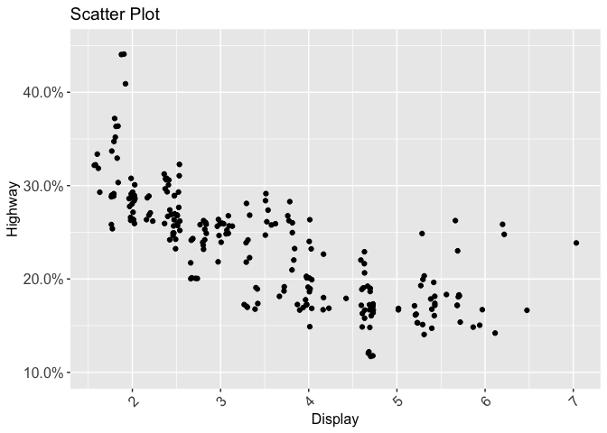<!-- -->


### Labelying X or y axis as percent
### Setting X and Y axis limits


```r
ggplot(mpg) + 
  geom_jitter(mapping = aes(x=displ, y = hwy/100)) +
  scale_y_continuous(labels = scales::percent, limits = c(.10, .45))
```

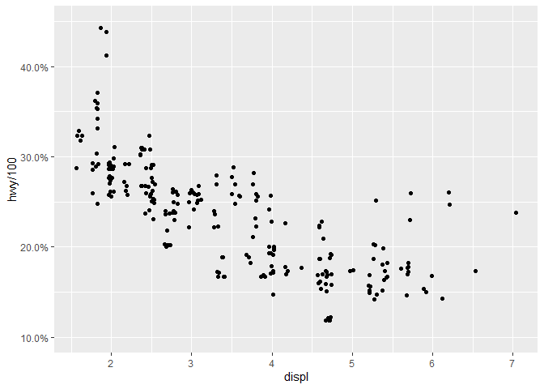<!-- -->


Aids the eye in seeing patterns in the presence of overplotting. geom_smooth() and stat_smooth() are effectively aliases: they both use the same arguments. Use stat_smooth() if you want to display the results with a non-standard geom.


```r
ggplot(mpg) + 
  geom_smooth(mapping = aes(x=displ, y = hwy))
```

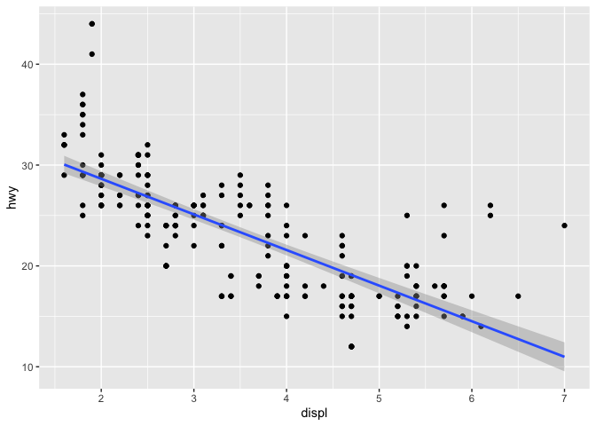<!-- -->

```r
ggplot(mpg) + 
  geom_smooth(mapping = aes(x=displ, y = hwy),method = 'lm')
```

<!-- -->

```r
ggplot(mpg,mapping = aes(x=displ,y=hwy)) +
  geom_jitter(mapping=aes(color=class)) +
  geom_smooth() +
  annotate("rect",xmin=1.5,xmax=2,ymin=40,ymax = 45, color="red", alpha = 0.3) +
  annotate("text",x=3,y=43,label="Let's highlight these \n outliers") +
  ggtitle("Lets lavel our chart","Add your subtitle here")
```

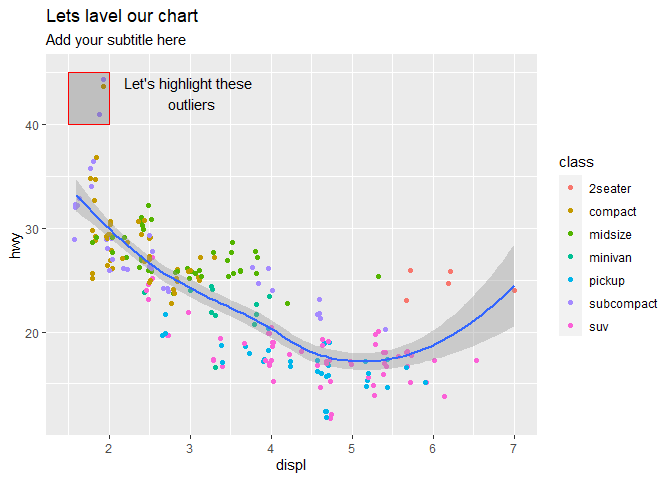<!-- -->

```r
who_events <- tribble(
  ~ date, ~ event,
  "2020-01-30", "Global health\nemergency declared",
  "2020-03-11", "Pandemic\ndeclared",
  "2020-02-13", "China reporting\nchange"
) %>%
  mutate(date = as.Date(date))

plt_cum_confirmed_cases_china_vs_world <- ggplot(confirmed_cases_china_vs_world) +
  geom_line(aes(x = date, y = cum_cases, group = is_china, color = is_china)) +
  ylab("Cumulative Confirmed Cases")

plt_cum_confirmed_cases_china_vs_world +
  geom_vline(aes(xintercept = date), data = who_events, linetype = "dashed") +
  geom_text(aes(x = date ,label = event), data = who_events, y = 35000)
```

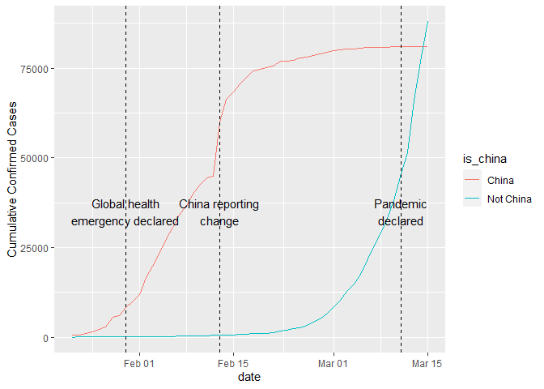<!-- -->

```r
# Filter for China, from Feb 15
china_after_feb15 <- confirmed_cases_china_vs_world %>%
  filter(is_china == "China", date >= "2020-02-15")

# Using china_after_feb15, draw a line plot cum_cases vs. date
# Add a smooth trend line using linear regression, no error bars
ggplot(china_after_feb15, aes(x = date, y = cum_cases)) +
  geom_line() +
  geom_smooth(method = "lm", se = FALSE) +
  ylab("Cumulative confirmed cases")
```

<!-- -->

```r
# Filter confirmed_cases_china_vs_world for not China
not_china <- confirmed_cases_china_vs_world  %>% 
    filter(is_china != 'China')

# Using not_china, draw a line plot cum_cases vs. date
# Add a smooth trend line using linear regression, no error bars
plt_not_china_trend_lin <- ggplot(not_china, aes(x = date, y = cum_cases)) +
  geom_line() +
  geom_smooth(method = "lm", se = FALSE) +
  ylab("Cumulative confirmed cases")

# See the result
plt_not_china_trend_lin 
```

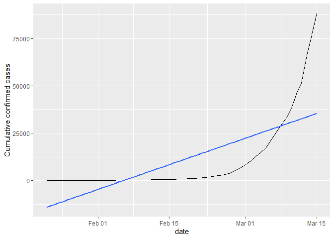<!-- -->

```r
### From the plot above, we can see a straight line does not fit well at all, and the rest of the world is growing much faster 
### than linearly. What if we added a logarithmic scale to the y-axis?

plt_not_china_trend_lin + 
  scale_y_log10()
```

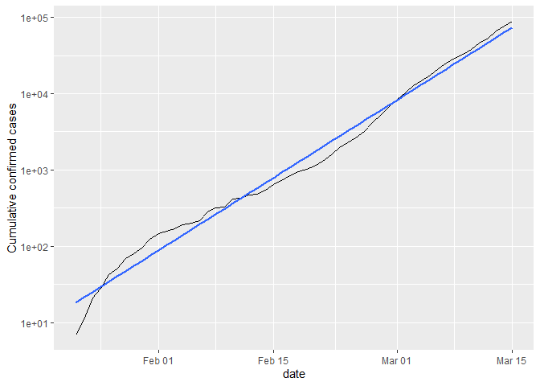<!-- -->

```r
ggplot(mpg) + 
  geom_jitter(aes(x=displ, y = hwy,color=class)) +
  facet_wrap(~class)
```

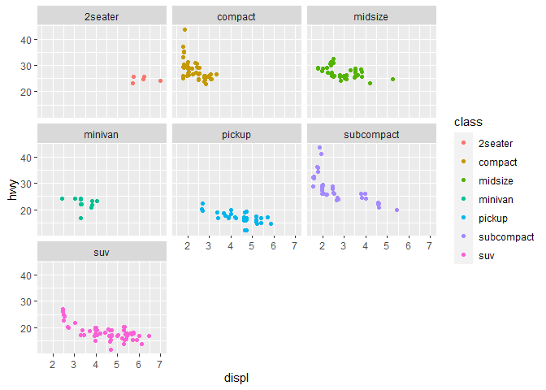<!-- -->

```r
ggplot(mpg) + 
  geom_jitter(aes(x=displ, y = hwy,color=class)) +
  facet_wrap(year~class)
```

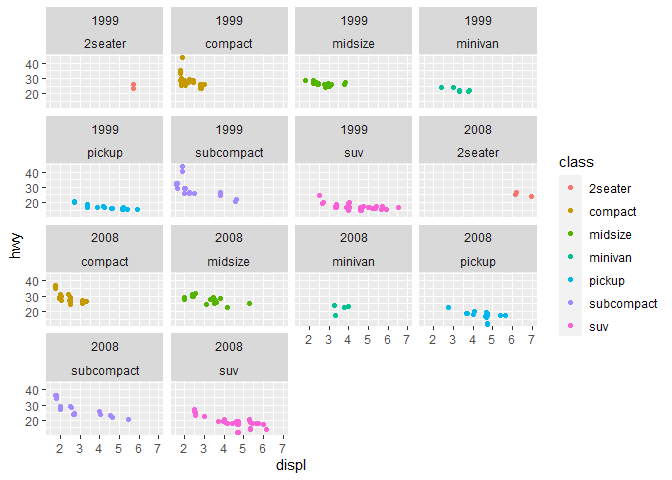<!-- -->


```r
#***************************************************************************
### Interactive Data Tables
### https://www.udemy.com/course/r-tidyverse-reporting-and-analytics-for-excel-users/learn/lecture/8797450#overview

library(DT)

mpg %>% datatable()
```

<!--html_preserve--><div id="htmlwidget-c2b1e099c870936dffeb" style="width:100%;height:auto;" class="datatables html-widget"></div>
<script type="application/json" data-for="htmlwidget-c2b1e099c870936dffeb">{"x":{"filter":"none","data":[["1","2","3","4","5","6","7","8","9","10","11","12","13","14","15","16","17","18","19","20","21","22","23","24","25","26","27","28","29","30","31","32","33","34","35","36","37","38","39","40","41","42","43","44","45","46","47","48","49","50","51","52","53","54","55","56","57","58","59","60","61","62","63","64","65","66","67","68","69","70","71","72","73","74","75","76","77","78","79","80","81","82","83","84","85","86","87","88","89","90","91","92","93","94","95","96","97","98","99","100","101","102","103","104","105","106","107","108","109","110","111","112","113","114","115","116","117","118","119","120","121","122","123","124","125","126","127","128","129","130","131","132","133","134","135","136","137","138","139","140","141","142","143","144","145","146","147","148","149","150","151","152","153","154","155","156","157","158","159","160","161","162","163","164","165","166","167","168","169","170","171","172","173","174","175","176","177","178","179","180","181","182","183","184","185","186","187","188","189","190","191","192","193","194","195","196","197","198","199","200","201","202","203","204","205","206","207","208","209","210","211","212","213","214","215","216","217","218","219","220","221","222","223","224","225","226","227","228","229","230","231","232","233","234"],["audi","audi","audi","audi","audi","audi","audi","audi","audi","audi","audi","audi","audi","audi","audi","audi","audi","audi","chevrolet","chevrolet","chevrolet","chevrolet","chevrolet","chevrolet","chevrolet","chevrolet","chevrolet","chevrolet","chevrolet","chevrolet","chevrolet","chevrolet","chevrolet","chevrolet","chevrolet","chevrolet","chevrolet","dodge","dodge","dodge","dodge","dodge","dodge","dodge","dodge","dodge","dodge","dodge","dodge","dodge","dodge","dodge","dodge","dodge","dodge","dodge","dodge","dodge","dodge","dodge","dodge","dodge","dodge","dodge","dodge","dodge","dodge","dodge","dodge","dodge","dodge","dodge","dodge","dodge","ford","ford","ford","ford","ford","ford","ford","ford","ford","ford","ford","ford","ford","ford","ford","ford","ford","ford","ford","ford","ford","ford","ford","ford","ford","honda","honda","honda","honda","honda","honda","honda","honda","honda","hyundai","hyundai","hyundai","hyundai","hyundai","hyundai","hyundai","hyundai","hyundai","hyundai","hyundai","hyundai","hyundai","hyundai","jeep","jeep","jeep","jeep","jeep","jeep","jeep","jeep","land rover","land rover","land rover","land rover","lincoln","lincoln","lincoln","mercury","mercury","mercury","mercury","nissan","nissan","nissan","nissan","nissan","nissan","nissan","nissan","nissan","nissan","nissan","nissan","nissan","pontiac","pontiac","pontiac","pontiac","pontiac","subaru","subaru","subaru","subaru","subaru","subaru","subaru","subaru","subaru","subaru","subaru","subaru","subaru","subaru","toyota","toyota","toyota","toyota","toyota","toyota","toyota","toyota","toyota","toyota","toyota","toyota","toyota","toyota","toyota","toyota","toyota","toyota","toyota","toyota","toyota","toyota","toyota","toyota","toyota","toyota","toyota","toyota","toyota","toyota","toyota","toyota","toyota","toyota","volkswagen","volkswagen","volkswagen","volkswagen","volkswagen","volkswagen","volkswagen","volkswagen","volkswagen","volkswagen","volkswagen","volkswagen","volkswagen","volkswagen","volkswagen","volkswagen","volkswagen","volkswagen","volkswagen","volkswagen","volkswagen","volkswagen","volkswagen","volkswagen","volkswagen","volkswagen","volkswagen"],["a4","a4","a4","a4","a4","a4","a4","a4 quattro","a4 quattro","a4 quattro","a4 quattro","a4 quattro","a4 quattro","a4 quattro","a4 quattro","a6 quattro","a6 quattro","a6 quattro","c1500 suburban 2wd","c1500 suburban 2wd","c1500 suburban 2wd","c1500 suburban 2wd","c1500 suburban 2wd","corvette","corvette","corvette","corvette","corvette","k1500 tahoe 4wd","k1500 tahoe 4wd","k1500 tahoe 4wd","k1500 tahoe 4wd","malibu","malibu","malibu","malibu","malibu","caravan 2wd","caravan 2wd","caravan 2wd","caravan 2wd","caravan 2wd","caravan 2wd","caravan 2wd","caravan 2wd","caravan 2wd","caravan 2wd","caravan 2wd","dakota pickup 4wd","dakota pickup 4wd","dakota pickup 4wd","dakota pickup 4wd","dakota pickup 4wd","dakota pickup 4wd","dakota pickup 4wd","dakota pickup 4wd","dakota pickup 4wd","durango 4wd","durango 4wd","durango 4wd","durango 4wd","durango 4wd","durango 4wd","durango 4wd","ram 1500 pickup 4wd","ram 1500 pickup 4wd","ram 1500 pickup 4wd","ram 1500 pickup 4wd","ram 1500 pickup 4wd","ram 1500 pickup 4wd","ram 1500 pickup 4wd","ram 1500 pickup 4wd","ram 1500 pickup 4wd","ram 1500 pickup 4wd","expedition 2wd","expedition 2wd","expedition 2wd","explorer 4wd","explorer 4wd","explorer 4wd","explorer 4wd","explorer 4wd","explorer 4wd","f150 pickup 4wd","f150 pickup 4wd","f150 pickup 4wd","f150 pickup 4wd","f150 pickup 4wd","f150 pickup 4wd","f150 pickup 4wd","mustang","mustang","mustang","mustang","mustang","mustang","mustang","mustang","mustang","civic","civic","civic","civic","civic","civic","civic","civic","civic","sonata","sonata","sonata","sonata","sonata","sonata","sonata","tiburon","tiburon","tiburon","tiburon","tiburon","tiburon","tiburon","grand cherokee 4wd","grand cherokee 4wd","grand cherokee 4wd","grand cherokee 4wd","grand cherokee 4wd","grand cherokee 4wd","grand cherokee 4wd","grand cherokee 4wd","range rover","range rover","range rover","range rover","navigator 2wd","navigator 2wd","navigator 2wd","mountaineer 4wd","mountaineer 4wd","mountaineer 4wd","mountaineer 4wd","altima","altima","altima","altima","altima","altima","maxima","maxima","maxima","pathfinder 4wd","pathfinder 4wd","pathfinder 4wd","pathfinder 4wd","grand prix","grand prix","grand prix","grand prix","grand prix","forester awd","forester awd","forester awd","forester awd","forester awd","forester awd","impreza awd","impreza awd","impreza awd","impreza awd","impreza awd","impreza awd","impreza awd","impreza awd","4runner 4wd","4runner 4wd","4runner 4wd","4runner 4wd","4runner 4wd","4runner 4wd","camry","camry","camry","camry","camry","camry","camry","camry solara","camry solara","camry solara","camry solara","camry solara","camry solara","camry solara","corolla","corolla","corolla","corolla","corolla","land cruiser wagon 4wd","land cruiser wagon 4wd","toyota tacoma 4wd","toyota tacoma 4wd","toyota tacoma 4wd","toyota tacoma 4wd","toyota tacoma 4wd","toyota tacoma 4wd","toyota tacoma 4wd","gti","gti","gti","gti","gti","jetta","jetta","jetta","jetta","jetta","jetta","jetta","jetta","jetta","new beetle","new beetle","new beetle","new beetle","new beetle","new beetle","passat","passat","passat","passat","passat","passat","passat"],[1.8,1.8,2,2,2.8,2.8,3.1,1.8,1.8,2,2,2.8,2.8,3.1,3.1,2.8,3.1,4.2,5.3,5.3,5.3,5.7,6,5.7,5.7,6.2,6.2,7,5.3,5.3,5.7,6.5,2.4,2.4,3.1,3.5,3.6,2.4,3,3.3,3.3,3.3,3.3,3.3,3.8,3.8,3.8,4,3.7,3.7,3.9,3.9,4.7,4.7,4.7,5.2,5.2,3.9,4.7,4.7,4.7,5.2,5.7,5.9,4.7,4.7,4.7,4.7,4.7,4.7,5.2,5.2,5.7,5.9,4.6,5.4,5.4,4,4,4,4,4.6,5,4.2,4.2,4.6,4.6,4.6,5.4,5.4,3.8,3.8,4,4,4.6,4.6,4.6,4.6,5.4,1.6,1.6,1.6,1.6,1.6,1.8,1.8,1.8,2,2.4,2.4,2.4,2.4,2.5,2.5,3.3,2,2,2,2,2.7,2.7,2.7,3,3.7,4,4.7,4.7,4.7,5.7,6.1,4,4.2,4.4,4.6,5.4,5.4,5.4,4,4,4.6,5,2.4,2.4,2.5,2.5,3.5,3.5,3,3,3.5,3.3,3.3,4,5.6,3.1,3.8,3.8,3.8,5.3,2.5,2.5,2.5,2.5,2.5,2.5,2.2,2.2,2.5,2.5,2.5,2.5,2.5,2.5,2.7,2.7,3.4,3.4,4,4.7,2.2,2.2,2.4,2.4,3,3,3.5,2.2,2.2,2.4,2.4,3,3,3.3,1.8,1.8,1.8,1.8,1.8,4.7,5.7,2.7,2.7,2.7,3.4,3.4,4,4,2,2,2,2,2.8,1.9,2,2,2,2,2.5,2.5,2.8,2.8,1.9,1.9,2,2,2.5,2.5,1.8,1.8,2,2,2.8,2.8,3.6],[1999,1999,2008,2008,1999,1999,2008,1999,1999,2008,2008,1999,1999,2008,2008,1999,2008,2008,2008,2008,2008,1999,2008,1999,1999,2008,2008,2008,2008,2008,1999,1999,1999,2008,1999,2008,2008,1999,1999,1999,1999,2008,2008,2008,1999,1999,2008,2008,2008,2008,1999,1999,2008,2008,2008,1999,1999,1999,2008,2008,2008,1999,2008,1999,2008,2008,2008,2008,2008,2008,1999,1999,2008,1999,1999,1999,2008,1999,1999,1999,2008,2008,1999,1999,1999,1999,1999,2008,1999,2008,1999,1999,2008,2008,1999,1999,2008,2008,2008,1999,1999,1999,1999,1999,2008,2008,2008,2008,1999,1999,2008,2008,1999,1999,2008,1999,1999,2008,2008,2008,2008,2008,2008,2008,1999,1999,2008,2008,2008,2008,1999,2008,2008,1999,1999,1999,2008,1999,2008,2008,1999,1999,1999,2008,2008,2008,2008,1999,1999,2008,1999,1999,2008,2008,1999,1999,1999,2008,2008,1999,1999,2008,2008,2008,2008,1999,1999,1999,1999,2008,2008,2008,2008,1999,1999,1999,1999,2008,2008,1999,1999,2008,2008,1999,1999,2008,1999,1999,2008,2008,1999,1999,2008,1999,1999,1999,2008,2008,1999,2008,1999,1999,2008,1999,1999,2008,2008,1999,1999,2008,2008,1999,1999,1999,1999,2008,2008,2008,2008,1999,1999,1999,1999,1999,1999,2008,2008,1999,1999,2008,2008,1999,1999,2008],[4,4,4,4,6,6,6,4,4,4,4,6,6,6,6,6,6,8,8,8,8,8,8,8,8,8,8,8,8,8,8,8,4,4,6,6,6,4,6,6,6,6,6,6,6,6,6,6,6,6,6,6,8,8,8,8,8,6,8,8,8,8,8,8,8,8,8,8,8,8,8,8,8,8,8,8,8,6,6,6,6,8,8,6,6,8,8,8,8,8,6,6,6,6,8,8,8,8,8,4,4,4,4,4,4,4,4,4,4,4,4,4,6,6,6,4,4,4,4,6,6,6,6,6,6,8,8,8,8,8,8,8,8,8,8,8,8,6,6,8,8,4,4,4,4,6,6,6,6,6,6,6,6,8,6,6,6,6,8,4,4,4,4,4,4,4,4,4,4,4,4,4,4,4,4,6,6,6,8,4,4,4,4,6,6,6,4,4,4,4,6,6,6,4,4,4,4,4,8,8,4,4,4,6,6,6,6,4,4,4,4,6,4,4,4,4,4,5,5,6,6,4,4,4,4,5,5,4,4,4,4,6,6,6],["auto(l5)","manual(m5)","manual(m6)","auto(av)","auto(l5)","manual(m5)","auto(av)","manual(m5)","auto(l5)","manual(m6)","auto(s6)","auto(l5)","manual(m5)","auto(s6)","manual(m6)","auto(l5)","auto(s6)","auto(s6)","auto(l4)","auto(l4)","auto(l4)","auto(l4)","auto(l4)","manual(m6)","auto(l4)","manual(m6)","auto(s6)","manual(m6)","auto(l4)","auto(l4)","auto(l4)","auto(l4)","auto(l4)","auto(l4)","auto(l4)","auto(l4)","auto(s6)","auto(l3)","auto(l4)","auto(l4)","auto(l4)","auto(l4)","auto(l4)","auto(l4)","auto(l4)","auto(l4)","auto(l6)","auto(l6)","manual(m6)","auto(l4)","auto(l4)","manual(m5)","auto(l5)","auto(l5)","auto(l5)","manual(m5)","auto(l4)","auto(l4)","auto(l5)","auto(l5)","auto(l5)","auto(l4)","auto(l5)","auto(l4)","manual(m6)","auto(l5)","auto(l5)","auto(l5)","manual(m6)","manual(m6)","auto(l4)","manual(m5)","auto(l5)","auto(l4)","auto(l4)","auto(l4)","auto(l6)","auto(l5)","manual(m5)","auto(l5)","auto(l5)","auto(l6)","auto(l4)","auto(l4)","manual(m5)","manual(m5)","auto(l4)","auto(l4)","auto(l4)","auto(l4)","manual(m5)","auto(l4)","manual(m5)","auto(l5)","auto(l4)","manual(m5)","manual(m5)","auto(l5)","manual(m6)","manual(m5)","auto(l4)","manual(m5)","manual(m5)","auto(l4)","manual(m5)","auto(l5)","auto(l5)","manual(m6)","auto(l4)","manual(m5)","auto(l4)","manual(m5)","auto(l4)","manual(m5)","auto(l5)","auto(l4)","manual(m5)","manual(m5)","auto(l4)","auto(l4)","manual(m6)","manual(m5)","auto(l5)","auto(l5)","auto(l4)","auto(l4)","auto(l5)","auto(l5)","auto(l5)","auto(l5)","auto(l4)","auto(s6)","auto(s6)","auto(l4)","auto(l4)","auto(l4)","auto(l6)","auto(l5)","auto(l5)","auto(l6)","auto(l4)","manual(m5)","auto(l4)","auto(av)","manual(m6)","manual(m6)","auto(av)","auto(l4)","manual(m5)","auto(av)","auto(l4)","manual(m5)","auto(l5)","auto(s5)","auto(l4)","auto(l4)","auto(l4)","auto(l4)","auto(s4)","manual(m5)","auto(l4)","manual(m5)","manual(m5)","auto(l4)","auto(l4)","auto(l4)","manual(m5)","manual(m5)","auto(l4)","auto(s4)","auto(s4)","manual(m5)","manual(m5)","manual(m5)","auto(l4)","auto(l4)","manual(m5)","auto(l5)","auto(l5)","manual(m5)","auto(l4)","manual(m5)","auto(l5)","auto(l4)","manual(m5)","auto(s6)","auto(l4)","manual(m5)","manual(m5)","auto(s5)","auto(l4)","manual(m5)","auto(s5)","auto(l3)","auto(l4)","manual(m5)","manual(m5)","auto(l4)","auto(l4)","auto(s6)","manual(m5)","auto(l4)","manual(m5)","manual(m5)","auto(l4)","manual(m6)","auto(l5)","manual(m5)","auto(l4)","manual(m6)","auto(s6)","manual(m5)","manual(m5)","manual(m5)","auto(l4)","auto(s6)","manual(m6)","auto(s6)","manual(m5)","auto(l4)","manual(m5)","manual(m5)","auto(l4)","manual(m5)","auto(l4)","manual(m5)","auto(s6)","manual(m5)","auto(l5)","auto(s6)","manual(m6)","auto(l5)","manual(m5)","auto(s6)"],["f","f","f","f","f","f","f","4","4","4","4","4","4","4","4","4","4","4","r","r","r","r","r","r","r","r","r","r","4","4","4","4","f","f","f","f","f","f","f","f","f","f","f","f","f","f","f","f","4","4","4","4","4","4","4","4","4","4","4","4","4","4","4","4","4","4","4","4","4","4","4","4","4","4","r","r","r","4","4","4","4","4","4","4","4","4","4","4","4","4","r","r","r","r","r","r","r","r","r","f","f","f","f","f","f","f","f","f","f","f","f","f","f","f","f","f","f","f","f","f","f","f","4","4","4","4","4","4","4","4","4","4","4","4","r","r","r","4","4","4","4","f","f","f","f","f","f","f","f","f","4","4","4","4","f","f","f","f","f","4","4","4","4","4","4","4","4","4","4","4","4","4","4","4","4","4","4","4","4","f","f","f","f","f","f","f","f","f","f","f","f","f","f","f","f","f","f","f","4","4","4","4","4","4","4","4","4","f","f","f","f","f","f","f","f","f","f","f","f","f","f","f","f","f","f","f","f","f","f","f","f","f","f","f"],[18,21,20,21,16,18,18,18,16,20,19,15,17,17,15,15,17,16,14,11,14,13,12,16,15,16,15,15,14,11,11,14,19,22,18,18,17,18,17,16,16,17,17,11,15,15,16,16,15,14,13,14,14,14,9,11,11,13,13,9,13,11,13,11,12,9,13,13,12,9,11,11,13,11,11,11,12,14,15,14,13,13,13,14,14,13,13,13,11,13,18,18,17,16,15,15,15,15,14,28,24,25,23,24,26,25,24,21,18,18,21,21,18,18,19,19,19,20,20,17,16,17,17,15,15,14,9,14,13,11,11,12,12,11,11,11,12,14,13,13,13,21,19,23,23,19,19,18,19,19,14,15,14,12,18,16,17,18,16,18,18,20,19,20,18,21,19,19,19,20,20,19,20,15,16,15,15,16,14,21,21,21,21,18,18,19,21,21,21,22,18,18,18,24,24,26,28,26,11,13,15,16,17,15,15,15,16,21,19,21,22,17,33,21,19,22,21,21,21,16,17,35,29,21,19,20,20,21,18,19,21,16,18,17],[29,29,31,30,26,26,27,26,25,28,27,25,25,25,25,24,25,23,20,15,20,17,17,26,23,26,25,24,19,14,15,17,27,30,26,29,26,24,24,22,22,24,24,17,22,21,23,23,19,18,17,17,19,19,12,17,15,17,17,12,17,16,18,15,16,12,17,17,16,12,15,16,17,15,17,17,18,17,19,17,19,19,17,17,17,16,16,17,15,17,26,25,26,24,21,22,23,22,20,33,32,32,29,32,34,36,36,29,26,27,30,31,26,26,28,26,29,28,27,24,24,24,22,19,20,17,12,19,18,14,15,18,18,15,17,16,18,17,19,19,17,29,27,31,32,27,26,26,25,25,17,17,20,18,26,26,27,28,25,25,24,27,25,26,23,26,26,26,26,25,27,25,27,20,20,19,17,20,17,29,27,31,31,26,26,28,27,29,31,31,26,26,27,30,33,35,37,35,15,18,20,20,22,17,19,18,20,29,26,29,29,24,44,29,26,29,29,29,29,23,24,44,41,29,26,28,29,29,29,28,29,26,26,26],["p","p","p","p","p","p","p","p","p","p","p","p","p","p","p","p","p","p","r","e","r","r","r","p","p","p","p","p","r","e","r","d","r","r","r","r","r","r","r","r","r","r","r","e","r","r","r","r","r","r","r","r","r","r","e","r","r","r","r","e","r","r","r","r","r","e","r","r","r","e","r","r","r","r","r","r","r","r","r","r","r","r","r","r","r","r","r","r","r","r","r","r","r","r","r","r","r","r","p","r","r","r","p","r","r","r","c","p","r","r","r","r","r","r","r","r","r","r","r","r","r","r","d","r","r","r","e","r","r","p","p","r","r","p","r","p","r","r","r","r","r","r","r","r","r","p","p","r","r","p","r","r","p","p","r","p","r","r","p","r","r","r","p","r","p","r","r","r","r","p","r","p","r","r","r","r","r","r","r","r","r","r","r","r","r","r","r","r","r","r","r","r","r","r","r","r","r","r","r","r","r","r","r","r","r","r","r","r","r","p","p","r","d","r","r","p","p","r","r","r","r","d","d","r","r","r","r","p","p","p","p","p","p","p"],["compact","compact","compact","compact","compact","compact","compact","compact","compact","compact","compact","compact","compact","compact","compact","midsize","midsize","midsize","suv","suv","suv","suv","suv","2seater","2seater","2seater","2seater","2seater","suv","suv","suv","suv","midsize","midsize","midsize","midsize","midsize","minivan","minivan","minivan","minivan","minivan","minivan","minivan","minivan","minivan","minivan","minivan","pickup","pickup","pickup","pickup","pickup","pickup","pickup","pickup","pickup","suv","suv","suv","suv","suv","suv","suv","pickup","pickup","pickup","pickup","pickup","pickup","pickup","pickup","pickup","pickup","suv","suv","suv","suv","suv","suv","suv","suv","suv","pickup","pickup","pickup","pickup","pickup","pickup","pickup","subcompact","subcompact","subcompact","subcompact","subcompact","subcompact","subcompact","subcompact","subcompact","subcompact","subcompact","subcompact","subcompact","subcompact","subcompact","subcompact","subcompact","subcompact","midsize","midsize","midsize","midsize","midsize","midsize","midsize","subcompact","subcompact","subcompact","subcompact","subcompact","subcompact","subcompact","suv","suv","suv","suv","suv","suv","suv","suv","suv","suv","suv","suv","suv","suv","suv","suv","suv","suv","suv","compact","compact","midsize","midsize","midsize","midsize","midsize","midsize","midsize","suv","suv","suv","suv","midsize","midsize","midsize","midsize","midsize","suv","suv","suv","suv","suv","suv","subcompact","subcompact","subcompact","subcompact","compact","compact","compact","compact","suv","suv","suv","suv","suv","suv","midsize","midsize","midsize","midsize","midsize","midsize","midsize","compact","compact","compact","compact","compact","compact","compact","compact","compact","compact","compact","compact","suv","suv","pickup","pickup","pickup","pickup","pickup","pickup","pickup","compact","compact","compact","compact","compact","compact","compact","compact","compact","compact","compact","compact","compact","compact","subcompact","subcompact","subcompact","subcompact","subcompact","subcompact","midsize","midsize","midsize","midsize","midsize","midsize","midsize"]],"container":"<table class=\"display\">\n  <thead>\n    <tr>\n      <th> <\/th>\n      <th>manufacturer<\/th>\n      <th>model<\/th>\n      <th>displ<\/th>\n      <th>year<\/th>\n      <th>cyl<\/th>\n      <th>trans<\/th>\n      <th>drv<\/th>\n      <th>cty<\/th>\n      <th>hwy<\/th>\n      <th>fl<\/th>\n      <th>class<\/th>\n    <\/tr>\n  <\/thead>\n<\/table>","options":{"columnDefs":[{"className":"dt-right","targets":[3,4,5,8,9]},{"orderable":false,"targets":0}],"order":[],"autoWidth":false,"orderClasses":false}},"evals":[],"jsHooks":[]}</script><!--/html_preserve-->

```r
mpg %>% datatable(rownames = F)
```

<!--html_preserve--><div id="htmlwidget-34e0178deed085fb63c8" style="width:100%;height:auto;" class="datatables html-widget"></div>
<script type="application/json" data-for="htmlwidget-34e0178deed085fb63c8">{"x":{"filter":"none","data":[["audi","audi","audi","audi","audi","audi","audi","audi","audi","audi","audi","audi","audi","audi","audi","audi","audi","audi","chevrolet","chevrolet","chevrolet","chevrolet","chevrolet","chevrolet","chevrolet","chevrolet","chevrolet","chevrolet","chevrolet","chevrolet","chevrolet","chevrolet","chevrolet","chevrolet","chevrolet","chevrolet","chevrolet","dodge","dodge","dodge","dodge","dodge","dodge","dodge","dodge","dodge","dodge","dodge","dodge","dodge","dodge","dodge","dodge","dodge","dodge","dodge","dodge","dodge","dodge","dodge","dodge","dodge","dodge","dodge","dodge","dodge","dodge","dodge","dodge","dodge","dodge","dodge","dodge","dodge","ford","ford","ford","ford","ford","ford","ford","ford","ford","ford","ford","ford","ford","ford","ford","ford","ford","ford","ford","ford","ford","ford","ford","ford","ford","honda","honda","honda","honda","honda","honda","honda","honda","honda","hyundai","hyundai","hyundai","hyundai","hyundai","hyundai","hyundai","hyundai","hyundai","hyundai","hyundai","hyundai","hyundai","hyundai","jeep","jeep","jeep","jeep","jeep","jeep","jeep","jeep","land rover","land rover","land rover","land rover","lincoln","lincoln","lincoln","mercury","mercury","mercury","mercury","nissan","nissan","nissan","nissan","nissan","nissan","nissan","nissan","nissan","nissan","nissan","nissan","nissan","pontiac","pontiac","pontiac","pontiac","pontiac","subaru","subaru","subaru","subaru","subaru","subaru","subaru","subaru","subaru","subaru","subaru","subaru","subaru","subaru","toyota","toyota","toyota","toyota","toyota","toyota","toyota","toyota","toyota","toyota","toyota","toyota","toyota","toyota","toyota","toyota","toyota","toyota","toyota","toyota","toyota","toyota","toyota","toyota","toyota","toyota","toyota","toyota","toyota","toyota","toyota","toyota","toyota","toyota","volkswagen","volkswagen","volkswagen","volkswagen","volkswagen","volkswagen","volkswagen","volkswagen","volkswagen","volkswagen","volkswagen","volkswagen","volkswagen","volkswagen","volkswagen","volkswagen","volkswagen","volkswagen","volkswagen","volkswagen","volkswagen","volkswagen","volkswagen","volkswagen","volkswagen","volkswagen","volkswagen"],["a4","a4","a4","a4","a4","a4","a4","a4 quattro","a4 quattro","a4 quattro","a4 quattro","a4 quattro","a4 quattro","a4 quattro","a4 quattro","a6 quattro","a6 quattro","a6 quattro","c1500 suburban 2wd","c1500 suburban 2wd","c1500 suburban 2wd","c1500 suburban 2wd","c1500 suburban 2wd","corvette","corvette","corvette","corvette","corvette","k1500 tahoe 4wd","k1500 tahoe 4wd","k1500 tahoe 4wd","k1500 tahoe 4wd","malibu","malibu","malibu","malibu","malibu","caravan 2wd","caravan 2wd","caravan 2wd","caravan 2wd","caravan 2wd","caravan 2wd","caravan 2wd","caravan 2wd","caravan 2wd","caravan 2wd","caravan 2wd","dakota pickup 4wd","dakota pickup 4wd","dakota pickup 4wd","dakota pickup 4wd","dakota pickup 4wd","dakota pickup 4wd","dakota pickup 4wd","dakota pickup 4wd","dakota pickup 4wd","durango 4wd","durango 4wd","durango 4wd","durango 4wd","durango 4wd","durango 4wd","durango 4wd","ram 1500 pickup 4wd","ram 1500 pickup 4wd","ram 1500 pickup 4wd","ram 1500 pickup 4wd","ram 1500 pickup 4wd","ram 1500 pickup 4wd","ram 1500 pickup 4wd","ram 1500 pickup 4wd","ram 1500 pickup 4wd","ram 1500 pickup 4wd","expedition 2wd","expedition 2wd","expedition 2wd","explorer 4wd","explorer 4wd","explorer 4wd","explorer 4wd","explorer 4wd","explorer 4wd","f150 pickup 4wd","f150 pickup 4wd","f150 pickup 4wd","f150 pickup 4wd","f150 pickup 4wd","f150 pickup 4wd","f150 pickup 4wd","mustang","mustang","mustang","mustang","mustang","mustang","mustang","mustang","mustang","civic","civic","civic","civic","civic","civic","civic","civic","civic","sonata","sonata","sonata","sonata","sonata","sonata","sonata","tiburon","tiburon","tiburon","tiburon","tiburon","tiburon","tiburon","grand cherokee 4wd","grand cherokee 4wd","grand cherokee 4wd","grand cherokee 4wd","grand cherokee 4wd","grand cherokee 4wd","grand cherokee 4wd","grand cherokee 4wd","range rover","range rover","range rover","range rover","navigator 2wd","navigator 2wd","navigator 2wd","mountaineer 4wd","mountaineer 4wd","mountaineer 4wd","mountaineer 4wd","altima","altima","altima","altima","altima","altima","maxima","maxima","maxima","pathfinder 4wd","pathfinder 4wd","pathfinder 4wd","pathfinder 4wd","grand prix","grand prix","grand prix","grand prix","grand prix","forester awd","forester awd","forester awd","forester awd","forester awd","forester awd","impreza awd","impreza awd","impreza awd","impreza awd","impreza awd","impreza awd","impreza awd","impreza awd","4runner 4wd","4runner 4wd","4runner 4wd","4runner 4wd","4runner 4wd","4runner 4wd","camry","camry","camry","camry","camry","camry","camry","camry solara","camry solara","camry solara","camry solara","camry solara","camry solara","camry solara","corolla","corolla","corolla","corolla","corolla","land cruiser wagon 4wd","land cruiser wagon 4wd","toyota tacoma 4wd","toyota tacoma 4wd","toyota tacoma 4wd","toyota tacoma 4wd","toyota tacoma 4wd","toyota tacoma 4wd","toyota tacoma 4wd","gti","gti","gti","gti","gti","jetta","jetta","jetta","jetta","jetta","jetta","jetta","jetta","jetta","new beetle","new beetle","new beetle","new beetle","new beetle","new beetle","passat","passat","passat","passat","passat","passat","passat"],[1.8,1.8,2,2,2.8,2.8,3.1,1.8,1.8,2,2,2.8,2.8,3.1,3.1,2.8,3.1,4.2,5.3,5.3,5.3,5.7,6,5.7,5.7,6.2,6.2,7,5.3,5.3,5.7,6.5,2.4,2.4,3.1,3.5,3.6,2.4,3,3.3,3.3,3.3,3.3,3.3,3.8,3.8,3.8,4,3.7,3.7,3.9,3.9,4.7,4.7,4.7,5.2,5.2,3.9,4.7,4.7,4.7,5.2,5.7,5.9,4.7,4.7,4.7,4.7,4.7,4.7,5.2,5.2,5.7,5.9,4.6,5.4,5.4,4,4,4,4,4.6,5,4.2,4.2,4.6,4.6,4.6,5.4,5.4,3.8,3.8,4,4,4.6,4.6,4.6,4.6,5.4,1.6,1.6,1.6,1.6,1.6,1.8,1.8,1.8,2,2.4,2.4,2.4,2.4,2.5,2.5,3.3,2,2,2,2,2.7,2.7,2.7,3,3.7,4,4.7,4.7,4.7,5.7,6.1,4,4.2,4.4,4.6,5.4,5.4,5.4,4,4,4.6,5,2.4,2.4,2.5,2.5,3.5,3.5,3,3,3.5,3.3,3.3,4,5.6,3.1,3.8,3.8,3.8,5.3,2.5,2.5,2.5,2.5,2.5,2.5,2.2,2.2,2.5,2.5,2.5,2.5,2.5,2.5,2.7,2.7,3.4,3.4,4,4.7,2.2,2.2,2.4,2.4,3,3,3.5,2.2,2.2,2.4,2.4,3,3,3.3,1.8,1.8,1.8,1.8,1.8,4.7,5.7,2.7,2.7,2.7,3.4,3.4,4,4,2,2,2,2,2.8,1.9,2,2,2,2,2.5,2.5,2.8,2.8,1.9,1.9,2,2,2.5,2.5,1.8,1.8,2,2,2.8,2.8,3.6],[1999,1999,2008,2008,1999,1999,2008,1999,1999,2008,2008,1999,1999,2008,2008,1999,2008,2008,2008,2008,2008,1999,2008,1999,1999,2008,2008,2008,2008,2008,1999,1999,1999,2008,1999,2008,2008,1999,1999,1999,1999,2008,2008,2008,1999,1999,2008,2008,2008,2008,1999,1999,2008,2008,2008,1999,1999,1999,2008,2008,2008,1999,2008,1999,2008,2008,2008,2008,2008,2008,1999,1999,2008,1999,1999,1999,2008,1999,1999,1999,2008,2008,1999,1999,1999,1999,1999,2008,1999,2008,1999,1999,2008,2008,1999,1999,2008,2008,2008,1999,1999,1999,1999,1999,2008,2008,2008,2008,1999,1999,2008,2008,1999,1999,2008,1999,1999,2008,2008,2008,2008,2008,2008,2008,1999,1999,2008,2008,2008,2008,1999,2008,2008,1999,1999,1999,2008,1999,2008,2008,1999,1999,1999,2008,2008,2008,2008,1999,1999,2008,1999,1999,2008,2008,1999,1999,1999,2008,2008,1999,1999,2008,2008,2008,2008,1999,1999,1999,1999,2008,2008,2008,2008,1999,1999,1999,1999,2008,2008,1999,1999,2008,2008,1999,1999,2008,1999,1999,2008,2008,1999,1999,2008,1999,1999,1999,2008,2008,1999,2008,1999,1999,2008,1999,1999,2008,2008,1999,1999,2008,2008,1999,1999,1999,1999,2008,2008,2008,2008,1999,1999,1999,1999,1999,1999,2008,2008,1999,1999,2008,2008,1999,1999,2008],[4,4,4,4,6,6,6,4,4,4,4,6,6,6,6,6,6,8,8,8,8,8,8,8,8,8,8,8,8,8,8,8,4,4,6,6,6,4,6,6,6,6,6,6,6,6,6,6,6,6,6,6,8,8,8,8,8,6,8,8,8,8,8,8,8,8,8,8,8,8,8,8,8,8,8,8,8,6,6,6,6,8,8,6,6,8,8,8,8,8,6,6,6,6,8,8,8,8,8,4,4,4,4,4,4,4,4,4,4,4,4,4,6,6,6,4,4,4,4,6,6,6,6,6,6,8,8,8,8,8,8,8,8,8,8,8,8,6,6,8,8,4,4,4,4,6,6,6,6,6,6,6,6,8,6,6,6,6,8,4,4,4,4,4,4,4,4,4,4,4,4,4,4,4,4,6,6,6,8,4,4,4,4,6,6,6,4,4,4,4,6,6,6,4,4,4,4,4,8,8,4,4,4,6,6,6,6,4,4,4,4,6,4,4,4,4,4,5,5,6,6,4,4,4,4,5,5,4,4,4,4,6,6,6],["auto(l5)","manual(m5)","manual(m6)","auto(av)","auto(l5)","manual(m5)","auto(av)","manual(m5)","auto(l5)","manual(m6)","auto(s6)","auto(l5)","manual(m5)","auto(s6)","manual(m6)","auto(l5)","auto(s6)","auto(s6)","auto(l4)","auto(l4)","auto(l4)","auto(l4)","auto(l4)","manual(m6)","auto(l4)","manual(m6)","auto(s6)","manual(m6)","auto(l4)","auto(l4)","auto(l4)","auto(l4)","auto(l4)","auto(l4)","auto(l4)","auto(l4)","auto(s6)","auto(l3)","auto(l4)","auto(l4)","auto(l4)","auto(l4)","auto(l4)","auto(l4)","auto(l4)","auto(l4)","auto(l6)","auto(l6)","manual(m6)","auto(l4)","auto(l4)","manual(m5)","auto(l5)","auto(l5)","auto(l5)","manual(m5)","auto(l4)","auto(l4)","auto(l5)","auto(l5)","auto(l5)","auto(l4)","auto(l5)","auto(l4)","manual(m6)","auto(l5)","auto(l5)","auto(l5)","manual(m6)","manual(m6)","auto(l4)","manual(m5)","auto(l5)","auto(l4)","auto(l4)","auto(l4)","auto(l6)","auto(l5)","manual(m5)","auto(l5)","auto(l5)","auto(l6)","auto(l4)","auto(l4)","manual(m5)","manual(m5)","auto(l4)","auto(l4)","auto(l4)","auto(l4)","manual(m5)","auto(l4)","manual(m5)","auto(l5)","auto(l4)","manual(m5)","manual(m5)","auto(l5)","manual(m6)","manual(m5)","auto(l4)","manual(m5)","manual(m5)","auto(l4)","manual(m5)","auto(l5)","auto(l5)","manual(m6)","auto(l4)","manual(m5)","auto(l4)","manual(m5)","auto(l4)","manual(m5)","auto(l5)","auto(l4)","manual(m5)","manual(m5)","auto(l4)","auto(l4)","manual(m6)","manual(m5)","auto(l5)","auto(l5)","auto(l4)","auto(l4)","auto(l5)","auto(l5)","auto(l5)","auto(l5)","auto(l4)","auto(s6)","auto(s6)","auto(l4)","auto(l4)","auto(l4)","auto(l6)","auto(l5)","auto(l5)","auto(l6)","auto(l4)","manual(m5)","auto(l4)","auto(av)","manual(m6)","manual(m6)","auto(av)","auto(l4)","manual(m5)","auto(av)","auto(l4)","manual(m5)","auto(l5)","auto(s5)","auto(l4)","auto(l4)","auto(l4)","auto(l4)","auto(s4)","manual(m5)","auto(l4)","manual(m5)","manual(m5)","auto(l4)","auto(l4)","auto(l4)","manual(m5)","manual(m5)","auto(l4)","auto(s4)","auto(s4)","manual(m5)","manual(m5)","manual(m5)","auto(l4)","auto(l4)","manual(m5)","auto(l5)","auto(l5)","manual(m5)","auto(l4)","manual(m5)","auto(l5)","auto(l4)","manual(m5)","auto(s6)","auto(l4)","manual(m5)","manual(m5)","auto(s5)","auto(l4)","manual(m5)","auto(s5)","auto(l3)","auto(l4)","manual(m5)","manual(m5)","auto(l4)","auto(l4)","auto(s6)","manual(m5)","auto(l4)","manual(m5)","manual(m5)","auto(l4)","manual(m6)","auto(l5)","manual(m5)","auto(l4)","manual(m6)","auto(s6)","manual(m5)","manual(m5)","manual(m5)","auto(l4)","auto(s6)","manual(m6)","auto(s6)","manual(m5)","auto(l4)","manual(m5)","manual(m5)","auto(l4)","manual(m5)","auto(l4)","manual(m5)","auto(s6)","manual(m5)","auto(l5)","auto(s6)","manual(m6)","auto(l5)","manual(m5)","auto(s6)"],["f","f","f","f","f","f","f","4","4","4","4","4","4","4","4","4","4","4","r","r","r","r","r","r","r","r","r","r","4","4","4","4","f","f","f","f","f","f","f","f","f","f","f","f","f","f","f","f","4","4","4","4","4","4","4","4","4","4","4","4","4","4","4","4","4","4","4","4","4","4","4","4","4","4","r","r","r","4","4","4","4","4","4","4","4","4","4","4","4","4","r","r","r","r","r","r","r","r","r","f","f","f","f","f","f","f","f","f","f","f","f","f","f","f","f","f","f","f","f","f","f","f","4","4","4","4","4","4","4","4","4","4","4","4","r","r","r","4","4","4","4","f","f","f","f","f","f","f","f","f","4","4","4","4","f","f","f","f","f","4","4","4","4","4","4","4","4","4","4","4","4","4","4","4","4","4","4","4","4","f","f","f","f","f","f","f","f","f","f","f","f","f","f","f","f","f","f","f","4","4","4","4","4","4","4","4","4","f","f","f","f","f","f","f","f","f","f","f","f","f","f","f","f","f","f","f","f","f","f","f","f","f","f","f"],[18,21,20,21,16,18,18,18,16,20,19,15,17,17,15,15,17,16,14,11,14,13,12,16,15,16,15,15,14,11,11,14,19,22,18,18,17,18,17,16,16,17,17,11,15,15,16,16,15,14,13,14,14,14,9,11,11,13,13,9,13,11,13,11,12,9,13,13,12,9,11,11,13,11,11,11,12,14,15,14,13,13,13,14,14,13,13,13,11,13,18,18,17,16,15,15,15,15,14,28,24,25,23,24,26,25,24,21,18,18,21,21,18,18,19,19,19,20,20,17,16,17,17,15,15,14,9,14,13,11,11,12,12,11,11,11,12,14,13,13,13,21,19,23,23,19,19,18,19,19,14,15,14,12,18,16,17,18,16,18,18,20,19,20,18,21,19,19,19,20,20,19,20,15,16,15,15,16,14,21,21,21,21,18,18,19,21,21,21,22,18,18,18,24,24,26,28,26,11,13,15,16,17,15,15,15,16,21,19,21,22,17,33,21,19,22,21,21,21,16,17,35,29,21,19,20,20,21,18,19,21,16,18,17],[29,29,31,30,26,26,27,26,25,28,27,25,25,25,25,24,25,23,20,15,20,17,17,26,23,26,25,24,19,14,15,17,27,30,26,29,26,24,24,22,22,24,24,17,22,21,23,23,19,18,17,17,19,19,12,17,15,17,17,12,17,16,18,15,16,12,17,17,16,12,15,16,17,15,17,17,18,17,19,17,19,19,17,17,17,16,16,17,15,17,26,25,26,24,21,22,23,22,20,33,32,32,29,32,34,36,36,29,26,27,30,31,26,26,28,26,29,28,27,24,24,24,22,19,20,17,12,19,18,14,15,18,18,15,17,16,18,17,19,19,17,29,27,31,32,27,26,26,25,25,17,17,20,18,26,26,27,28,25,25,24,27,25,26,23,26,26,26,26,25,27,25,27,20,20,19,17,20,17,29,27,31,31,26,26,28,27,29,31,31,26,26,27,30,33,35,37,35,15,18,20,20,22,17,19,18,20,29,26,29,29,24,44,29,26,29,29,29,29,23,24,44,41,29,26,28,29,29,29,28,29,26,26,26],["p","p","p","p","p","p","p","p","p","p","p","p","p","p","p","p","p","p","r","e","r","r","r","p","p","p","p","p","r","e","r","d","r","r","r","r","r","r","r","r","r","r","r","e","r","r","r","r","r","r","r","r","r","r","e","r","r","r","r","e","r","r","r","r","r","e","r","r","r","e","r","r","r","r","r","r","r","r","r","r","r","r","r","r","r","r","r","r","r","r","r","r","r","r","r","r","r","r","p","r","r","r","p","r","r","r","c","p","r","r","r","r","r","r","r","r","r","r","r","r","r","r","d","r","r","r","e","r","r","p","p","r","r","p","r","p","r","r","r","r","r","r","r","r","r","p","p","r","r","p","r","r","p","p","r","p","r","r","p","r","r","r","p","r","p","r","r","r","r","p","r","p","r","r","r","r","r","r","r","r","r","r","r","r","r","r","r","r","r","r","r","r","r","r","r","r","r","r","r","r","r","r","r","r","r","r","r","r","r","p","p","r","d","r","r","p","p","r","r","r","r","d","d","r","r","r","r","p","p","p","p","p","p","p"],["compact","compact","compact","compact","compact","compact","compact","compact","compact","compact","compact","compact","compact","compact","compact","midsize","midsize","midsize","suv","suv","suv","suv","suv","2seater","2seater","2seater","2seater","2seater","suv","suv","suv","suv","midsize","midsize","midsize","midsize","midsize","minivan","minivan","minivan","minivan","minivan","minivan","minivan","minivan","minivan","minivan","minivan","pickup","pickup","pickup","pickup","pickup","pickup","pickup","pickup","pickup","suv","suv","suv","suv","suv","suv","suv","pickup","pickup","pickup","pickup","pickup","pickup","pickup","pickup","pickup","pickup","suv","suv","suv","suv","suv","suv","suv","suv","suv","pickup","pickup","pickup","pickup","pickup","pickup","pickup","subcompact","subcompact","subcompact","subcompact","subcompact","subcompact","subcompact","subcompact","subcompact","subcompact","subcompact","subcompact","subcompact","subcompact","subcompact","subcompact","subcompact","subcompact","midsize","midsize","midsize","midsize","midsize","midsize","midsize","subcompact","subcompact","subcompact","subcompact","subcompact","subcompact","subcompact","suv","suv","suv","suv","suv","suv","suv","suv","suv","suv","suv","suv","suv","suv","suv","suv","suv","suv","suv","compact","compact","midsize","midsize","midsize","midsize","midsize","midsize","midsize","suv","suv","suv","suv","midsize","midsize","midsize","midsize","midsize","suv","suv","suv","suv","suv","suv","subcompact","subcompact","subcompact","subcompact","compact","compact","compact","compact","suv","suv","suv","suv","suv","suv","midsize","midsize","midsize","midsize","midsize","midsize","midsize","compact","compact","compact","compact","compact","compact","compact","compact","compact","compact","compact","compact","suv","suv","pickup","pickup","pickup","pickup","pickup","pickup","pickup","compact","compact","compact","compact","compact","compact","compact","compact","compact","compact","compact","compact","compact","compact","subcompact","subcompact","subcompact","subcompact","subcompact","subcompact","midsize","midsize","midsize","midsize","midsize","midsize","midsize"]],"container":"<table class=\"display\">\n  <thead>\n    <tr>\n      <th>manufacturer<\/th>\n      <th>model<\/th>\n      <th>displ<\/th>\n      <th>year<\/th>\n      <th>cyl<\/th>\n      <th>trans<\/th>\n      <th>drv<\/th>\n      <th>cty<\/th>\n      <th>hwy<\/th>\n      <th>fl<\/th>\n      <th>class<\/th>\n    <\/tr>\n  <\/thead>\n<\/table>","options":{"columnDefs":[{"className":"dt-right","targets":[2,3,4,7,8]}],"order":[],"autoWidth":false,"orderClasses":false}},"evals":[],"jsHooks":[]}</script><!--/html_preserve-->

```r
mpg %>% datatable(rownames = F) %>% 
  formatCurrency("displ",currency = "$", digits = 2)
```

<!--html_preserve--><div id="htmlwidget-04a99ea197ee384f707f" style="width:100%;height:auto;" class="datatables html-widget"></div>
<script type="application/json" data-for="htmlwidget-04a99ea197ee384f707f">{"x":{"filter":"none","data":[["audi","audi","audi","audi","audi","audi","audi","audi","audi","audi","audi","audi","audi","audi","audi","audi","audi","audi","chevrolet","chevrolet","chevrolet","chevrolet","chevrolet","chevrolet","chevrolet","chevrolet","chevrolet","chevrolet","chevrolet","chevrolet","chevrolet","chevrolet","chevrolet","chevrolet","chevrolet","chevrolet","chevrolet","dodge","dodge","dodge","dodge","dodge","dodge","dodge","dodge","dodge","dodge","dodge","dodge","dodge","dodge","dodge","dodge","dodge","dodge","dodge","dodge","dodge","dodge","dodge","dodge","dodge","dodge","dodge","dodge","dodge","dodge","dodge","dodge","dodge","dodge","dodge","dodge","dodge","ford","ford","ford","ford","ford","ford","ford","ford","ford","ford","ford","ford","ford","ford","ford","ford","ford","ford","ford","ford","ford","ford","ford","ford","ford","honda","honda","honda","honda","honda","honda","honda","honda","honda","hyundai","hyundai","hyundai","hyundai","hyundai","hyundai","hyundai","hyundai","hyundai","hyundai","hyundai","hyundai","hyundai","hyundai","jeep","jeep","jeep","jeep","jeep","jeep","jeep","jeep","land rover","land rover","land rover","land rover","lincoln","lincoln","lincoln","mercury","mercury","mercury","mercury","nissan","nissan","nissan","nissan","nissan","nissan","nissan","nissan","nissan","nissan","nissan","nissan","nissan","pontiac","pontiac","pontiac","pontiac","pontiac","subaru","subaru","subaru","subaru","subaru","subaru","subaru","subaru","subaru","subaru","subaru","subaru","subaru","subaru","toyota","toyota","toyota","toyota","toyota","toyota","toyota","toyota","toyota","toyota","toyota","toyota","toyota","toyota","toyota","toyota","toyota","toyota","toyota","toyota","toyota","toyota","toyota","toyota","toyota","toyota","toyota","toyota","toyota","toyota","toyota","toyota","toyota","toyota","volkswagen","volkswagen","volkswagen","volkswagen","volkswagen","volkswagen","volkswagen","volkswagen","volkswagen","volkswagen","volkswagen","volkswagen","volkswagen","volkswagen","volkswagen","volkswagen","volkswagen","volkswagen","volkswagen","volkswagen","volkswagen","volkswagen","volkswagen","volkswagen","volkswagen","volkswagen","volkswagen"],["a4","a4","a4","a4","a4","a4","a4","a4 quattro","a4 quattro","a4 quattro","a4 quattro","a4 quattro","a4 quattro","a4 quattro","a4 quattro","a6 quattro","a6 quattro","a6 quattro","c1500 suburban 2wd","c1500 suburban 2wd","c1500 suburban 2wd","c1500 suburban 2wd","c1500 suburban 2wd","corvette","corvette","corvette","corvette","corvette","k1500 tahoe 4wd","k1500 tahoe 4wd","k1500 tahoe 4wd","k1500 tahoe 4wd","malibu","malibu","malibu","malibu","malibu","caravan 2wd","caravan 2wd","caravan 2wd","caravan 2wd","caravan 2wd","caravan 2wd","caravan 2wd","caravan 2wd","caravan 2wd","caravan 2wd","caravan 2wd","dakota pickup 4wd","dakota pickup 4wd","dakota pickup 4wd","dakota pickup 4wd","dakota pickup 4wd","dakota pickup 4wd","dakota pickup 4wd","dakota pickup 4wd","dakota pickup 4wd","durango 4wd","durango 4wd","durango 4wd","durango 4wd","durango 4wd","durango 4wd","durango 4wd","ram 1500 pickup 4wd","ram 1500 pickup 4wd","ram 1500 pickup 4wd","ram 1500 pickup 4wd","ram 1500 pickup 4wd","ram 1500 pickup 4wd","ram 1500 pickup 4wd","ram 1500 pickup 4wd","ram 1500 pickup 4wd","ram 1500 pickup 4wd","expedition 2wd","expedition 2wd","expedition 2wd","explorer 4wd","explorer 4wd","explorer 4wd","explorer 4wd","explorer 4wd","explorer 4wd","f150 pickup 4wd","f150 pickup 4wd","f150 pickup 4wd","f150 pickup 4wd","f150 pickup 4wd","f150 pickup 4wd","f150 pickup 4wd","mustang","mustang","mustang","mustang","mustang","mustang","mustang","mustang","mustang","civic","civic","civic","civic","civic","civic","civic","civic","civic","sonata","sonata","sonata","sonata","sonata","sonata","sonata","tiburon","tiburon","tiburon","tiburon","tiburon","tiburon","tiburon","grand cherokee 4wd","grand cherokee 4wd","grand cherokee 4wd","grand cherokee 4wd","grand cherokee 4wd","grand cherokee 4wd","grand cherokee 4wd","grand cherokee 4wd","range rover","range rover","range rover","range rover","navigator 2wd","navigator 2wd","navigator 2wd","mountaineer 4wd","mountaineer 4wd","mountaineer 4wd","mountaineer 4wd","altima","altima","altima","altima","altima","altima","maxima","maxima","maxima","pathfinder 4wd","pathfinder 4wd","pathfinder 4wd","pathfinder 4wd","grand prix","grand prix","grand prix","grand prix","grand prix","forester awd","forester awd","forester awd","forester awd","forester awd","forester awd","impreza awd","impreza awd","impreza awd","impreza awd","impreza awd","impreza awd","impreza awd","impreza awd","4runner 4wd","4runner 4wd","4runner 4wd","4runner 4wd","4runner 4wd","4runner 4wd","camry","camry","camry","camry","camry","camry","camry","camry solara","camry solara","camry solara","camry solara","camry solara","camry solara","camry solara","corolla","corolla","corolla","corolla","corolla","land cruiser wagon 4wd","land cruiser wagon 4wd","toyota tacoma 4wd","toyota tacoma 4wd","toyota tacoma 4wd","toyota tacoma 4wd","toyota tacoma 4wd","toyota tacoma 4wd","toyota tacoma 4wd","gti","gti","gti","gti","gti","jetta","jetta","jetta","jetta","jetta","jetta","jetta","jetta","jetta","new beetle","new beetle","new beetle","new beetle","new beetle","new beetle","passat","passat","passat","passat","passat","passat","passat"],[1.8,1.8,2,2,2.8,2.8,3.1,1.8,1.8,2,2,2.8,2.8,3.1,3.1,2.8,3.1,4.2,5.3,5.3,5.3,5.7,6,5.7,5.7,6.2,6.2,7,5.3,5.3,5.7,6.5,2.4,2.4,3.1,3.5,3.6,2.4,3,3.3,3.3,3.3,3.3,3.3,3.8,3.8,3.8,4,3.7,3.7,3.9,3.9,4.7,4.7,4.7,5.2,5.2,3.9,4.7,4.7,4.7,5.2,5.7,5.9,4.7,4.7,4.7,4.7,4.7,4.7,5.2,5.2,5.7,5.9,4.6,5.4,5.4,4,4,4,4,4.6,5,4.2,4.2,4.6,4.6,4.6,5.4,5.4,3.8,3.8,4,4,4.6,4.6,4.6,4.6,5.4,1.6,1.6,1.6,1.6,1.6,1.8,1.8,1.8,2,2.4,2.4,2.4,2.4,2.5,2.5,3.3,2,2,2,2,2.7,2.7,2.7,3,3.7,4,4.7,4.7,4.7,5.7,6.1,4,4.2,4.4,4.6,5.4,5.4,5.4,4,4,4.6,5,2.4,2.4,2.5,2.5,3.5,3.5,3,3,3.5,3.3,3.3,4,5.6,3.1,3.8,3.8,3.8,5.3,2.5,2.5,2.5,2.5,2.5,2.5,2.2,2.2,2.5,2.5,2.5,2.5,2.5,2.5,2.7,2.7,3.4,3.4,4,4.7,2.2,2.2,2.4,2.4,3,3,3.5,2.2,2.2,2.4,2.4,3,3,3.3,1.8,1.8,1.8,1.8,1.8,4.7,5.7,2.7,2.7,2.7,3.4,3.4,4,4,2,2,2,2,2.8,1.9,2,2,2,2,2.5,2.5,2.8,2.8,1.9,1.9,2,2,2.5,2.5,1.8,1.8,2,2,2.8,2.8,3.6],[1999,1999,2008,2008,1999,1999,2008,1999,1999,2008,2008,1999,1999,2008,2008,1999,2008,2008,2008,2008,2008,1999,2008,1999,1999,2008,2008,2008,2008,2008,1999,1999,1999,2008,1999,2008,2008,1999,1999,1999,1999,2008,2008,2008,1999,1999,2008,2008,2008,2008,1999,1999,2008,2008,2008,1999,1999,1999,2008,2008,2008,1999,2008,1999,2008,2008,2008,2008,2008,2008,1999,1999,2008,1999,1999,1999,2008,1999,1999,1999,2008,2008,1999,1999,1999,1999,1999,2008,1999,2008,1999,1999,2008,2008,1999,1999,2008,2008,2008,1999,1999,1999,1999,1999,2008,2008,2008,2008,1999,1999,2008,2008,1999,1999,2008,1999,1999,2008,2008,2008,2008,2008,2008,2008,1999,1999,2008,2008,2008,2008,1999,2008,2008,1999,1999,1999,2008,1999,2008,2008,1999,1999,1999,2008,2008,2008,2008,1999,1999,2008,1999,1999,2008,2008,1999,1999,1999,2008,2008,1999,1999,2008,2008,2008,2008,1999,1999,1999,1999,2008,2008,2008,2008,1999,1999,1999,1999,2008,2008,1999,1999,2008,2008,1999,1999,2008,1999,1999,2008,2008,1999,1999,2008,1999,1999,1999,2008,2008,1999,2008,1999,1999,2008,1999,1999,2008,2008,1999,1999,2008,2008,1999,1999,1999,1999,2008,2008,2008,2008,1999,1999,1999,1999,1999,1999,2008,2008,1999,1999,2008,2008,1999,1999,2008],[4,4,4,4,6,6,6,4,4,4,4,6,6,6,6,6,6,8,8,8,8,8,8,8,8,8,8,8,8,8,8,8,4,4,6,6,6,4,6,6,6,6,6,6,6,6,6,6,6,6,6,6,8,8,8,8,8,6,8,8,8,8,8,8,8,8,8,8,8,8,8,8,8,8,8,8,8,6,6,6,6,8,8,6,6,8,8,8,8,8,6,6,6,6,8,8,8,8,8,4,4,4,4,4,4,4,4,4,4,4,4,4,6,6,6,4,4,4,4,6,6,6,6,6,6,8,8,8,8,8,8,8,8,8,8,8,8,6,6,8,8,4,4,4,4,6,6,6,6,6,6,6,6,8,6,6,6,6,8,4,4,4,4,4,4,4,4,4,4,4,4,4,4,4,4,6,6,6,8,4,4,4,4,6,6,6,4,4,4,4,6,6,6,4,4,4,4,4,8,8,4,4,4,6,6,6,6,4,4,4,4,6,4,4,4,4,4,5,5,6,6,4,4,4,4,5,5,4,4,4,4,6,6,6],["auto(l5)","manual(m5)","manual(m6)","auto(av)","auto(l5)","manual(m5)","auto(av)","manual(m5)","auto(l5)","manual(m6)","auto(s6)","auto(l5)","manual(m5)","auto(s6)","manual(m6)","auto(l5)","auto(s6)","auto(s6)","auto(l4)","auto(l4)","auto(l4)","auto(l4)","auto(l4)","manual(m6)","auto(l4)","manual(m6)","auto(s6)","manual(m6)","auto(l4)","auto(l4)","auto(l4)","auto(l4)","auto(l4)","auto(l4)","auto(l4)","auto(l4)","auto(s6)","auto(l3)","auto(l4)","auto(l4)","auto(l4)","auto(l4)","auto(l4)","auto(l4)","auto(l4)","auto(l4)","auto(l6)","auto(l6)","manual(m6)","auto(l4)","auto(l4)","manual(m5)","auto(l5)","auto(l5)","auto(l5)","manual(m5)","auto(l4)","auto(l4)","auto(l5)","auto(l5)","auto(l5)","auto(l4)","auto(l5)","auto(l4)","manual(m6)","auto(l5)","auto(l5)","auto(l5)","manual(m6)","manual(m6)","auto(l4)","manual(m5)","auto(l5)","auto(l4)","auto(l4)","auto(l4)","auto(l6)","auto(l5)","manual(m5)","auto(l5)","auto(l5)","auto(l6)","auto(l4)","auto(l4)","manual(m5)","manual(m5)","auto(l4)","auto(l4)","auto(l4)","auto(l4)","manual(m5)","auto(l4)","manual(m5)","auto(l5)","auto(l4)","manual(m5)","manual(m5)","auto(l5)","manual(m6)","manual(m5)","auto(l4)","manual(m5)","manual(m5)","auto(l4)","manual(m5)","auto(l5)","auto(l5)","manual(m6)","auto(l4)","manual(m5)","auto(l4)","manual(m5)","auto(l4)","manual(m5)","auto(l5)","auto(l4)","manual(m5)","manual(m5)","auto(l4)","auto(l4)","manual(m6)","manual(m5)","auto(l5)","auto(l5)","auto(l4)","auto(l4)","auto(l5)","auto(l5)","auto(l5)","auto(l5)","auto(l4)","auto(s6)","auto(s6)","auto(l4)","auto(l4)","auto(l4)","auto(l6)","auto(l5)","auto(l5)","auto(l6)","auto(l4)","manual(m5)","auto(l4)","auto(av)","manual(m6)","manual(m6)","auto(av)","auto(l4)","manual(m5)","auto(av)","auto(l4)","manual(m5)","auto(l5)","auto(s5)","auto(l4)","auto(l4)","auto(l4)","auto(l4)","auto(s4)","manual(m5)","auto(l4)","manual(m5)","manual(m5)","auto(l4)","auto(l4)","auto(l4)","manual(m5)","manual(m5)","auto(l4)","auto(s4)","auto(s4)","manual(m5)","manual(m5)","manual(m5)","auto(l4)","auto(l4)","manual(m5)","auto(l5)","auto(l5)","manual(m5)","auto(l4)","manual(m5)","auto(l5)","auto(l4)","manual(m5)","auto(s6)","auto(l4)","manual(m5)","manual(m5)","auto(s5)","auto(l4)","manual(m5)","auto(s5)","auto(l3)","auto(l4)","manual(m5)","manual(m5)","auto(l4)","auto(l4)","auto(s6)","manual(m5)","auto(l4)","manual(m5)","manual(m5)","auto(l4)","manual(m6)","auto(l5)","manual(m5)","auto(l4)","manual(m6)","auto(s6)","manual(m5)","manual(m5)","manual(m5)","auto(l4)","auto(s6)","manual(m6)","auto(s6)","manual(m5)","auto(l4)","manual(m5)","manual(m5)","auto(l4)","manual(m5)","auto(l4)","manual(m5)","auto(s6)","manual(m5)","auto(l5)","auto(s6)","manual(m6)","auto(l5)","manual(m5)","auto(s6)"],["f","f","f","f","f","f","f","4","4","4","4","4","4","4","4","4","4","4","r","r","r","r","r","r","r","r","r","r","4","4","4","4","f","f","f","f","f","f","f","f","f","f","f","f","f","f","f","f","4","4","4","4","4","4","4","4","4","4","4","4","4","4","4","4","4","4","4","4","4","4","4","4","4","4","r","r","r","4","4","4","4","4","4","4","4","4","4","4","4","4","r","r","r","r","r","r","r","r","r","f","f","f","f","f","f","f","f","f","f","f","f","f","f","f","f","f","f","f","f","f","f","f","4","4","4","4","4","4","4","4","4","4","4","4","r","r","r","4","4","4","4","f","f","f","f","f","f","f","f","f","4","4","4","4","f","f","f","f","f","4","4","4","4","4","4","4","4","4","4","4","4","4","4","4","4","4","4","4","4","f","f","f","f","f","f","f","f","f","f","f","f","f","f","f","f","f","f","f","4","4","4","4","4","4","4","4","4","f","f","f","f","f","f","f","f","f","f","f","f","f","f","f","f","f","f","f","f","f","f","f","f","f","f","f"],[18,21,20,21,16,18,18,18,16,20,19,15,17,17,15,15,17,16,14,11,14,13,12,16,15,16,15,15,14,11,11,14,19,22,18,18,17,18,17,16,16,17,17,11,15,15,16,16,15,14,13,14,14,14,9,11,11,13,13,9,13,11,13,11,12,9,13,13,12,9,11,11,13,11,11,11,12,14,15,14,13,13,13,14,14,13,13,13,11,13,18,18,17,16,15,15,15,15,14,28,24,25,23,24,26,25,24,21,18,18,21,21,18,18,19,19,19,20,20,17,16,17,17,15,15,14,9,14,13,11,11,12,12,11,11,11,12,14,13,13,13,21,19,23,23,19,19,18,19,19,14,15,14,12,18,16,17,18,16,18,18,20,19,20,18,21,19,19,19,20,20,19,20,15,16,15,15,16,14,21,21,21,21,18,18,19,21,21,21,22,18,18,18,24,24,26,28,26,11,13,15,16,17,15,15,15,16,21,19,21,22,17,33,21,19,22,21,21,21,16,17,35,29,21,19,20,20,21,18,19,21,16,18,17],[29,29,31,30,26,26,27,26,25,28,27,25,25,25,25,24,25,23,20,15,20,17,17,26,23,26,25,24,19,14,15,17,27,30,26,29,26,24,24,22,22,24,24,17,22,21,23,23,19,18,17,17,19,19,12,17,15,17,17,12,17,16,18,15,16,12,17,17,16,12,15,16,17,15,17,17,18,17,19,17,19,19,17,17,17,16,16,17,15,17,26,25,26,24,21,22,23,22,20,33,32,32,29,32,34,36,36,29,26,27,30,31,26,26,28,26,29,28,27,24,24,24,22,19,20,17,12,19,18,14,15,18,18,15,17,16,18,17,19,19,17,29,27,31,32,27,26,26,25,25,17,17,20,18,26,26,27,28,25,25,24,27,25,26,23,26,26,26,26,25,27,25,27,20,20,19,17,20,17,29,27,31,31,26,26,28,27,29,31,31,26,26,27,30,33,35,37,35,15,18,20,20,22,17,19,18,20,29,26,29,29,24,44,29,26,29,29,29,29,23,24,44,41,29,26,28,29,29,29,28,29,26,26,26],["p","p","p","p","p","p","p","p","p","p","p","p","p","p","p","p","p","p","r","e","r","r","r","p","p","p","p","p","r","e","r","d","r","r","r","r","r","r","r","r","r","r","r","e","r","r","r","r","r","r","r","r","r","r","e","r","r","r","r","e","r","r","r","r","r","e","r","r","r","e","r","r","r","r","r","r","r","r","r","r","r","r","r","r","r","r","r","r","r","r","r","r","r","r","r","r","r","r","p","r","r","r","p","r","r","r","c","p","r","r","r","r","r","r","r","r","r","r","r","r","r","r","d","r","r","r","e","r","r","p","p","r","r","p","r","p","r","r","r","r","r","r","r","r","r","p","p","r","r","p","r","r","p","p","r","p","r","r","p","r","r","r","p","r","p","r","r","r","r","p","r","p","r","r","r","r","r","r","r","r","r","r","r","r","r","r","r","r","r","r","r","r","r","r","r","r","r","r","r","r","r","r","r","r","r","r","r","r","r","p","p","r","d","r","r","p","p","r","r","r","r","d","d","r","r","r","r","p","p","p","p","p","p","p"],["compact","compact","compact","compact","compact","compact","compact","compact","compact","compact","compact","compact","compact","compact","compact","midsize","midsize","midsize","suv","suv","suv","suv","suv","2seater","2seater","2seater","2seater","2seater","suv","suv","suv","suv","midsize","midsize","midsize","midsize","midsize","minivan","minivan","minivan","minivan","minivan","minivan","minivan","minivan","minivan","minivan","minivan","pickup","pickup","pickup","pickup","pickup","pickup","pickup","pickup","pickup","suv","suv","suv","suv","suv","suv","suv","pickup","pickup","pickup","pickup","pickup","pickup","pickup","pickup","pickup","pickup","suv","suv","suv","suv","suv","suv","suv","suv","suv","pickup","pickup","pickup","pickup","pickup","pickup","pickup","subcompact","subcompact","subcompact","subcompact","subcompact","subcompact","subcompact","subcompact","subcompact","subcompact","subcompact","subcompact","subcompact","subcompact","subcompact","subcompact","subcompact","subcompact","midsize","midsize","midsize","midsize","midsize","midsize","midsize","subcompact","subcompact","subcompact","subcompact","subcompact","subcompact","subcompact","suv","suv","suv","suv","suv","suv","suv","suv","suv","suv","suv","suv","suv","suv","suv","suv","suv","suv","suv","compact","compact","midsize","midsize","midsize","midsize","midsize","midsize","midsize","suv","suv","suv","suv","midsize","midsize","midsize","midsize","midsize","suv","suv","suv","suv","suv","suv","subcompact","subcompact","subcompact","subcompact","compact","compact","compact","compact","suv","suv","suv","suv","suv","suv","midsize","midsize","midsize","midsize","midsize","midsize","midsize","compact","compact","compact","compact","compact","compact","compact","compact","compact","compact","compact","compact","suv","suv","pickup","pickup","pickup","pickup","pickup","pickup","pickup","compact","compact","compact","compact","compact","compact","compact","compact","compact","compact","compact","compact","compact","compact","subcompact","subcompact","subcompact","subcompact","subcompact","subcompact","midsize","midsize","midsize","midsize","midsize","midsize","midsize"]],"container":"<table class=\"display\">\n  <thead>\n    <tr>\n      <th>manufacturer<\/th>\n      <th>model<\/th>\n      <th>displ<\/th>\n      <th>year<\/th>\n      <th>cyl<\/th>\n      <th>trans<\/th>\n      <th>drv<\/th>\n      <th>cty<\/th>\n      <th>hwy<\/th>\n      <th>fl<\/th>\n      <th>class<\/th>\n    <\/tr>\n  <\/thead>\n<\/table>","options":{"columnDefs":[{"targets":2,"render":"function(data, type, row, meta) { return DTWidget.formatCurrency(data, \"$\", 2, 3, \",\", \".\", true); }"},{"className":"dt-right","targets":[2,3,4,7,8]}],"order":[],"autoWidth":false,"orderClasses":false}},"evals":["options.columnDefs.0.render"],"jsHooks":[]}</script><!--/html_preserve-->

```r
mpg %>% datatable(rownames = F) %>% 
  formatCurrency("displ",currency = "$", digits = 2)
```

<!--html_preserve--><div id="htmlwidget-b2ee38997dcecb43b867" style="width:100%;height:auto;" class="datatables html-widget"></div>
<script type="application/json" data-for="htmlwidget-b2ee38997dcecb43b867">{"x":{"filter":"none","data":[["audi","audi","audi","audi","audi","audi","audi","audi","audi","audi","audi","audi","audi","audi","audi","audi","audi","audi","chevrolet","chevrolet","chevrolet","chevrolet","chevrolet","chevrolet","chevrolet","chevrolet","chevrolet","chevrolet","chevrolet","chevrolet","chevrolet","chevrolet","chevrolet","chevrolet","chevrolet","chevrolet","chevrolet","dodge","dodge","dodge","dodge","dodge","dodge","dodge","dodge","dodge","dodge","dodge","dodge","dodge","dodge","dodge","dodge","dodge","dodge","dodge","dodge","dodge","dodge","dodge","dodge","dodge","dodge","dodge","dodge","dodge","dodge","dodge","dodge","dodge","dodge","dodge","dodge","dodge","ford","ford","ford","ford","ford","ford","ford","ford","ford","ford","ford","ford","ford","ford","ford","ford","ford","ford","ford","ford","ford","ford","ford","ford","ford","honda","honda","honda","honda","honda","honda","honda","honda","honda","hyundai","hyundai","hyundai","hyundai","hyundai","hyundai","hyundai","hyundai","hyundai","hyundai","hyundai","hyundai","hyundai","hyundai","jeep","jeep","jeep","jeep","jeep","jeep","jeep","jeep","land rover","land rover","land rover","land rover","lincoln","lincoln","lincoln","mercury","mercury","mercury","mercury","nissan","nissan","nissan","nissan","nissan","nissan","nissan","nissan","nissan","nissan","nissan","nissan","nissan","pontiac","pontiac","pontiac","pontiac","pontiac","subaru","subaru","subaru","subaru","subaru","subaru","subaru","subaru","subaru","subaru","subaru","subaru","subaru","subaru","toyota","toyota","toyota","toyota","toyota","toyota","toyota","toyota","toyota","toyota","toyota","toyota","toyota","toyota","toyota","toyota","toyota","toyota","toyota","toyota","toyota","toyota","toyota","toyota","toyota","toyota","toyota","toyota","toyota","toyota","toyota","toyota","toyota","toyota","volkswagen","volkswagen","volkswagen","volkswagen","volkswagen","volkswagen","volkswagen","volkswagen","volkswagen","volkswagen","volkswagen","volkswagen","volkswagen","volkswagen","volkswagen","volkswagen","volkswagen","volkswagen","volkswagen","volkswagen","volkswagen","volkswagen","volkswagen","volkswagen","volkswagen","volkswagen","volkswagen"],["a4","a4","a4","a4","a4","a4","a4","a4 quattro","a4 quattro","a4 quattro","a4 quattro","a4 quattro","a4 quattro","a4 quattro","a4 quattro","a6 quattro","a6 quattro","a6 quattro","c1500 suburban 2wd","c1500 suburban 2wd","c1500 suburban 2wd","c1500 suburban 2wd","c1500 suburban 2wd","corvette","corvette","corvette","corvette","corvette","k1500 tahoe 4wd","k1500 tahoe 4wd","k1500 tahoe 4wd","k1500 tahoe 4wd","malibu","malibu","malibu","malibu","malibu","caravan 2wd","caravan 2wd","caravan 2wd","caravan 2wd","caravan 2wd","caravan 2wd","caravan 2wd","caravan 2wd","caravan 2wd","caravan 2wd","caravan 2wd","dakota pickup 4wd","dakota pickup 4wd","dakota pickup 4wd","dakota pickup 4wd","dakota pickup 4wd","dakota pickup 4wd","dakota pickup 4wd","dakota pickup 4wd","dakota pickup 4wd","durango 4wd","durango 4wd","durango 4wd","durango 4wd","durango 4wd","durango 4wd","durango 4wd","ram 1500 pickup 4wd","ram 1500 pickup 4wd","ram 1500 pickup 4wd","ram 1500 pickup 4wd","ram 1500 pickup 4wd","ram 1500 pickup 4wd","ram 1500 pickup 4wd","ram 1500 pickup 4wd","ram 1500 pickup 4wd","ram 1500 pickup 4wd","expedition 2wd","expedition 2wd","expedition 2wd","explorer 4wd","explorer 4wd","explorer 4wd","explorer 4wd","explorer 4wd","explorer 4wd","f150 pickup 4wd","f150 pickup 4wd","f150 pickup 4wd","f150 pickup 4wd","f150 pickup 4wd","f150 pickup 4wd","f150 pickup 4wd","mustang","mustang","mustang","mustang","mustang","mustang","mustang","mustang","mustang","civic","civic","civic","civic","civic","civic","civic","civic","civic","sonata","sonata","sonata","sonata","sonata","sonata","sonata","tiburon","tiburon","tiburon","tiburon","tiburon","tiburon","tiburon","grand cherokee 4wd","grand cherokee 4wd","grand cherokee 4wd","grand cherokee 4wd","grand cherokee 4wd","grand cherokee 4wd","grand cherokee 4wd","grand cherokee 4wd","range rover","range rover","range rover","range rover","navigator 2wd","navigator 2wd","navigator 2wd","mountaineer 4wd","mountaineer 4wd","mountaineer 4wd","mountaineer 4wd","altima","altima","altima","altima","altima","altima","maxima","maxima","maxima","pathfinder 4wd","pathfinder 4wd","pathfinder 4wd","pathfinder 4wd","grand prix","grand prix","grand prix","grand prix","grand prix","forester awd","forester awd","forester awd","forester awd","forester awd","forester awd","impreza awd","impreza awd","impreza awd","impreza awd","impreza awd","impreza awd","impreza awd","impreza awd","4runner 4wd","4runner 4wd","4runner 4wd","4runner 4wd","4runner 4wd","4runner 4wd","camry","camry","camry","camry","camry","camry","camry","camry solara","camry solara","camry solara","camry solara","camry solara","camry solara","camry solara","corolla","corolla","corolla","corolla","corolla","land cruiser wagon 4wd","land cruiser wagon 4wd","toyota tacoma 4wd","toyota tacoma 4wd","toyota tacoma 4wd","toyota tacoma 4wd","toyota tacoma 4wd","toyota tacoma 4wd","toyota tacoma 4wd","gti","gti","gti","gti","gti","jetta","jetta","jetta","jetta","jetta","jetta","jetta","jetta","jetta","new beetle","new beetle","new beetle","new beetle","new beetle","new beetle","passat","passat","passat","passat","passat","passat","passat"],[1.8,1.8,2,2,2.8,2.8,3.1,1.8,1.8,2,2,2.8,2.8,3.1,3.1,2.8,3.1,4.2,5.3,5.3,5.3,5.7,6,5.7,5.7,6.2,6.2,7,5.3,5.3,5.7,6.5,2.4,2.4,3.1,3.5,3.6,2.4,3,3.3,3.3,3.3,3.3,3.3,3.8,3.8,3.8,4,3.7,3.7,3.9,3.9,4.7,4.7,4.7,5.2,5.2,3.9,4.7,4.7,4.7,5.2,5.7,5.9,4.7,4.7,4.7,4.7,4.7,4.7,5.2,5.2,5.7,5.9,4.6,5.4,5.4,4,4,4,4,4.6,5,4.2,4.2,4.6,4.6,4.6,5.4,5.4,3.8,3.8,4,4,4.6,4.6,4.6,4.6,5.4,1.6,1.6,1.6,1.6,1.6,1.8,1.8,1.8,2,2.4,2.4,2.4,2.4,2.5,2.5,3.3,2,2,2,2,2.7,2.7,2.7,3,3.7,4,4.7,4.7,4.7,5.7,6.1,4,4.2,4.4,4.6,5.4,5.4,5.4,4,4,4.6,5,2.4,2.4,2.5,2.5,3.5,3.5,3,3,3.5,3.3,3.3,4,5.6,3.1,3.8,3.8,3.8,5.3,2.5,2.5,2.5,2.5,2.5,2.5,2.2,2.2,2.5,2.5,2.5,2.5,2.5,2.5,2.7,2.7,3.4,3.4,4,4.7,2.2,2.2,2.4,2.4,3,3,3.5,2.2,2.2,2.4,2.4,3,3,3.3,1.8,1.8,1.8,1.8,1.8,4.7,5.7,2.7,2.7,2.7,3.4,3.4,4,4,2,2,2,2,2.8,1.9,2,2,2,2,2.5,2.5,2.8,2.8,1.9,1.9,2,2,2.5,2.5,1.8,1.8,2,2,2.8,2.8,3.6],[1999,1999,2008,2008,1999,1999,2008,1999,1999,2008,2008,1999,1999,2008,2008,1999,2008,2008,2008,2008,2008,1999,2008,1999,1999,2008,2008,2008,2008,2008,1999,1999,1999,2008,1999,2008,2008,1999,1999,1999,1999,2008,2008,2008,1999,1999,2008,2008,2008,2008,1999,1999,2008,2008,2008,1999,1999,1999,2008,2008,2008,1999,2008,1999,2008,2008,2008,2008,2008,2008,1999,1999,2008,1999,1999,1999,2008,1999,1999,1999,2008,2008,1999,1999,1999,1999,1999,2008,1999,2008,1999,1999,2008,2008,1999,1999,2008,2008,2008,1999,1999,1999,1999,1999,2008,2008,2008,2008,1999,1999,2008,2008,1999,1999,2008,1999,1999,2008,2008,2008,2008,2008,2008,2008,1999,1999,2008,2008,2008,2008,1999,2008,2008,1999,1999,1999,2008,1999,2008,2008,1999,1999,1999,2008,2008,2008,2008,1999,1999,2008,1999,1999,2008,2008,1999,1999,1999,2008,2008,1999,1999,2008,2008,2008,2008,1999,1999,1999,1999,2008,2008,2008,2008,1999,1999,1999,1999,2008,2008,1999,1999,2008,2008,1999,1999,2008,1999,1999,2008,2008,1999,1999,2008,1999,1999,1999,2008,2008,1999,2008,1999,1999,2008,1999,1999,2008,2008,1999,1999,2008,2008,1999,1999,1999,1999,2008,2008,2008,2008,1999,1999,1999,1999,1999,1999,2008,2008,1999,1999,2008,2008,1999,1999,2008],[4,4,4,4,6,6,6,4,4,4,4,6,6,6,6,6,6,8,8,8,8,8,8,8,8,8,8,8,8,8,8,8,4,4,6,6,6,4,6,6,6,6,6,6,6,6,6,6,6,6,6,6,8,8,8,8,8,6,8,8,8,8,8,8,8,8,8,8,8,8,8,8,8,8,8,8,8,6,6,6,6,8,8,6,6,8,8,8,8,8,6,6,6,6,8,8,8,8,8,4,4,4,4,4,4,4,4,4,4,4,4,4,6,6,6,4,4,4,4,6,6,6,6,6,6,8,8,8,8,8,8,8,8,8,8,8,8,6,6,8,8,4,4,4,4,6,6,6,6,6,6,6,6,8,6,6,6,6,8,4,4,4,4,4,4,4,4,4,4,4,4,4,4,4,4,6,6,6,8,4,4,4,4,6,6,6,4,4,4,4,6,6,6,4,4,4,4,4,8,8,4,4,4,6,6,6,6,4,4,4,4,6,4,4,4,4,4,5,5,6,6,4,4,4,4,5,5,4,4,4,4,6,6,6],["auto(l5)","manual(m5)","manual(m6)","auto(av)","auto(l5)","manual(m5)","auto(av)","manual(m5)","auto(l5)","manual(m6)","auto(s6)","auto(l5)","manual(m5)","auto(s6)","manual(m6)","auto(l5)","auto(s6)","auto(s6)","auto(l4)","auto(l4)","auto(l4)","auto(l4)","auto(l4)","manual(m6)","auto(l4)","manual(m6)","auto(s6)","manual(m6)","auto(l4)","auto(l4)","auto(l4)","auto(l4)","auto(l4)","auto(l4)","auto(l4)","auto(l4)","auto(s6)","auto(l3)","auto(l4)","auto(l4)","auto(l4)","auto(l4)","auto(l4)","auto(l4)","auto(l4)","auto(l4)","auto(l6)","auto(l6)","manual(m6)","auto(l4)","auto(l4)","manual(m5)","auto(l5)","auto(l5)","auto(l5)","manual(m5)","auto(l4)","auto(l4)","auto(l5)","auto(l5)","auto(l5)","auto(l4)","auto(l5)","auto(l4)","manual(m6)","auto(l5)","auto(l5)","auto(l5)","manual(m6)","manual(m6)","auto(l4)","manual(m5)","auto(l5)","auto(l4)","auto(l4)","auto(l4)","auto(l6)","auto(l5)","manual(m5)","auto(l5)","auto(l5)","auto(l6)","auto(l4)","auto(l4)","manual(m5)","manual(m5)","auto(l4)","auto(l4)","auto(l4)","auto(l4)","manual(m5)","auto(l4)","manual(m5)","auto(l5)","auto(l4)","manual(m5)","manual(m5)","auto(l5)","manual(m6)","manual(m5)","auto(l4)","manual(m5)","manual(m5)","auto(l4)","manual(m5)","auto(l5)","auto(l5)","manual(m6)","auto(l4)","manual(m5)","auto(l4)","manual(m5)","auto(l4)","manual(m5)","auto(l5)","auto(l4)","manual(m5)","manual(m5)","auto(l4)","auto(l4)","manual(m6)","manual(m5)","auto(l5)","auto(l5)","auto(l4)","auto(l4)","auto(l5)","auto(l5)","auto(l5)","auto(l5)","auto(l4)","auto(s6)","auto(s6)","auto(l4)","auto(l4)","auto(l4)","auto(l6)","auto(l5)","auto(l5)","auto(l6)","auto(l4)","manual(m5)","auto(l4)","auto(av)","manual(m6)","manual(m6)","auto(av)","auto(l4)","manual(m5)","auto(av)","auto(l4)","manual(m5)","auto(l5)","auto(s5)","auto(l4)","auto(l4)","auto(l4)","auto(l4)","auto(s4)","manual(m5)","auto(l4)","manual(m5)","manual(m5)","auto(l4)","auto(l4)","auto(l4)","manual(m5)","manual(m5)","auto(l4)","auto(s4)","auto(s4)","manual(m5)","manual(m5)","manual(m5)","auto(l4)","auto(l4)","manual(m5)","auto(l5)","auto(l5)","manual(m5)","auto(l4)","manual(m5)","auto(l5)","auto(l4)","manual(m5)","auto(s6)","auto(l4)","manual(m5)","manual(m5)","auto(s5)","auto(l4)","manual(m5)","auto(s5)","auto(l3)","auto(l4)","manual(m5)","manual(m5)","auto(l4)","auto(l4)","auto(s6)","manual(m5)","auto(l4)","manual(m5)","manual(m5)","auto(l4)","manual(m6)","auto(l5)","manual(m5)","auto(l4)","manual(m6)","auto(s6)","manual(m5)","manual(m5)","manual(m5)","auto(l4)","auto(s6)","manual(m6)","auto(s6)","manual(m5)","auto(l4)","manual(m5)","manual(m5)","auto(l4)","manual(m5)","auto(l4)","manual(m5)","auto(s6)","manual(m5)","auto(l5)","auto(s6)","manual(m6)","auto(l5)","manual(m5)","auto(s6)"],["f","f","f","f","f","f","f","4","4","4","4","4","4","4","4","4","4","4","r","r","r","r","r","r","r","r","r","r","4","4","4","4","f","f","f","f","f","f","f","f","f","f","f","f","f","f","f","f","4","4","4","4","4","4","4","4","4","4","4","4","4","4","4","4","4","4","4","4","4","4","4","4","4","4","r","r","r","4","4","4","4","4","4","4","4","4","4","4","4","4","r","r","r","r","r","r","r","r","r","f","f","f","f","f","f","f","f","f","f","f","f","f","f","f","f","f","f","f","f","f","f","f","4","4","4","4","4","4","4","4","4","4","4","4","r","r","r","4","4","4","4","f","f","f","f","f","f","f","f","f","4","4","4","4","f","f","f","f","f","4","4","4","4","4","4","4","4","4","4","4","4","4","4","4","4","4","4","4","4","f","f","f","f","f","f","f","f","f","f","f","f","f","f","f","f","f","f","f","4","4","4","4","4","4","4","4","4","f","f","f","f","f","f","f","f","f","f","f","f","f","f","f","f","f","f","f","f","f","f","f","f","f","f","f"],[18,21,20,21,16,18,18,18,16,20,19,15,17,17,15,15,17,16,14,11,14,13,12,16,15,16,15,15,14,11,11,14,19,22,18,18,17,18,17,16,16,17,17,11,15,15,16,16,15,14,13,14,14,14,9,11,11,13,13,9,13,11,13,11,12,9,13,13,12,9,11,11,13,11,11,11,12,14,15,14,13,13,13,14,14,13,13,13,11,13,18,18,17,16,15,15,15,15,14,28,24,25,23,24,26,25,24,21,18,18,21,21,18,18,19,19,19,20,20,17,16,17,17,15,15,14,9,14,13,11,11,12,12,11,11,11,12,14,13,13,13,21,19,23,23,19,19,18,19,19,14,15,14,12,18,16,17,18,16,18,18,20,19,20,18,21,19,19,19,20,20,19,20,15,16,15,15,16,14,21,21,21,21,18,18,19,21,21,21,22,18,18,18,24,24,26,28,26,11,13,15,16,17,15,15,15,16,21,19,21,22,17,33,21,19,22,21,21,21,16,17,35,29,21,19,20,20,21,18,19,21,16,18,17],[29,29,31,30,26,26,27,26,25,28,27,25,25,25,25,24,25,23,20,15,20,17,17,26,23,26,25,24,19,14,15,17,27,30,26,29,26,24,24,22,22,24,24,17,22,21,23,23,19,18,17,17,19,19,12,17,15,17,17,12,17,16,18,15,16,12,17,17,16,12,15,16,17,15,17,17,18,17,19,17,19,19,17,17,17,16,16,17,15,17,26,25,26,24,21,22,23,22,20,33,32,32,29,32,34,36,36,29,26,27,30,31,26,26,28,26,29,28,27,24,24,24,22,19,20,17,12,19,18,14,15,18,18,15,17,16,18,17,19,19,17,29,27,31,32,27,26,26,25,25,17,17,20,18,26,26,27,28,25,25,24,27,25,26,23,26,26,26,26,25,27,25,27,20,20,19,17,20,17,29,27,31,31,26,26,28,27,29,31,31,26,26,27,30,33,35,37,35,15,18,20,20,22,17,19,18,20,29,26,29,29,24,44,29,26,29,29,29,29,23,24,44,41,29,26,28,29,29,29,28,29,26,26,26],["p","p","p","p","p","p","p","p","p","p","p","p","p","p","p","p","p","p","r","e","r","r","r","p","p","p","p","p","r","e","r","d","r","r","r","r","r","r","r","r","r","r","r","e","r","r","r","r","r","r","r","r","r","r","e","r","r","r","r","e","r","r","r","r","r","e","r","r","r","e","r","r","r","r","r","r","r","r","r","r","r","r","r","r","r","r","r","r","r","r","r","r","r","r","r","r","r","r","p","r","r","r","p","r","r","r","c","p","r","r","r","r","r","r","r","r","r","r","r","r","r","r","d","r","r","r","e","r","r","p","p","r","r","p","r","p","r","r","r","r","r","r","r","r","r","p","p","r","r","p","r","r","p","p","r","p","r","r","p","r","r","r","p","r","p","r","r","r","r","p","r","p","r","r","r","r","r","r","r","r","r","r","r","r","r","r","r","r","r","r","r","r","r","r","r","r","r","r","r","r","r","r","r","r","r","r","r","r","r","p","p","r","d","r","r","p","p","r","r","r","r","d","d","r","r","r","r","p","p","p","p","p","p","p"],["compact","compact","compact","compact","compact","compact","compact","compact","compact","compact","compact","compact","compact","compact","compact","midsize","midsize","midsize","suv","suv","suv","suv","suv","2seater","2seater","2seater","2seater","2seater","suv","suv","suv","suv","midsize","midsize","midsize","midsize","midsize","minivan","minivan","minivan","minivan","minivan","minivan","minivan","minivan","minivan","minivan","minivan","pickup","pickup","pickup","pickup","pickup","pickup","pickup","pickup","pickup","suv","suv","suv","suv","suv","suv","suv","pickup","pickup","pickup","pickup","pickup","pickup","pickup","pickup","pickup","pickup","suv","suv","suv","suv","suv","suv","suv","suv","suv","pickup","pickup","pickup","pickup","pickup","pickup","pickup","subcompact","subcompact","subcompact","subcompact","subcompact","subcompact","subcompact","subcompact","subcompact","subcompact","subcompact","subcompact","subcompact","subcompact","subcompact","subcompact","subcompact","subcompact","midsize","midsize","midsize","midsize","midsize","midsize","midsize","subcompact","subcompact","subcompact","subcompact","subcompact","subcompact","subcompact","suv","suv","suv","suv","suv","suv","suv","suv","suv","suv","suv","suv","suv","suv","suv","suv","suv","suv","suv","compact","compact","midsize","midsize","midsize","midsize","midsize","midsize","midsize","suv","suv","suv","suv","midsize","midsize","midsize","midsize","midsize","suv","suv","suv","suv","suv","suv","subcompact","subcompact","subcompact","subcompact","compact","compact","compact","compact","suv","suv","suv","suv","suv","suv","midsize","midsize","midsize","midsize","midsize","midsize","midsize","compact","compact","compact","compact","compact","compact","compact","compact","compact","compact","compact","compact","suv","suv","pickup","pickup","pickup","pickup","pickup","pickup","pickup","compact","compact","compact","compact","compact","compact","compact","compact","compact","compact","compact","compact","compact","compact","subcompact","subcompact","subcompact","subcompact","subcompact","subcompact","midsize","midsize","midsize","midsize","midsize","midsize","midsize"]],"container":"<table class=\"display\">\n  <thead>\n    <tr>\n      <th>manufacturer<\/th>\n      <th>model<\/th>\n      <th>displ<\/th>\n      <th>year<\/th>\n      <th>cyl<\/th>\n      <th>trans<\/th>\n      <th>drv<\/th>\n      <th>cty<\/th>\n      <th>hwy<\/th>\n      <th>fl<\/th>\n      <th>class<\/th>\n    <\/tr>\n  <\/thead>\n<\/table>","options":{"columnDefs":[{"targets":2,"render":"function(data, type, row, meta) { return DTWidget.formatCurrency(data, \"$\", 2, 3, \",\", \".\", true); }"},{"className":"dt-right","targets":[2,3,4,7,8]}],"order":[],"autoWidth":false,"orderClasses":false}},"evals":["options.columnDefs.0.render"],"jsHooks":[]}</script><!--/html_preserve-->

```r
ctyPercentile <- mpg$cty %>% quantile(c(.25,.75))

mpg %>% datatable(rownames = F) %>% 
  formatCurrency("displ",currency = "$", digits = 2) %>% 
  formatStyle("cty",
      backgroundColor = styleInterval(ctyPercentile,c("green","yellow","red")),
      color = styleInterval(ctyPercentile,c("white","blue","white"))
              ) %>% 
  formatStyle("hwy",background = styleColorBar(mpg$hwy,"steelblue"))
```

<!--html_preserve--><div id="htmlwidget-331f352a6fd89daff4d2" style="width:100%;height:auto;" class="datatables html-widget"></div>
<script type="application/json" data-for="htmlwidget-331f352a6fd89daff4d2">{"x":{"filter":"none","data":[["audi","audi","audi","audi","audi","audi","audi","audi","audi","audi","audi","audi","audi","audi","audi","audi","audi","audi","chevrolet","chevrolet","chevrolet","chevrolet","chevrolet","chevrolet","chevrolet","chevrolet","chevrolet","chevrolet","chevrolet","chevrolet","chevrolet","chevrolet","chevrolet","chevrolet","chevrolet","chevrolet","chevrolet","dodge","dodge","dodge","dodge","dodge","dodge","dodge","dodge","dodge","dodge","dodge","dodge","dodge","dodge","dodge","dodge","dodge","dodge","dodge","dodge","dodge","dodge","dodge","dodge","dodge","dodge","dodge","dodge","dodge","dodge","dodge","dodge","dodge","dodge","dodge","dodge","dodge","ford","ford","ford","ford","ford","ford","ford","ford","ford","ford","ford","ford","ford","ford","ford","ford","ford","ford","ford","ford","ford","ford","ford","ford","ford","honda","honda","honda","honda","honda","honda","honda","honda","honda","hyundai","hyundai","hyundai","hyundai","hyundai","hyundai","hyundai","hyundai","hyundai","hyundai","hyundai","hyundai","hyundai","hyundai","jeep","jeep","jeep","jeep","jeep","jeep","jeep","jeep","land rover","land rover","land rover","land rover","lincoln","lincoln","lincoln","mercury","mercury","mercury","mercury","nissan","nissan","nissan","nissan","nissan","nissan","nissan","nissan","nissan","nissan","nissan","nissan","nissan","pontiac","pontiac","pontiac","pontiac","pontiac","subaru","subaru","subaru","subaru","subaru","subaru","subaru","subaru","subaru","subaru","subaru","subaru","subaru","subaru","toyota","toyota","toyota","toyota","toyota","toyota","toyota","toyota","toyota","toyota","toyota","toyota","toyota","toyota","toyota","toyota","toyota","toyota","toyota","toyota","toyota","toyota","toyota","toyota","toyota","toyota","toyota","toyota","toyota","toyota","toyota","toyota","toyota","toyota","volkswagen","volkswagen","volkswagen","volkswagen","volkswagen","volkswagen","volkswagen","volkswagen","volkswagen","volkswagen","volkswagen","volkswagen","volkswagen","volkswagen","volkswagen","volkswagen","volkswagen","volkswagen","volkswagen","volkswagen","volkswagen","volkswagen","volkswagen","volkswagen","volkswagen","volkswagen","volkswagen"],["a4","a4","a4","a4","a4","a4","a4","a4 quattro","a4 quattro","a4 quattro","a4 quattro","a4 quattro","a4 quattro","a4 quattro","a4 quattro","a6 quattro","a6 quattro","a6 quattro","c1500 suburban 2wd","c1500 suburban 2wd","c1500 suburban 2wd","c1500 suburban 2wd","c1500 suburban 2wd","corvette","corvette","corvette","corvette","corvette","k1500 tahoe 4wd","k1500 tahoe 4wd","k1500 tahoe 4wd","k1500 tahoe 4wd","malibu","malibu","malibu","malibu","malibu","caravan 2wd","caravan 2wd","caravan 2wd","caravan 2wd","caravan 2wd","caravan 2wd","caravan 2wd","caravan 2wd","caravan 2wd","caravan 2wd","caravan 2wd","dakota pickup 4wd","dakota pickup 4wd","dakota pickup 4wd","dakota pickup 4wd","dakota pickup 4wd","dakota pickup 4wd","dakota pickup 4wd","dakota pickup 4wd","dakota pickup 4wd","durango 4wd","durango 4wd","durango 4wd","durango 4wd","durango 4wd","durango 4wd","durango 4wd","ram 1500 pickup 4wd","ram 1500 pickup 4wd","ram 1500 pickup 4wd","ram 1500 pickup 4wd","ram 1500 pickup 4wd","ram 1500 pickup 4wd","ram 1500 pickup 4wd","ram 1500 pickup 4wd","ram 1500 pickup 4wd","ram 1500 pickup 4wd","expedition 2wd","expedition 2wd","expedition 2wd","explorer 4wd","explorer 4wd","explorer 4wd","explorer 4wd","explorer 4wd","explorer 4wd","f150 pickup 4wd","f150 pickup 4wd","f150 pickup 4wd","f150 pickup 4wd","f150 pickup 4wd","f150 pickup 4wd","f150 pickup 4wd","mustang","mustang","mustang","mustang","mustang","mustang","mustang","mustang","mustang","civic","civic","civic","civic","civic","civic","civic","civic","civic","sonata","sonata","sonata","sonata","sonata","sonata","sonata","tiburon","tiburon","tiburon","tiburon","tiburon","tiburon","tiburon","grand cherokee 4wd","grand cherokee 4wd","grand cherokee 4wd","grand cherokee 4wd","grand cherokee 4wd","grand cherokee 4wd","grand cherokee 4wd","grand cherokee 4wd","range rover","range rover","range rover","range rover","navigator 2wd","navigator 2wd","navigator 2wd","mountaineer 4wd","mountaineer 4wd","mountaineer 4wd","mountaineer 4wd","altima","altima","altima","altima","altima","altima","maxima","maxima","maxima","pathfinder 4wd","pathfinder 4wd","pathfinder 4wd","pathfinder 4wd","grand prix","grand prix","grand prix","grand prix","grand prix","forester awd","forester awd","forester awd","forester awd","forester awd","forester awd","impreza awd","impreza awd","impreza awd","impreza awd","impreza awd","impreza awd","impreza awd","impreza awd","4runner 4wd","4runner 4wd","4runner 4wd","4runner 4wd","4runner 4wd","4runner 4wd","camry","camry","camry","camry","camry","camry","camry","camry solara","camry solara","camry solara","camry solara","camry solara","camry solara","camry solara","corolla","corolla","corolla","corolla","corolla","land cruiser wagon 4wd","land cruiser wagon 4wd","toyota tacoma 4wd","toyota tacoma 4wd","toyota tacoma 4wd","toyota tacoma 4wd","toyota tacoma 4wd","toyota tacoma 4wd","toyota tacoma 4wd","gti","gti","gti","gti","gti","jetta","jetta","jetta","jetta","jetta","jetta","jetta","jetta","jetta","new beetle","new beetle","new beetle","new beetle","new beetle","new beetle","passat","passat","passat","passat","passat","passat","passat"],[1.8,1.8,2,2,2.8,2.8,3.1,1.8,1.8,2,2,2.8,2.8,3.1,3.1,2.8,3.1,4.2,5.3,5.3,5.3,5.7,6,5.7,5.7,6.2,6.2,7,5.3,5.3,5.7,6.5,2.4,2.4,3.1,3.5,3.6,2.4,3,3.3,3.3,3.3,3.3,3.3,3.8,3.8,3.8,4,3.7,3.7,3.9,3.9,4.7,4.7,4.7,5.2,5.2,3.9,4.7,4.7,4.7,5.2,5.7,5.9,4.7,4.7,4.7,4.7,4.7,4.7,5.2,5.2,5.7,5.9,4.6,5.4,5.4,4,4,4,4,4.6,5,4.2,4.2,4.6,4.6,4.6,5.4,5.4,3.8,3.8,4,4,4.6,4.6,4.6,4.6,5.4,1.6,1.6,1.6,1.6,1.6,1.8,1.8,1.8,2,2.4,2.4,2.4,2.4,2.5,2.5,3.3,2,2,2,2,2.7,2.7,2.7,3,3.7,4,4.7,4.7,4.7,5.7,6.1,4,4.2,4.4,4.6,5.4,5.4,5.4,4,4,4.6,5,2.4,2.4,2.5,2.5,3.5,3.5,3,3,3.5,3.3,3.3,4,5.6,3.1,3.8,3.8,3.8,5.3,2.5,2.5,2.5,2.5,2.5,2.5,2.2,2.2,2.5,2.5,2.5,2.5,2.5,2.5,2.7,2.7,3.4,3.4,4,4.7,2.2,2.2,2.4,2.4,3,3,3.5,2.2,2.2,2.4,2.4,3,3,3.3,1.8,1.8,1.8,1.8,1.8,4.7,5.7,2.7,2.7,2.7,3.4,3.4,4,4,2,2,2,2,2.8,1.9,2,2,2,2,2.5,2.5,2.8,2.8,1.9,1.9,2,2,2.5,2.5,1.8,1.8,2,2,2.8,2.8,3.6],[1999,1999,2008,2008,1999,1999,2008,1999,1999,2008,2008,1999,1999,2008,2008,1999,2008,2008,2008,2008,2008,1999,2008,1999,1999,2008,2008,2008,2008,2008,1999,1999,1999,2008,1999,2008,2008,1999,1999,1999,1999,2008,2008,2008,1999,1999,2008,2008,2008,2008,1999,1999,2008,2008,2008,1999,1999,1999,2008,2008,2008,1999,2008,1999,2008,2008,2008,2008,2008,2008,1999,1999,2008,1999,1999,1999,2008,1999,1999,1999,2008,2008,1999,1999,1999,1999,1999,2008,1999,2008,1999,1999,2008,2008,1999,1999,2008,2008,2008,1999,1999,1999,1999,1999,2008,2008,2008,2008,1999,1999,2008,2008,1999,1999,2008,1999,1999,2008,2008,2008,2008,2008,2008,2008,1999,1999,2008,2008,2008,2008,1999,2008,2008,1999,1999,1999,2008,1999,2008,2008,1999,1999,1999,2008,2008,2008,2008,1999,1999,2008,1999,1999,2008,2008,1999,1999,1999,2008,2008,1999,1999,2008,2008,2008,2008,1999,1999,1999,1999,2008,2008,2008,2008,1999,1999,1999,1999,2008,2008,1999,1999,2008,2008,1999,1999,2008,1999,1999,2008,2008,1999,1999,2008,1999,1999,1999,2008,2008,1999,2008,1999,1999,2008,1999,1999,2008,2008,1999,1999,2008,2008,1999,1999,1999,1999,2008,2008,2008,2008,1999,1999,1999,1999,1999,1999,2008,2008,1999,1999,2008,2008,1999,1999,2008],[4,4,4,4,6,6,6,4,4,4,4,6,6,6,6,6,6,8,8,8,8,8,8,8,8,8,8,8,8,8,8,8,4,4,6,6,6,4,6,6,6,6,6,6,6,6,6,6,6,6,6,6,8,8,8,8,8,6,8,8,8,8,8,8,8,8,8,8,8,8,8,8,8,8,8,8,8,6,6,6,6,8,8,6,6,8,8,8,8,8,6,6,6,6,8,8,8,8,8,4,4,4,4,4,4,4,4,4,4,4,4,4,6,6,6,4,4,4,4,6,6,6,6,6,6,8,8,8,8,8,8,8,8,8,8,8,8,6,6,8,8,4,4,4,4,6,6,6,6,6,6,6,6,8,6,6,6,6,8,4,4,4,4,4,4,4,4,4,4,4,4,4,4,4,4,6,6,6,8,4,4,4,4,6,6,6,4,4,4,4,6,6,6,4,4,4,4,4,8,8,4,4,4,6,6,6,6,4,4,4,4,6,4,4,4,4,4,5,5,6,6,4,4,4,4,5,5,4,4,4,4,6,6,6],["auto(l5)","manual(m5)","manual(m6)","auto(av)","auto(l5)","manual(m5)","auto(av)","manual(m5)","auto(l5)","manual(m6)","auto(s6)","auto(l5)","manual(m5)","auto(s6)","manual(m6)","auto(l5)","auto(s6)","auto(s6)","auto(l4)","auto(l4)","auto(l4)","auto(l4)","auto(l4)","manual(m6)","auto(l4)","manual(m6)","auto(s6)","manual(m6)","auto(l4)","auto(l4)","auto(l4)","auto(l4)","auto(l4)","auto(l4)","auto(l4)","auto(l4)","auto(s6)","auto(l3)","auto(l4)","auto(l4)","auto(l4)","auto(l4)","auto(l4)","auto(l4)","auto(l4)","auto(l4)","auto(l6)","auto(l6)","manual(m6)","auto(l4)","auto(l4)","manual(m5)","auto(l5)","auto(l5)","auto(l5)","manual(m5)","auto(l4)","auto(l4)","auto(l5)","auto(l5)","auto(l5)","auto(l4)","auto(l5)","auto(l4)","manual(m6)","auto(l5)","auto(l5)","auto(l5)","manual(m6)","manual(m6)","auto(l4)","manual(m5)","auto(l5)","auto(l4)","auto(l4)","auto(l4)","auto(l6)","auto(l5)","manual(m5)","auto(l5)","auto(l5)","auto(l6)","auto(l4)","auto(l4)","manual(m5)","manual(m5)","auto(l4)","auto(l4)","auto(l4)","auto(l4)","manual(m5)","auto(l4)","manual(m5)","auto(l5)","auto(l4)","manual(m5)","manual(m5)","auto(l5)","manual(m6)","manual(m5)","auto(l4)","manual(m5)","manual(m5)","auto(l4)","manual(m5)","auto(l5)","auto(l5)","manual(m6)","auto(l4)","manual(m5)","auto(l4)","manual(m5)","auto(l4)","manual(m5)","auto(l5)","auto(l4)","manual(m5)","manual(m5)","auto(l4)","auto(l4)","manual(m6)","manual(m5)","auto(l5)","auto(l5)","auto(l4)","auto(l4)","auto(l5)","auto(l5)","auto(l5)","auto(l5)","auto(l4)","auto(s6)","auto(s6)","auto(l4)","auto(l4)","auto(l4)","auto(l6)","auto(l5)","auto(l5)","auto(l6)","auto(l4)","manual(m5)","auto(l4)","auto(av)","manual(m6)","manual(m6)","auto(av)","auto(l4)","manual(m5)","auto(av)","auto(l4)","manual(m5)","auto(l5)","auto(s5)","auto(l4)","auto(l4)","auto(l4)","auto(l4)","auto(s4)","manual(m5)","auto(l4)","manual(m5)","manual(m5)","auto(l4)","auto(l4)","auto(l4)","manual(m5)","manual(m5)","auto(l4)","auto(s4)","auto(s4)","manual(m5)","manual(m5)","manual(m5)","auto(l4)","auto(l4)","manual(m5)","auto(l5)","auto(l5)","manual(m5)","auto(l4)","manual(m5)","auto(l5)","auto(l4)","manual(m5)","auto(s6)","auto(l4)","manual(m5)","manual(m5)","auto(s5)","auto(l4)","manual(m5)","auto(s5)","auto(l3)","auto(l4)","manual(m5)","manual(m5)","auto(l4)","auto(l4)","auto(s6)","manual(m5)","auto(l4)","manual(m5)","manual(m5)","auto(l4)","manual(m6)","auto(l5)","manual(m5)","auto(l4)","manual(m6)","auto(s6)","manual(m5)","manual(m5)","manual(m5)","auto(l4)","auto(s6)","manual(m6)","auto(s6)","manual(m5)","auto(l4)","manual(m5)","manual(m5)","auto(l4)","manual(m5)","auto(l4)","manual(m5)","auto(s6)","manual(m5)","auto(l5)","auto(s6)","manual(m6)","auto(l5)","manual(m5)","auto(s6)"],["f","f","f","f","f","f","f","4","4","4","4","4","4","4","4","4","4","4","r","r","r","r","r","r","r","r","r","r","4","4","4","4","f","f","f","f","f","f","f","f","f","f","f","f","f","f","f","f","4","4","4","4","4","4","4","4","4","4","4","4","4","4","4","4","4","4","4","4","4","4","4","4","4","4","r","r","r","4","4","4","4","4","4","4","4","4","4","4","4","4","r","r","r","r","r","r","r","r","r","f","f","f","f","f","f","f","f","f","f","f","f","f","f","f","f","f","f","f","f","f","f","f","4","4","4","4","4","4","4","4","4","4","4","4","r","r","r","4","4","4","4","f","f","f","f","f","f","f","f","f","4","4","4","4","f","f","f","f","f","4","4","4","4","4","4","4","4","4","4","4","4","4","4","4","4","4","4","4","4","f","f","f","f","f","f","f","f","f","f","f","f","f","f","f","f","f","f","f","4","4","4","4","4","4","4","4","4","f","f","f","f","f","f","f","f","f","f","f","f","f","f","f","f","f","f","f","f","f","f","f","f","f","f","f"],[18,21,20,21,16,18,18,18,16,20,19,15,17,17,15,15,17,16,14,11,14,13,12,16,15,16,15,15,14,11,11,14,19,22,18,18,17,18,17,16,16,17,17,11,15,15,16,16,15,14,13,14,14,14,9,11,11,13,13,9,13,11,13,11,12,9,13,13,12,9,11,11,13,11,11,11,12,14,15,14,13,13,13,14,14,13,13,13,11,13,18,18,17,16,15,15,15,15,14,28,24,25,23,24,26,25,24,21,18,18,21,21,18,18,19,19,19,20,20,17,16,17,17,15,15,14,9,14,13,11,11,12,12,11,11,11,12,14,13,13,13,21,19,23,23,19,19,18,19,19,14,15,14,12,18,16,17,18,16,18,18,20,19,20,18,21,19,19,19,20,20,19,20,15,16,15,15,16,14,21,21,21,21,18,18,19,21,21,21,22,18,18,18,24,24,26,28,26,11,13,15,16,17,15,15,15,16,21,19,21,22,17,33,21,19,22,21,21,21,16,17,35,29,21,19,20,20,21,18,19,21,16,18,17],[29,29,31,30,26,26,27,26,25,28,27,25,25,25,25,24,25,23,20,15,20,17,17,26,23,26,25,24,19,14,15,17,27,30,26,29,26,24,24,22,22,24,24,17,22,21,23,23,19,18,17,17,19,19,12,17,15,17,17,12,17,16,18,15,16,12,17,17,16,12,15,16,17,15,17,17,18,17,19,17,19,19,17,17,17,16,16,17,15,17,26,25,26,24,21,22,23,22,20,33,32,32,29,32,34,36,36,29,26,27,30,31,26,26,28,26,29,28,27,24,24,24,22,19,20,17,12,19,18,14,15,18,18,15,17,16,18,17,19,19,17,29,27,31,32,27,26,26,25,25,17,17,20,18,26,26,27,28,25,25,24,27,25,26,23,26,26,26,26,25,27,25,27,20,20,19,17,20,17,29,27,31,31,26,26,28,27,29,31,31,26,26,27,30,33,35,37,35,15,18,20,20,22,17,19,18,20,29,26,29,29,24,44,29,26,29,29,29,29,23,24,44,41,29,26,28,29,29,29,28,29,26,26,26],["p","p","p","p","p","p","p","p","p","p","p","p","p","p","p","p","p","p","r","e","r","r","r","p","p","p","p","p","r","e","r","d","r","r","r","r","r","r","r","r","r","r","r","e","r","r","r","r","r","r","r","r","r","r","e","r","r","r","r","e","r","r","r","r","r","e","r","r","r","e","r","r","r","r","r","r","r","r","r","r","r","r","r","r","r","r","r","r","r","r","r","r","r","r","r","r","r","r","p","r","r","r","p","r","r","r","c","p","r","r","r","r","r","r","r","r","r","r","r","r","r","r","d","r","r","r","e","r","r","p","p","r","r","p","r","p","r","r","r","r","r","r","r","r","r","p","p","r","r","p","r","r","p","p","r","p","r","r","p","r","r","r","p","r","p","r","r","r","r","p","r","p","r","r","r","r","r","r","r","r","r","r","r","r","r","r","r","r","r","r","r","r","r","r","r","r","r","r","r","r","r","r","r","r","r","r","r","r","r","p","p","r","d","r","r","p","p","r","r","r","r","d","d","r","r","r","r","p","p","p","p","p","p","p"],["compact","compact","compact","compact","compact","compact","compact","compact","compact","compact","compact","compact","compact","compact","compact","midsize","midsize","midsize","suv","suv","suv","suv","suv","2seater","2seater","2seater","2seater","2seater","suv","suv","suv","suv","midsize","midsize","midsize","midsize","midsize","minivan","minivan","minivan","minivan","minivan","minivan","minivan","minivan","minivan","minivan","minivan","pickup","pickup","pickup","pickup","pickup","pickup","pickup","pickup","pickup","suv","suv","suv","suv","suv","suv","suv","pickup","pickup","pickup","pickup","pickup","pickup","pickup","pickup","pickup","pickup","suv","suv","suv","suv","suv","suv","suv","suv","suv","pickup","pickup","pickup","pickup","pickup","pickup","pickup","subcompact","subcompact","subcompact","subcompact","subcompact","subcompact","subcompact","subcompact","subcompact","subcompact","subcompact","subcompact","subcompact","subcompact","subcompact","subcompact","subcompact","subcompact","midsize","midsize","midsize","midsize","midsize","midsize","midsize","subcompact","subcompact","subcompact","subcompact","subcompact","subcompact","subcompact","suv","suv","suv","suv","suv","suv","suv","suv","suv","suv","suv","suv","suv","suv","suv","suv","suv","suv","suv","compact","compact","midsize","midsize","midsize","midsize","midsize","midsize","midsize","suv","suv","suv","suv","midsize","midsize","midsize","midsize","midsize","suv","suv","suv","suv","suv","suv","subcompact","subcompact","subcompact","subcompact","compact","compact","compact","compact","suv","suv","suv","suv","suv","suv","midsize","midsize","midsize","midsize","midsize","midsize","midsize","compact","compact","compact","compact","compact","compact","compact","compact","compact","compact","compact","compact","suv","suv","pickup","pickup","pickup","pickup","pickup","pickup","pickup","compact","compact","compact","compact","compact","compact","compact","compact","compact","compact","compact","compact","compact","compact","subcompact","subcompact","subcompact","subcompact","subcompact","subcompact","midsize","midsize","midsize","midsize","midsize","midsize","midsize"]],"container":"<table class=\"display\">\n  <thead>\n    <tr>\n      <th>manufacturer<\/th>\n      <th>model<\/th>\n      <th>displ<\/th>\n      <th>year<\/th>\n      <th>cyl<\/th>\n      <th>trans<\/th>\n      <th>drv<\/th>\n      <th>cty<\/th>\n      <th>hwy<\/th>\n      <th>fl<\/th>\n      <th>class<\/th>\n    <\/tr>\n  <\/thead>\n<\/table>","options":{"columnDefs":[{"targets":2,"render":"function(data, type, row, meta) { return DTWidget.formatCurrency(data, \"$\", 2, 3, \",\", \".\", true); }"},{"className":"dt-right","targets":[2,3,4,7,8]}],"order":[],"autoWidth":false,"orderClasses":false,"rowCallback":"function(row, data) {\nvar value=data[7]; $(this.api().cell(row, 7).node()).css({'color':isNaN(parseFloat(value)) ? '' : value <= 14 ? \"white\" : value <= 19 ? \"blue\" : \"white\",'background-color':isNaN(parseFloat(value)) ? '' : value <= 14 ? \"green\" : value <= 19 ? \"yellow\" : \"red\"});\nvar value=data[8]; $(this.api().cell(row, 8).node()).css({'background':isNaN(parseFloat(value)) || value <= 12.000000 ? '' : 'linear-gradient(90.000000deg, transparent ' + (44.000000 - value)/32.000000 * 100 + '%, steelblue ' + (44.000000 - value)/32.000000 * 100 + '%)'});\n}"}},"evals":["options.columnDefs.0.render","options.rowCallback"],"jsHooks":[]}</script><!--/html_preserve-->

Different Ways to set figure size in RMarkdown
https://sebastiansauer.github.io/figure_sizing_knitr/


```r
### {r fig1, fig.height = 3, fig.width = 5}

ggplot(mpg) + 
  geom_jitter(mapping = aes(x=displ, y = hwy/100)) +
  scale_y_continuous(labels = scales::percent)
```

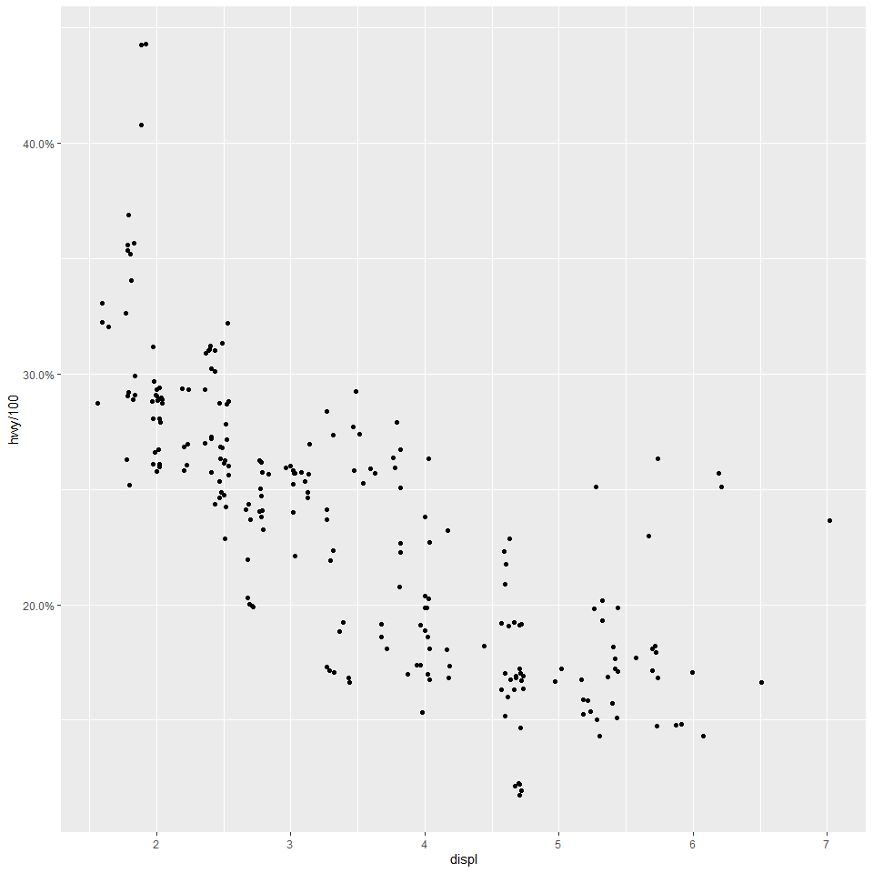<!-- -->

